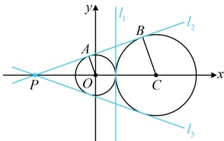

如图，两圆圆心分别为 $ O(0,0) $， $ C(3,0) $，半径分别为 $ r_{1}=1 $，半径 $ r_{2}=2 $

所以圆心距$|OC|=3=r_1+r_2$，故两圆外切，且切点为$(1,0)$，因此两圆有图中$l_1$，$l_2$，$l_3$三条切线，

显然图中$l_1$的方程是$x=1$，到此本题已可结束，我们把另外的$l_2$和$l_3$也求一下。观察发现$l_2$，$l_3$关于$x$轴对称，

它们交于$x$轴上一点$P$，故只需求出其中一条即可，不妨求$l_2$，怎么求？可以到$\triangle POA$和$\triangle PCB$中来分析，

如图，由$l_2$与两圆分别切于$A$，$B$两点可得$\angle OAP=\angle CBP=90^\circ$，所以$\triangle POA\sim\triangle PCB$，故$\frac{|PO|}{|PC|}=\frac{|OA|}{|CB|}=\frac{1}{2}$，

所以$O$为$PC$的中点，从而$|PO|=|OC|=3$，故$P(-3,0)$，所以$|AP|=$

$\sqrt{|PO|^2-|OA|^2}=2\sqrt{2}$，故$l_2$的斜率$k=\tan\angle APO=\frac{|OA|}{|AP|}=\frac{1}{2\sqrt{2}}=\frac{\sqrt{2}}{4}$，

所以直线$l_2$的方程为$y-0=\frac{\sqrt{2}}{4}[x-(-3)]$，整理得：$y=\frac{\sqrt{2}}{4}x+\frac{3\sqrt{2}}{4}$，

由对称性可知，$l_2$与$l_3$关于$x$轴对称，所以$l_3$的斜率为$-\frac{\sqrt{2}}{4}$，

故直线$l_3$的方程为$y-0=-\frac{\sqrt{2}}{4}[x-(-3)]$，整理得：$y=-\frac{\sqrt{2}}{4}x-\frac{3\sqrt{2}}{4}$，

综上所述，圆 O 与圆 C 的所有公切线为 x=1， $ y=\frac{\sqrt{2}}{4}x+\frac{3\sqrt{2}}{4} $， $ y=-\frac{\sqrt{2}}{4}x-\frac{3\sqrt{2}}{4} $。

解法2： $ l_1 $ 的求法同解法1，对于  $ l_2 $ 和  $ l_3 $，它们的斜率必然存在，故也可统一设它们的方程为  $ y = kx + b $，翻译该直线与两圆相切，可得到两个方程，从而解出所设参数  $ k $ 和  $ b $，

设另外两条切线的方程为  $ y = kx + b $，即  $ kx - y + b = 0 $ ①，

因为该直线与圆 O 和圆 C 都相切，所以  $ \left\{\begin{array}{l}\left|\frac{k \cdot 0 - 0 + b}{\sqrt{k^2 + (-1)^2}}\right| = 1 \\ \frac{\left|k \cdot 3 - 0 + b}{\sqrt{k^2 + (-1)^2}}\right| = 2\end{array}\right. $，故  $ \left\{\begin{array}{l}\frac{\left|b\right|}{\sqrt{k^2 + 1}} = 1 \\ \frac{\left|3k + b\right|}{\sqrt{k^2 + 1}} = 2\end{array}\right. $ ③

对比②③可得 $ \left|3k+b\right|=2\left|b\right| $，所以 $ 3k+b=2b $或 $ 3k+b=-2b $，故b=3k或b=-k，若b=3k，代入②整理得： $ 8k^{2}=1 $，解得： $ k=\pm\frac{\sqrt{2}}{4} $，

当  $ k = \frac{\sqrt{2}}{4} $ 时， $ b = \frac{3\sqrt{2}}{4} $，代入①得  $ y = \frac{\sqrt{2}}{4}x + \frac{3\sqrt{2}}{4} $；当  $ k = -\frac{\sqrt{2}}{4} $ 时， $ b = -\frac{3\sqrt{2}}{4} $，代入①得  $ y = -\frac{\sqrt{2}}{4}x - \frac{3\sqrt{2}}{4} $；若  $ b = -k $，代入②整理得： $ k^2 = k^2 + 1 $，该方程无解，不合题意；

综上所述，圆 O 与圆 C 的所有公切线为 x=1， $ y=\frac{\sqrt{2}}{4}x+\frac{3\sqrt{2}}{4} $， $ y=-\frac{\sqrt{2}}{4}x-\frac{3\sqrt{2}}{4} $。

答案：x=1（答案不唯一，也可填  $ y=\frac{\sqrt{2}}{4}x+\frac{3\sqrt{2}}{4} $ 或  $ y=-\frac{\sqrt{2}}{4}x-\frac{3\sqrt{2}}{4} $）

【反思】求两圆公切线的方程，可先观察图形是否特殊。若是，则可尝试分析几何关系（通常当两圆圆心的连线为水平线或竖直线时，可用此法）；若否，则可按解法2的通法处理：设切线为  $ y = kx + b $，由切线与两圆相切建立关于 k，b 的方程组并求解。本题图形比较特殊，两个解法都可行，我们来看一个图形不特殊的变式。

【变式】（2022·新课标Ⅰ卷）写出与圆 $ x^{2}+y^{2}=1 $和 $ (x-3)^{2}+(y-4)^{2}=16 $都相切的一条直线的方程___.

解析：两个圆如图，它们的半径分别为1和4，圆心分别为原点 O 和 M(3,4)，

所以圆心距  $ \left|OM\right|=\sqrt{3^{2}+4^{2}}=5=1+4 $，从而两圆外切，故两圆共有三条公切线，如图中的  $ l_{1} $， $ l_{2} $， $ l_{3} $，

与例6相比，图形不再特殊，考虑用通法求公切线，可设切线的方程为  $ y = kx + b $，先考虑斜率不存在的情况，结合图形可得 x = -1 是两圆的一条公切线，即图中的  $ l_{1} $，