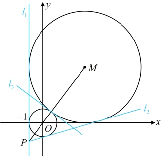
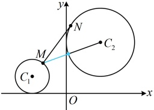
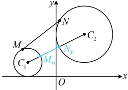

本题只需填一条公切线，做到这里已经可以结束了，但我们把另外两条公切线也求一下，对于图中的 $ l_2 $和 $ l_3 $，可统一设它们的方程为 $ y = kx + b $，即 $ kx - y + b = 0 $

因为该直线与两圆都相切，所以 $ \frac{|b|}{\sqrt{k^2 + 1}} = 1 $ ②， $ \frac{|3k - 4 + b|}{\sqrt{k^2 + 1}} = 4 $ ③，

对比②③可得 $ |3k - 4 + b| = 4|b| $，所以 $ 3k - 4 + b = 4b $或 $ 3k - 4 + b = -4b $，

整理得： $ b = k - \frac{4}{3} $或 $ b = \frac{4}{5} - \frac{3}{5}k $，

若 $ b = k - \frac{4}{3} $，代入②解得： $ k = \frac{7}{24} $，所以 $ b = k - \frac{4}{3} = -\frac{25}{24} $，

代入①整理得： $ 7x - 24y - 25 = 0 $；

若 $ b = \frac{4}{5} - \frac{3}{5}k $，代入②解得： $ k = -\frac{3}{4} $，所以 $ b = \frac{4}{5} - \frac{3}{5}k = \frac{5}{4} $，

代入①整理得： $ 3x + 4y - 5 = 0 $；

综上所述，与两圆都相切的直线有 $ x = -1 $， $ 7x - 24y - 25 = 0 $，

 $ 3x + 4y - 5 = 0 $，任选其一填入空格即可。

答案：x=-1（答案不唯一，也可填 $ 3x+4y-5=0 $或 $ 7x-24y-25=0 $）

【反思】当两圆外切或内切时，过两圆公共点的公切线方程可由两圆的方程作差得到。若熟悉这一结论，本题的 $ l_3 $就能用此法求得，即将两圆方程相减得 $ (x-3)^2+(y-4)^2-(x^2+y^2)=16-1 $，化简得： $ 3x+4y-5=0 $，这就是 $ l_3 $的方程。类似的，例6中的 $ l_1 $也可用此法求得。

## 类型IV：基于两圆位置关系的一类最值问题

【例 7】已知圆  $ C_1:(x+2)^2+(y-1)^2=1 $， $ C_2:(x-2)^2+(y-3)^2=4 $， $ M $， $ N $ 分别是  $ C_1 $， $ C_2 $ 上的动点，则  $ |MN| $ 的最小值为___.

解析：为了找到何时 $ \left|MN\right| $最小，可尝试画出两圆的图形，再作观察，

圆  $ C_1 $ 的圆心为  $ C_1(-2,1) $，半径  $ r_1=1 $，圆  $ C_2 $ 的圆心为  $ C_2(2,3) $，半径  $ r_2=2 $。所以  $ |C_1C_2|=\sqrt{[2-(-2)]^2+(3-1)^2}=2\sqrt{5}>r_1+r_2 $，故两圆外离，如图 1，

涉及两个动点，可考虑先取定一个，这里 $M, N$ 都是圆上动点，取定谁都行，不妨取定 $M$，对圆 $C_1$ 上任意的点 $M$，当 $N$ 在圆 $C_2$ 上运动时，总有 $|MN| \geq |MC_2| - r_2 = |MC_2| - 2$ ①，

对圆  $ C_1 $ 上任意的点  $ M $，当  $ N $ 在圆  $ C_2 $ 上运动时，总有  $ |MN| \geq |MC_2| - r_2 = |MC_2| - 2 $ ①，

取等条件是  $ N $ 为线段  $ MC_2 $ 与圆  $ C_2 $ 的交点，如图 1 中的蓝色小点，

故只需再看$|MC_2|$的最小值，此时只有$M$在圆$C_1$上运动了，按圆上动点到圆外定点距离最值模型处理即可，$|MC_2| \geq |C_1C_2| - r_1 = |C_1C_2| - 1$，结合①得$|MN| \geq |C_1C_2| - 1 - 2 = |C_1C_2| - 3 = 2\sqrt{5} - 3$，

取等条件是 M，N 分别为线段  $ C_1C_2 $ 与两圆的交点，如图 2 中的  $ M_0 $ 和  $ N_0 $，所以  $ |MN| $ 的最小值为  $ 2\sqrt{5} - 3 $。

答案： $ 2\sqrt{5}-3 $

【反思】当两圆  $ C_1 $ 和  $ C_2 $ 外离时，若  $ M $， $ N $ 分别在圆  $ C_1 $ 和  $ C_2 $ 上运动，则如图， $ \left|MN\right|_{\min} = \left|M_1N_1\right| = \left|C_1C_2\right| - r_1 - r_2 $， $ \left|MN\right|_{\max} = \left|M_2N_2\right| = \left|C_1C_2\right| + r_1 + r_2 $。