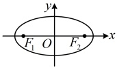
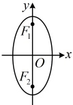

# 第三章 圆锥曲线的方程

# 3.1.1 椭圆及其标准方程

习题：P1

知识梳理

## 知识点1：椭圆的定义

把平面内与两个定点$F_1$，$F_2$的距离的和等于常数（该常数一般记作$2a$，且$2a > |F_1F_2|\)）的点的轨迹叫做椭圆。这两个定点叫做椭圆的焦点，两焦点间的距离（即$|F_1F_2|$）叫做椭圆的焦距，焦距的一半称为半焦距。

注：①从椭圆的定义来看，椭圆可以看成是点集  $ P = \left\{ M \middle| M F _ { 1 } \middle| + \middle| M F _ { 2 } \middle| = 2 a , 0 < \middle| F _ { 1 } F _ { 2 } \middle| < 2 a \right\} $，当椭圆定义中的  $ F _ { 1 } = F _ { 2 } F _ { 2 } $ 重合时，对应点的集合为圆.

②定义中的限制条件 “ $ 2a > |F_1F_2| $” 怎么理解？2a 与  $ \left|F_1F_2\right| $ 的大小关系不同，所得图形的形状不同：

(i)  $ 2a > |F_1F_2| $，动点的轨迹为椭圆；

(ii) $ 2a=\left|F_{1}F_{2}\right| $，动点的轨迹为线段 $ F_{1}F_{2} $

(iii) $ 2a<|F_1F_2| $，动点不存在轨迹.

③我们既可以利用椭圆的定义判断符合条件的动点轨迹为椭圆，也可以利用椭圆定义得到椭圆上的点到两焦点的距离之和为定值.

## 知识点2：椭圆的标准方程

<table border=1 style='margin: auto; word-wrap: break-word;'><tr><td style='text-align: center; word-wrap: break-word;'>标准方程</td><td style='text-align: center; word-wrap: break-word;'>$ \frac{x^{2}}{a^{2}}+\frac{y^{2}}{b^{2}}=1(a&gt;b&gt;0) $</td><td style='text-align: center; word-wrap: break-word;'>$ \frac{y^{2}}{a^{2}}+\frac{x^{2}}{b^{2}}=1(a&gt;b&gt;0) $</td></tr><tr><td style='text-align: center; word-wrap: break-word;'>图形</td><td style='text-align: center; word-wrap: break-word;'></td><td style='text-align: center; word-wrap: break-word;'></td></tr><tr><td style='text-align: center; word-wrap: break-word;'>焦点位置</td><td style='text-align: center; word-wrap: break-word;'>x轴上</td><td style='text-align: center; word-wrap: break-word;'>y轴上</td></tr><tr><td style='text-align: center; word-wrap: break-word;'>焦点坐标</td><td style='text-align: center; word-wrap: break-word;'>$ F_{1}(-c,0) $,  $ F_{2}(c,0) $</td><td style='text-align: center; word-wrap: break-word;'>$ F_{1}(0,c) $,  $ F_{2}(0,-c) $</td></tr><tr><td style='text-align: center; word-wrap: break-word;'>焦距</td><td colspan="2">$ |F_{1}F_{2}|=2c $</td></tr><tr><td style='text-align: center; word-wrap: break-word;'>异同点</td><td colspan="2">相同点：大小、形状相同，a,b,c&gt;0，且a</td></tr></table>

## 知识点1

【例 1】已知点  $ F_{1}(-2,0) $， $ F_{2}(4,0) $，

记点 P 到  $ F_{1} $， $ F_{2} $ 的距离之和为 m，若

点 P 的轨迹是椭圆，则实数 m 的取值范围是 ___.

解析：由题意，要使点 $P$ 的轨迹为椭圆，

需满足 $|PF_1| + |PF_2| = m > |F_1F_2| = |4 - (-2)|$

$=6$，所以实数 $m$ 的取值范围是 $m > 6$。

答案：(6, +∞)

## 知识点2

【例2】已知平面内一动点P到两定点 $ F_{1}(-2,0) $， $ F_{2}(2,0) $的距离之和为8，则动点P的轨迹方程为（ ）

A.  $ \frac{x^{2}}{16}+\frac{y^{2}}{4}=1 $ B.  $ \frac{x^{2}}{16}+\frac{y^{2}}{12}=1 $ C.  $ \frac{x^{2}}{9}+\frac{y^{2}}{5}=1 $ D.  $ \frac{x^{2}}{20}+\frac{y^{2}}{16}=1 $

解析：因为 $ \left|PF_{1}\right|+\left|PF_{2}\right|=8>\left|F_{1}F_{2}\right|=4 $，所以点 $ P $的轨迹是以 $ F_{1} $， $ F_{2} $为焦点的椭圆，且 $ c=2 $， $ 2a=8\Rightarrow a=4 $，

因为 $ a^{2}=b^{2}+c^{2} $，所以 $ b=\sqrt{a^{2}-c^{2}}=\sqrt{4^{2}-2^{2}}=2\sqrt{3} $，

故动点 P 的轨迹方程为  $ \frac{x^{2}}{4^{2}}+\frac{y^{2}}{(2\sqrt{3})^{2}}=1 $，

即 $ \frac{x^{2}}{16}+\frac{y^{2}}{12}=1 $

答案：B

【例3】若椭圆 $ \frac{x^{2}}{25}+y^{2}=1 $上一点P到

椭圆一个焦点的距离为3，则P到另