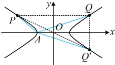
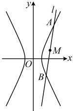

设  $ P(x_0, y_0) $，则  $ Q(-x_0, y_0) $，由题意， $ A(-a, 0) $，所以  $ k_{AP} k_{AQ} = \frac{y_0}{x_0 + a} \cdot \frac{y_0}{-x_0 + a} = \frac{y_0^2}{a^2 - x_0^2} $ ②，

求离心率需要建立  $ a, b, c $ 的关系，故考虑消去式②中的  $ x_0, y_0 $，怎么消？可尝试用双曲线方程来消元，

点  $ P $ 在双曲线  $ C $ 上  $ \Rightarrow \frac{x_0^2}{a^2} - \frac{y_0^2}{b^2} = 1 \Rightarrow y_0^2 = b^2 \left( \frac{x_0^2}{a^2} - 1 \right) = \frac{b^2 (x_0^2 - a^2)}{a^2} $，

代入②得  $ k_{AP} k_{AQ} = -\frac{b^2}{a^2} $，接下来同解法 1.

答案： $ \frac{\sqrt{5}}{2} $

## 类型VI：双曲线的中点弦斜率积结论的应用

【例 6】双曲线 $ \frac{x^2}{4} - \frac{y^2}{b^2} = 1 (b > 0) $的左、右焦点分别为 $ F_1 $， $ F_2 $，过 $ F_1 $作斜率为2的直线与双曲线交于 $ A $， $ B $两点， $ P $是 $ AB $的中点， $ O $为坐标原点，若直线 $ OP $的斜率为 $ \frac{1}{4} $，则 $ b $的值是___。

解析：条件涉及双曲线的弦中点，又与斜率有关，这是中点弦斜率积结论的使用场景，故按此尝试，由中点弦斜率积结论， $ k_{AB}k_{OP}=\frac{b^2}{a^2}=\frac{b^2}{4} $，又由题意， $ k_{AB}=2 $， $ k_{OP}=\frac{1}{4} $，所以 $ 2\times\frac{1}{4}=\frac{b^2}{4} $，故 $ b=\sqrt{2} $。

答案： $ \sqrt{2} $

【反思】在双曲线中，涉及弦中点时，可考虑使用中点弦斜率积结论，该结论的用法是固定的，但问题的形式可以多种多样，我们再来看两个变式.

【变式1】已知双曲线$C:x^2-\frac{y^2}{3}=1$，若直线$l$与双曲线$C$相交于$A$，$B$两点，线段$AB$的中点坐标为$M(2,1)$，则直线$l$的方程为$\ldots$

解析：如图，涉及弦中点，想到中点弦斜率积结论$k_{OM}k_{AB}=\frac{b^2}{a^2}$，此式中$\frac{b^2}{a^2}$已知，$k_{OM}$可由$M$的坐标求得，故可求出直线$AB$的斜率$k_{AB}$，结合点$M$可写出$l$的方程，

由题意，$k_{OM}=\frac{1-0}{2-0}=\frac{1}{2}$，由中点弦斜率积结论，$k_{OM}k_{AB}=\frac{b^2}{a^2}$，所以$\frac{1}{2}k_{AB}=3$，故$k_{AB}=6$，又直线$l$过点$M$，所以$l$的方程为$y-1=6(x-2)$，即$y=6x-11$。

答案： $ y=6x-11 $

【变式2】已知双曲线 $ C:\frac{x^2}{a^2}-\frac{y^2}{b^2}=1(a>0,b>0) $，斜率为1的直线 $ l $与双曲线 $ C $的两支分别交于 $ M $， $ N $两点，且 $ MN $的中点为 $ G(1,3) $，若右顶点 $ A $在以线段 $ MN $为直径的圆内，则此双曲线的实半轴长 $ a $的取值范围是（ ）

A.  $ (0,1) $ \quad B.  $ (1,2) $ \quad C.  $ (1,+\infty) $ \quad D.  $ (2,+\infty) $

解析：涉及弦 $MN$ 的中点 $G$，想到中点弦斜率积结论，先把它写出来，再作观察，

由中点弦斜率积结论，$k_{MN}k_{OG}=\frac{b^2}{a^2}$，又由题意，$k_{MN}=1$，$k_{OG}=\frac{3-0}{1-0}=3$，所以 $1\times3=\frac{b^2}{a^2}\Rightarrow b=\sqrt{3}a$ ①，