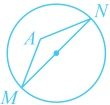
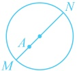

怎样翻译 $A$ 在以 $MN$ 为直径的圆内？若先求该圆的方程，再来翻译，则较为麻烦。如下两图，$A$ 在该圆内等价于 $\angle MAN$ 为钝角或平角，所以 $\overrightarrow{AM} \cdot \overrightarrow{AN} < 0$，故按此翻译，计算 $\overrightarrow{AM} \cdot \overrightarrow{AN}$ 需要 $M$，$N$ 的坐标，下面先设坐标，

设  $ M(x_1, y_1) $， $ N(x_2, y_2) $，因为  $ A(a, 0) $，所以  $ \overrightarrow{AM} = (x_1 - a, y_1) $， $ \overrightarrow{AN} = (x_2 - a, y_2) $，

设  $ M(x_1, y_1) $， $ N(x_2, y_2) $，因为  $ A(a, 0) $，所以  $ AM = (x_1 - a, y_1) $， $ AN = (x_2 - a, y_2) $，

由点  $ A $ 在以线段  $ MN $ 为直径的圆内可得  $ \overrightarrow{AM} \cdot \overrightarrow{AN} = (x_1 - a)(x_2 - a) + y_1 y_2 = x_1 x_2 - a(x_1 + x_2) + a^2 + y_1 y_2 < 0 $ ②，

看到  $ x_1 x_2 $， $ x_1 + x_2 $， $ y_1 y_2 $，想到联立直线  $ l $ 和双曲线  $ C $ 的方程，结合韦达定理计算它们，

直线  $ l $ 斜率为 1，且经过点  $ G(1, 3) $，所以  $ l $ 的方程为  $ y - 3 = 1 \cdot (x - 1) $，即  $ y = x + 2 $，

将①代入双曲线的方程得  $ \frac{x^2}{a^2} - \frac{y^2}{3a^2} = 1 $，即  $ 3x^2 - y^2 - 3a^2 = 0 $，

联立  $ \begin{cases} y = x + 2 \\ 3x^2 - y^2 - 3a^2 = 0 \end{cases} $ 消去  $ y $ 整理得： $ 2x^2 - 4x - 3a^2 - 4 = 0 $ ③，

判别式  $ \Delta = (-4)^2 - 4 \times 2 \times (-3a^2 - 4) = 24a^2 + 48 > 0 $，因为  $ M $， $ N $ 是直线  $ l $ 与双曲线  $ C $ 的两个交点，

所以  $ x_1 $， $ x_2 $ 是方程③的两个解，由韦达定理， $ x_1 + x_2 = 2 $， $ x_1 x_2 = -\frac{3a^2 + 4}{2} $，

所以  $ y_1 y_2 = (x_1 + 2)(x_2 + 2) = x_1 x_2 + 2(x_1 + x_2) + 4 = -\frac{3a^2 + 4}{2} + 2 \times 2 + 4 = \frac{12 - 3a^2}{2} $，

将以上各式代入②得  $ -\frac{3a^2 + 4}{2} - a \cdot 2 + a^2 + \frac{12 - 3a^2}{2} < 0 $，解得： $ a < -2 $ 或  $ a > 1 $，结合  $ a > 0 $ 得  $ a > 1 $。

答案：C

【反思】点  $ A $ 在以  $ MN $ 为直径的圆内常翻译为  $ \overrightarrow{AM} \cdot \overrightarrow{AN} < 0 $。相应的，若是点  $ A $ 在该圆上，则  $ \overrightarrow{AM} \cdot \overrightarrow{AN} = 0 $；若是点  $ A $ 在该圆外，则  $ \overrightarrow{AM} \cdot \overrightarrow{AN} > 0 $。

## 强化训练

考虑到本节涉及的题型都有一定的综合性和难度，故不设 A 组题，只设计了 B 组和 C 组题。

## B 组 强化能力

1. (2023·新疆克孜勒苏期末)

已知双曲线的中心在原点，两个焦点分别为  $ F_{1}(-\sqrt{5},0) $， $ F_{2}(\sqrt{5},0) $，点 P 在双曲线上，且  $ PF_{1} \perp PF_{2} $， $ \triangle PF_{1}F_{2} $ 的面积为 1，则双曲线的方程为（）

A.  $ \frac{x^{2}}{2}-\frac{y^{2}}{3}=1 $ B.  $ \frac{x^{2}}{3}-\frac{y^{2}}{2}=1 $ C.  $ x^{2}-\frac{y^{2}}{4}=1 $ D.  $ \frac{x^{2}}{4}-y^{2}=1 $

双曲线  $ C: \frac{x^2}{a^2} - \frac{y^2}{b^2} = 1 (a > 0, b > 0) $ 的左顶点为  $ A $，点  $ P $， $ Q $ 均在  $ C $ 上，且关于原点对称，若直线  $ AP $， $ AQ $ 的斜率之积为 2，则  $ C $ 的离心率为___。