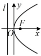
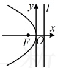
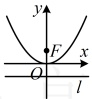
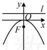

# 3.3.1 抛物线及其标准方程

习题：P1

## 知识梳理

## 知识点1：抛物线的定义

我们把平面内与一个定点 F 和一条定直线 l（l 不经过点 F）的距离相等的点的轨迹叫做抛物线。点 F 叫做抛物线的焦点，直线 l 叫做抛物线的准线。

抛物线的定义可用集合作如下表示：设 $M$ 是抛物线上一点，抛物线的焦点为 $F$，准线为 $l$，点 $M$ 到准线 $l$ 的距离为 $d$，则抛物线可视为动点 $M$ 的集合 $\{M \mid |MF| = d\}$.

## 知识点2：抛物线的标准方程

1. 抛物线的标准方程（表中的 p 都满足 p > 0）

<table border=1 style='margin: auto; word-wrap: break-word;'><tr><td style='text-align: center; word-wrap: break-word;'>标准方程</td><td style='text-align: center; word-wrap: break-word;'>$ y^{2}=2px $</td><td style='text-align: center; word-wrap: break-word;'>$ y^{2}=-2px $</td><td style='text-align: center; word-wrap: break-word;'>$ x^{2}=2py $</td><td style='text-align: center; word-wrap: break-word;'>$ x^{2}=-2py $</td></tr><tr><td style='text-align: center; word-wrap: break-word;'>图形</td><td style='text-align: center; word-wrap: break-word;'></td><td style='text-align: center; word-wrap: break-word;'></td><td style='text-align: center; word-wrap: break-word;'></td><td style='text-align: center; word-wrap: break-word;'></td></tr><tr><td style='text-align: center; word-wrap: break-word;'>焦点</td><td style='text-align: center; word-wrap: break-word;'>$ F\left(\frac{p}{2},0\right) $</td><td style='text-align: center; word-wrap: break-word;'>$ F\left(-\frac{p}{2},0\right) $</td><td style='text-align: center; word-wrap: break-word;'>$ F\left(0,\frac{p}{2}\right) $</td><td style='text-align: center; word-wrap: break-word;'>$ F\left(0,-\frac{p}{2}\right) $</td></tr><tr><td style='text-align: center; word-wrap: break-word;'>准线</td><td style='text-align: center; word-wrap: break-word;'>$ l:x=-\frac{p}{2} $</td><td style='text-align: center; word-wrap: break-word;'>$ l:x=\frac{p}{2} $</td><td style='text-align: center; word-wrap: break-word;'>$ l:y=-\frac{p}{2} $</td><td style='text-align: center; word-wrap: break-word;'>$ l:y=\frac{p}{2} $</td></tr></table>

注：①抛物线的标准方程指的是抛物线与对称轴的交点是坐标原点，且焦点在坐标轴上的抛物线的方程。抛物线的标准方程、焦点坐标、准线方程三者之中只要确定其中一个，另外两个也就确定了。

②焦点在y轴的抛物线的方程 $ x^2 = \pm 2py $经过变形就是 $ y = \pm \frac{1}{2p}x^2 $，也就是我们以前所学习的二次函数，所以对形如 $ y = ax^2 (a \neq 0) $的二次函数，要求其焦点与准线，需先变形为抛物线的标准方程的形式。

2. 参数 p 的几何意义

抛物线的标准方程中参数 p 的几何意义是抛物线的焦点到准线的距离，所以抛物线的方程中恒有 p > 0.

## 知识点1

【例 1】若动点 P 到点 (3,0) 的距离和它到直线 x = -1 的距离相等，则动点 P 的轨迹是（）

A. 椭圆 B. 抛物线 C. 直线 D. 双曲线

解析：由题意，点 P 到定点与定直线的距离相等，且该定点不在定直线上，所以点 P 轨迹为抛物线.

答案：B

## 知识点2

【例2】抛物线 $ x=-\frac{1}{4}y^{2} $的准线方程为（）

A. x = -1 B. x = 1

C. y = -1 D. y = 1

解析：抛物线的方程不是标准形式，先化为标准形式，再观察准线，

 $ x = -\frac{1}{4}y^2 \Leftrightarrow y^2 = -4x $，所以抛物线开口向左，其标准方程为  $ y^2 = -2px (p > 0) $，两者对比可得  $ 2p = 4 \Rightarrow p = 2 $，所以  $ \frac{p}{2} = 1 $，故  $ x = -\frac{1}{4}y^2 $ 的准线方程为  $ x = 1 $。

答案：B

【例3】已知抛物线  $ y=2x^{2} $，则抛物线的焦点到准线的距离为（）

A.  $ \frac{1}{4} $ B.  $ \frac{1}{2} $ C. 1 D. 2

解析： $ y=2x^2 \Leftrightarrow x^2=\frac{1}{2}y $，抛物线的开口