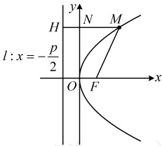

知识点 3：抛物线的焦半径公式

### 1. 抛物线的焦半径

若点 M 是抛物线上一点，抛物线的焦点为 F，准线为 l，则线段 MF 叫做抛物线的焦半径.

2. 坐标形式的焦半径公式

如图，设  $ M(x_0, y_0) $ 是抛物线  $ y^2 = 2px $ ( $ p > 0 $) 上任意一点，过  $ M $ 作  $ MH \perp l $ 于点  $ H $，交  $ y $ 轴于点  $ N $，由抛物线的定义可知  $ |MF| = |MH| $，而  $ |MH| = |MN| + |NH| = x_0 + \frac{p}{2} $，所以  $ |MF| = x_0 + \frac{p}{2} $。

同理可知其他形式标准方程下的焦半径公式，汇总如下表（表中的p均满足p>0)：

向上，与 $ x^{2}=2py(p>0) $对比得 $ p=\frac{1}{4} $

所以抛物线的焦点到准线的距离为 $ \frac{1}{4} $.

<table border=1 style='margin: auto; word-wrap: break-word;'><tr><td style='text-align: center; word-wrap: break-word;'>抛物线</td><td style='text-align: center; word-wrap: break-word;'>$ y^{2}=2px $</td><td style='text-align: center; word-wrap: break-word;'>$ y^{2}=-2px $</td><td style='text-align: center; word-wrap: break-word;'>$ x^{2}=2py $</td><td style='text-align: center; word-wrap: break-word;'>$ x^{2}=-2py $</td></tr><tr><td style='text-align: center; word-wrap: break-word;'>焦半径公式</td><td style='text-align: center; word-wrap: break-word;'>$ x_{0}+\frac{p}{2} $</td><td style='text-align: center; word-wrap: break-word;'>$ -x_{0}+\frac{p}{2} $</td><td style='text-align: center; word-wrap: break-word;'>$ y_{0}+\frac{p}{2} $</td><td style='text-align: center; word-wrap: break-word;'>$ -y_{0}+\frac{p}{2} $</td></tr></table>

答案：A

【反思】不管是哪种形式的抛物线，其焦点到准线的距离都为 p.

## 知识点3

【例4】已知抛物线 $ y^{2}=4x $上一点A的横坐标为4，则点A到抛物线焦点F的距离为（）

A. 5 B. 6 C.  $ \frac{17}{16} $ D.  $ 4\sqrt{2} $

解析：抛物线开口向右，要求$|AF|$，只需

要点 $A$ 的横坐标，题干恰好给了点 $A$ 的横

坐标，

将 $y^2 = 4x$ 与 $y^2 = 2px$ ($p > 0$) 对比，

可得 $2p = 4$，所以 $p = 2$，

故由焦半径公式，$|AF| = x_A + \frac{p}{2} = 4 + 1 = 5$。

答案：A

## 本节核心题型

本节的核心知识主要有两个：抛物线的定义和抛物线的标准方程、焦点坐标、准线方程，其中抛物线定义是难点（定义本身不难，难的是灵活应用定义解决综合性的问题）。为此我们首先设计了类型Ⅰ这组题来强化同学们对抛物线的标准方程、焦点坐标、准线方程这些基本概念的理解；又设计了类型Ⅱ、Ⅲ、Ⅳ三组题来归纳抛物线定义在一些具体题型中的应用；最后，抛物线还可能结合实际背景来考查，于是我们又通过类型V来给大家举了个例子。

类型 I：抛物线的标准方程有关概念题

【例 5】已知抛物线  $ y^{2}=2px (p>0) $ 的焦点在圆  $ x^{2}+y^{2}=4 $ 上，则该抛物线的焦点到准线的距离为（）

A. 1 B. 2 C. 4 D. 8