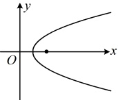
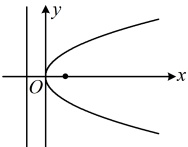

解析：抛物线的焦点 $ \left(\frac{p}{2},0\right) $到准线 $ x=-\frac{p}{2} $的距离为p，怎样求p？可将焦点坐标代入圆的方程，建立方程求p。

抛物线 $ y^2=2px(p>0) $的焦点为 $ \left(\frac{p}{2},0\right) $，代入 $ x^2+y^2=4 $可得 $ \frac{p^2}{4}=4 $，结合 $ p>0 $解得： $ p=4 $，

所以该抛物线的焦点到准线的距离为4.

答案：C

【变式1】抛物线  $ y=-4x^{2} $ 的准线方程是 ___.

解析：观察发现所给抛物线方程不是标准方程，应先将其化为标准方程，再找准线方程，

所给抛物线的方程可化为  $ x^2 = -\frac{1}{4}y $，所以该抛物线开口向下，与  $ x^2 = -2py (p > 0) $ 对比得  $ -2p = -\frac{1}{4} \Rightarrow p = \frac{1}{8} $，

该抛物线的准线方程是  $ y = \frac{p}{2} $，即  $ y = \frac{1}{16} $。

答案： $ y=\frac{1}{16} $

【反思】对于抛物线，我们首先要熟悉各种开口情况下的标准方程及其对应的焦点坐标、准线方程（详见知识点2），遇到不是标准方程的情形时，要先化成标准方程，再找焦点坐标和准线方程，诸多基础题就考这些基本概念。如果是经过平移的抛物线，又怎样求其方程？我们来看下面的变式2。

【变式2】以(1,0)为焦点，y轴为准线的抛物线的方程是（ ）

A.  $ y^2 = x - \frac{1}{2} $ B.  $ y^2 = x + \frac{1}{2} $ C.  $ y^2 = 2x - 1 $ D.  $ y^2 = 2x + 1 $

解析：如图1，抛物线的焦点和准线不在关于y轴对称的位置上，所以不能直接用抛物线的标准方程处理，怎么办呢？我们先通过平移，把它的焦点和准线移到关于y轴对称的位置上，

将原抛物线左移 $ \frac{1}{2} $个单位，则其焦点为 $ \left(\frac{1}{2},0\right) $，准线为 $ x=-\frac{1}{2} $，如图2，

设此时抛物线的标准方程为 $ y^{2}=2px(p>0) $，则 $ \frac{p}{2}=\frac{1}{2}\Rightarrow p=1 $，所以图2的抛物线的方程为 $ y^{2}=2x $，

怎样得到图1的抛物线方程？再将图2的抛物线向右平移 $ \frac{1}{2} $个单位即可，向右平移 $ \frac{1}{2} $个单位，只需在方程中将

x替换成 $ x-\frac{1}{2} $，以 $ (1,0) $为焦点，y轴为准线的抛物线的方程为 $ y^{2}=2x-1 $.

图1

图2

答案：C

类型Ⅱ：定义法求抛物线的轨迹方程

【例6】在平面直角坐标系 xOy 中，一动圆 M 经过点  $ F(1,0) $，且与直线  $ l: x = -1 $ 相切，则动圆圆心 M 的轨迹方程为 ___.

解析：条件涉及直线与圆相切，可按圆心到直线的距离等于半径来翻译，