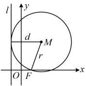
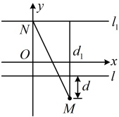
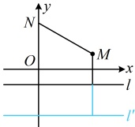

如图，设圆  $ M $ 的半径为  $ r $，则由题意，点  $ M $ 到直线  $ l $ 的距离  $ d = r $ ①，

又因为圆  $ M $ 过点  $ F $，所以  $ \left|MF\right| = r $，结合①可得  $ \left|MF\right| = d $，

所以点  $ M $ 到定点  $ F(1,0) $ 与到定直线  $ l: x = -1 $ 的距离相等，

故点  $ M $ 的轨迹是以  $ F $ 为焦点， $ l $ 为准线的抛物线，其方程为  $ y^2 = 4x $。

答案： $ y^2 = 4x $

【反思】遇到动点到定点和定直线之间距离相等，要想到动点的轨迹是抛物线。很多时候这一等量关系给得比较隐蔽，需要翻译已知条件才能发现，我们来看一个变式。

【变式】已知圆  $ N: x^2 + (y-3)^2 = 4 $，直线  $ l: y = -1 $，圆  $ M $ 与圆  $ N $ 外切，且与直线  $ l $ 相切，则点  $ M $ 的轨迹方程是___。

解法1：条件给出圆  $ M $ 与圆  $ N $ 外切，与直线  $ l $ 相切，我们来翻译这两个条件，建立点  $ M $ 满足的关系，

由题意，圆  $ N $ 的圆心为  $ N(0,3) $，半径  $ r=2 $，设圆  $ M $ 的半径为  $ r' $，由圆  $ M $ 与圆  $ N $ 外切得  $ \left|MN\right|=r'+2 $ ①，

又因为圆  $ M $ 与直线  $ l $ 相切，所以圆心  $ M $ 到直线  $ l $ 的距离  $ d=r' $ ②，

所求为点 $M$ 的轨迹方程，故考虑消去与 $M$ 无关的量，式①和式②中，$d$ 只与 $M$ 有关，$r'$ 与 $M$ 无关，故消 $r'$，将②代入①得 $|MN|=d+2$ ③，观察发现 $|MN|$ 和 $d$ 都容易用 $M$ 的坐标表示，故可直接用 $M$ 的坐标翻译式③，设 $M(x,y)$，则式③即为 $\sqrt{x^2+(y-3)^2}=|y+1|+2$，有根号，可考虑平方去根号，所以 $x^2+(y-3)^2=(y+1)^2+4+4|y+1|$，化简得：$x^2=4|y+1|+8y-4$ ④，

式④中有绝对值，又考虑通过讨论 $y$ 与 $-1$ 的大小来去掉绝对值，从而化简式④，当 $y \geq -1$ 时，式④可化为 $x^2 = 4(y+1) + 8y - 4$，即 $x^2 = 12y$，此方程中，$x^2 = 12y \geq 0 \Rightarrow y \geq 0 > -1$，满足要求；当 $y < -1$ 时，式④可化为 $x^2 = -4(y+1) + 8y - 4$，即 $x^2 = 4y - 8$，此方程中，$x^2 = 4y - 8 \geq 0 \Rightarrow y \geq 2$，这与 $y < -1$ 矛盾，不满足要求；综上所述，点 $M$ 的轨迹方程是 $x^2 = 12y$。

解法 2：按解法 1 得到式③后，有无其它处理方法？注意到  $ |MN| $ 是  $ M $ 到定点  $ N $ 的距离， $ d $ 是  $ M $ 到定直线  $ l $ 的距离，联想到抛物线定义，但式③等号右侧是  $ d+2 $，不是  $ d $，怎么办呢？那就想办法将其化为  $ d $，怎么化？可构造一条与  $ l $ 距离为 2 的平行线  $ l' $，则  $ d+2 $ 即为  $ M $ 到  $ l' $ 的距离，由于  $ M $ 在  $ l $ 上方还是下方不确定，故需讨论，当点  $ M $ 在直线  $ l $ 下方或在  $ l $ 上时，如图 1，记  $ l_1: y=3 $，设  $ M $ 到  $ l_1 $ 的距离为  $ d_1 $，则  $ d_1=d+4 $，由图 1 可知  $ \left|MN\right| \geq d_1=d+4 > d+2 $，所以式③不可能成立；当点  $ M $ 在直线  $ l $ 上方时，如图 2，记  $ l': y=-3 $，则  $ d+2 $ 即为点  $ M $ 到直线  $ l' $ 的距离，结合式③可知点  $ M $ 到定点  $ N $ 和定直线  $ l' $ 的距离相等，

所以点 $M$ 的轨迹是以 $N(0,3)$ 为焦点，$l': y = -3$ 为准线的抛物线，其方程为 $x^2 = 12y$。

图1

图2

答案： $ x^{2}=12y $

类型Ⅲ：用抛物线定义计算焦半径

【例 7】已知点  $ P(x_0,2) $ 在抛物线  $ C: y^2 = 4x $ 上，抛物线  $ C $ 的焦点为  $ F $，则  $ |PF| = $ （ ）

A. 4       B. 3       C. 2       D. 1