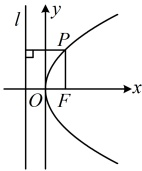
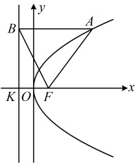
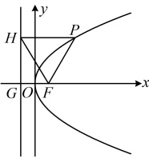

解析：求抛物线上的点到其焦点的距离，考虑用定义转化为它到准线的距离，

如图，抛物线 $C$ 的准线为 $l: x = -1$，由抛物线定义，$|PF|$ 等于点 $P$ 到准线的距离，所以 $|PF| = x_0 - (-1) = x_0 + 1$ ①，故只需求 $x_0$，可将点 $P$ 代入抛物线 $C$ 的方程求 $x_0$，将 $P(x_0, 2)$ 代入 $y^2 = 4x$ 可得 $2^2 = 4x_0$，解得： $x_0 = 1$，代入①得 $|PF| = 2$。

答案：C

【反思】涉及抛物线上的点到其焦点的距离，常用焦半径公式来计算，该公式的本质是抛物线的定义．对于开口向右的抛物线，其焦半径公式是 $ |PF|=x_0+\frac{p}{2} $，所以核心是求点P的横坐标 $ x_0 $．本题 $ x_0 $容易求出，我们来看一个稍复杂一点的变式．

【变式】（2025·全国Ⅱ卷）设抛物线 $ C:y^2=2px(p>0) $的焦点为F，点A在C上，过A作C的准线的垂线，垂足为B，若直线BF的方程为 $ y=-2x+2 $，则 $ |AF|= $（　　）

A. 3

B. 4

C. 5

D. 6

解析：如图，F在x轴上，故可先用所给直线与x轴联立，求出交点F的坐标，联立 $ \begin{cases} y=-2x+2 \\ y=0 \end{cases} $解得： $ \begin{cases} x=1 \\ y=0 \end{cases} $，所以 $ F(1,0) $，从而 $ \frac{p}{2}=1\Rightarrow p=2 $，故抛物线C的方程为 $ y^2=4x $，求 $ |AF| $需要A的横坐标，怎么求？观察图形发现B的横坐标容易获得，代入所给直线方程可求得其纵坐标，A，B纵坐标相等，代入抛物线方程可求得A的横坐标，抛物线的准线为x=-1，所以 $ x_B=-1 $，从而 $ y_B=-2x_B+2=4 $，故 $ y_A=4 $，又A在抛物线上，所以 $ x_A=\frac{y_A^2}{4}=4 $，故 $ |AF|=x_A+\frac{p}{2}=4+1=5 $．

答案：C

## 类型IV：抛物线定义与几何性质综合题

【例 8】已知点 P 在抛物线  $ C: y^2 = 2px $ ( $ p > 0 $) 上，过 P 作 C 的准线的垂线，垂足为 H，点 F 为 C 的焦点。若  $ \angle HPF = 60^\circ $，点 P 的横坐标为 1，则  $ p = $ ___。

解析：抛物线的准线方程为  $ x = -\frac{p}{2} $，如图，因为点  $ P $ 的横坐标为 1，所以由抛物线定义， $ |PF| = |PH| = 1 + \frac{p}{2} $，又  $ \angle HPF = 60^\circ $，所以  $ \triangle HPF $ 是正三角形，故  $ |HF| = 1 + \frac{p}{2} $，且

求 $p$ 需建立关于 $p$ 的方程，$\triangle HPF$ 已翻译完毕，可尝试到 $\triangle HGF$ 中找等量关系，

由图知 $HP \parallel x$ 轴，所以 $\angle HFG = \angle PHF = 60^\circ$，故 $|GF| = |HF| \cdot \cos \angle HFG = \frac{1}{2}\left(1 + \frac{p}{2}\right)$，

又 $|GF| = p$，所以 $\frac{1}{2}\left(1 + \frac{p}{2}\right) = p$，解得： $p = \frac{2}{3}$。

答案： $ \frac{2}{3} $

【反思】过抛物线上一点  $ P $ 向其准线作垂线，设垂足为  $ H $，则  $ \triangle PFH $ 天然就是等腰三角形  $ (|PF|=|PH|) $，有关问题常由此出发，结合  $ \triangle HGF(G $ 为准线与坐标轴的交点 $ ) $ 分析几何关系。本题天然就有准线的垂线  $ PH $，有时这个垂线需要自己作辅助线，我们来看三个变式。

