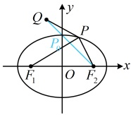
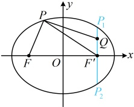
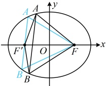

【例 15】已知椭圆  $ C: \frac{x^2}{8} + \frac{y^2}{4} = 1 $ 的左焦点为  $ F_1 $， $ P $ 为  $ C $ 上一点，若  $ Q(-1,3) $，则  $ |PF_1| - |PQ| $ 的最大值为___。

解析：先画图看看能否直接找到目标式何时最大，为了准确画图，我们先看看  $ Q $ 是在椭圆外，还是椭圆将点  $ Q $ 的坐标代入椭圆方程可得  $ \frac{(-1)^2}{8} + \frac{3^2}{4} = \frac{19}{8} > 1 $，所以点  $ Q $ 在椭圆  $ C $ 的外部，如图， $ \left|PF_1\right| - \left|PQ\right| $ 的最大值不易直接分析，涉及  $ \left|PF_1\right| $，可考虑利用椭圆定义转化为  $ \left|PF_2\right| $，再作观察，由所给椭圆方程可知  $ a^2 = 8 $， $ b^2 = 4 $，所以  $ a = 2\sqrt{2} $， $ b = 2 $， $ c = \sqrt{a^2 - b^2} = 2 $，设椭圆的右焦点为  $ F_2(2,0) $，则由椭圆定义， $ \left|PF_1\right| + \left|PF_2\right| = 2a = 4\sqrt{2} $，所以  $ \left|PF_1\right| = 4\sqrt{2} - \left|PF_2\right| $，故  $ \left|PF_1\right| - \left|PQ\right| = 4\sqrt{2} - \left|PF_2\right| - \left|PQ\right| = 4\sqrt{2} - \left(\left|PF_2\right| + \left|PQ\right|\right) $ ①，

于是只需求 $ |PF_2| + |PQ| $的最小值，该最小值容易从图上看出来，

由图可知， $ |PF_2| + |PQ| \geq |QF_2| = \sqrt{[2 - (-1)]^2 + (0 - 3)^2} = 3\sqrt{2} $，

代入①得 $ |PF_1| - |PQ| \leq 4\sqrt{2} - 3\sqrt{2} = \sqrt{2} $，

取等条件是 $P$ 与线段 $QF_2$ 与椭圆的交点 $P_0$ 重合，所以 $|PF_1| - |PQ|$ 的最大值为 $\sqrt{2}$。

答案： $ \sqrt{2} $

【反思】涉及椭圆上的动点到一个焦点距离的最值，若直接分析不易，可考虑利用椭圆定义转化到另一焦点上来看.本题的定点Q在椭圆外，当点Q在椭圆内时，也有相应的最值模型，我们来看下面的变式1.

【变式1】已知点 $ Q(2,1) $，且 $ F $是椭圆 $ \frac{x^2}{9}+\frac{y^2}{5}=1 $的左焦点， $ P $是椭圆上任意一点，则 $ |PF|+|PQ| $的最小值是（ ）

A. 6          B. 5          C. 4          D. 3

解析：将点  $ Q $ 的坐标代入椭圆方程可得  $ \frac{2^2}{9} + \frac{1^2}{5} = \frac{29}{45} < 1 $，所以点  $ Q $ 在椭圆内部，

如图，直接分析  $ |PF| + |PQ| $ 的最小值不易，涉及  $ |PF| $，可利用椭圆定义转化为  $ |PF'| $，再作观察，

由所给椭圆方程， $ a^2 = 9 $， $ b^2 = 5 $，所以  $ a = 3 $， $ c = \sqrt{a^2 - b^2} = 2 $，故可设椭圆的右焦点为  $ F'(2,0) $，

由椭圆定义， $ |PF| + |PF'| = 2a = 6 $，所以  $ |PF| = 6 - |PF'| $，故  $ |PF| + |PQ| = 6 - |PF'| + |PQ| = 6 - (|PF'| - |PQ|) $ ①，

于是只需求  $ |PF'| - |PQ| $ 的最大值。由此联想到三角形两边之差小于第三边，但  $ P $、 $ F' $、 $ O $ 可能共线。故讨论设直线  $ F'Q $ 与椭圆交于如图所示的  $ P $， $ P_2 $ 两点，

重合时， $ \left|PF^{\prime}\right|-\left|PQ\right|=\left|F^{\prime}Q\right|=1 $;

P 与  $ P_{2} $ 重合时， $ \left|PF^{\prime}\right|-\left|PQ\right|=-\left|F^{\prime}Q\right|=-1 $;

当 $P$ 不与 $P_1$，$P_2$ 重合时，由三角形两边之差小于第三边，$|PF'|-|PQ|<|F'Q|=1$；

综上所述，$|PF'|-|PQ|$ 的最大值为 1，结合①可得 $|PF|+|PQ|$ 的最小值为 $6-1=5$。

答案：B

【变式 2】若  $ F $ 为椭圆  $ C: \frac{x^2}{25} + \frac{y^2}{16} = 1 $ 的右焦点， $ A $， $ B $ 为  $ C $ 上的两个动点，则  $ \triangle ABF $ 周长的最大值为___.

解析：与上面两题不同，本题有  $ A $， $ B $ 两个点都在椭圆上运动，怎么分析呢？在椭圆中，涉及右焦点  $ F $，我们仍然考虑取出左焦点，结合椭圆定义来分析，

