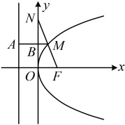
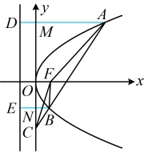
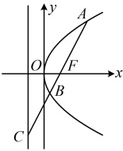

【变式 1】抛物线  $ y^2 = 2px $ ( $ p > 0 $) 的焦点为  $ F $，点  $ M $ 在抛物线上，且  $ |MF| = 3 $， $ FM $ 的延长线交  $ y $ 轴于点  $ N $，若  $ M $ 为线段  $ FN $ 的中点，则  $ p = $（ ）

A. 2

B.  $ 2\sqrt{2} $

C. 4

D. 6

解析：由题意，抛物线的焦点为  $ F\left(\frac{p}{2},0\right) $，准线为  $ x = -\frac{p}{2} $，

条件涉及  $ |MF| $，考虑过  $ M $ 作准线的垂线，结合抛物线定义分析，

如图，作  $ MA \perp $ 抛物线的准线于点  $ A $，则  $ |MA| = |MF| = 3 $，

怎样求  $ p $? 看到  $ M $ 为  $ FN $ 的中点，联想到构造中位线。如图， $ \triangle NOF $ 的中位线  $ BM $ 的长可由  $ OF $ 求出，另一方面。 $ |RM| = |MA| - |AB| $。故由此可建立方程求  $ n $。

设  $ MA $ 交  $ y $ 轴于点  $ B $，由图可知， $ |MB| = |MA| - |AB| = 3 - \frac{p}{2} $ ①，

因为  $ M $ 为  $ FN $ 的中点，且  $ BM \parallel OF $，所以  $ MB $ 是  $ \triangle NOF $ 的中位线，

故  $ |MB| = \frac{1}{2}|OF| = \frac{p}{4} $，结合①可得  $ 3 - \frac{p}{2} = \frac{p}{4} $，解得： $ p = 4 $。

答案：C

【反思】当条件涉及抛物线上的点到其焦点的距离时，常考虑过该点向准线作垂线，结合抛物线定义来分析.

【变式 2】（2015·浙江卷）设抛物线  $ y^2 = 4x $ 的焦点为  $ F $，不经过焦点的直线上有三个不同的点  $ A $， $ B $， $ C $，其中点  $ A $， $ B $ 在抛物线上，点  $ C $ 在  $ y $ 轴上， $ B $ 在线段  $ AC $ 上，则  $ \triangle BCF $ 与  $ \triangle ACF $ 的面积之比是（ ）

A.  $ \frac{|BF|-1}{|AF|-1} $ B.  $ \frac{|BF|^2-1}{|AF|^2-1} $ C.  $ \frac{|BF|+1}{|AF|+1} $ D.  $ \frac{|BF|^2+1}{|AF|^2+1} $

解析：如图，$\triangle BCF$ 与 $\triangle ACF$ 有相同的高（点 $F$ 到直线 $AC$ 的距离），故只需分析底边之比 $\frac{|BC|}{|AC|}$。选项中有 $|AF|$ 和 $|BF|$，由此联想到抛物线的定义，故过 $A$，$B$ 向准线作垂线，作出来就发现可用相似比来分析 $\frac{|BC|}{|AC|}$，过 $A$，$B$ 作抛物线准线 $x = -1$ 的垂线分别交 $y$ 轴于 $M$，$N$ 两点，垂足分别为 $D$，$E$，

过A，B作抛物线准线x=-1的垂线分别交y轴于M，N两点，垂足分别为D，E，则 $ \triangle CBN\sim\triangle CAM $，所以 $ \frac{|BC|}{|AC|}=\frac{|BN|}{|AM|}=\frac{|BE|-1}{|AD|-1} $ ①，

由抛物线定义， $ |BE|=|BF| $， $ |AD|=|AF| $，

代入①得 $ \frac{|BC|}{|AC|}=\frac{|BF|-1}{|AF|-1} $，所以 $ \frac{S_{\triangle BCF}}{S_{\triangle ACF}}=\frac{|BF|-1}{|AF|-1} $.

答案：A

【变式3】如图，过抛物线  $ y^2 = 4x $ 的焦点  $ F $ 作直线与抛物线及其准线分别交于  $ A $， $ B $， $ C $ 三点，若  $ \overrightarrow{FC} = 3\overrightarrow{FB} $，则  $ |AB| = $ ___.

解析：抛物线的准线为 x = -1，焦点为  $ F(1,0) $，设准线与 x 轴交于点 H，则  $ |FH| = 2 $，涉及抛物线上的点 A，B 和焦点 F，考虑过 A，B 向准线作垂线，联系抛物线定义分析，如图，作  $ AA' \perp $ 准线于  $ A' $， $ BB' \perp $ 准线于  $ B' $，则  $ |AF| = |AA'| $， $ |BF| = |BB'| $，

