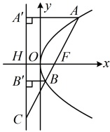
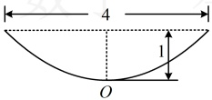
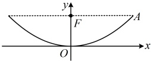

条件  $ \overrightarrow{FC}=3\overrightarrow{FB} $ 怎么用？由于已有较多的长度关系，故考虑设  $ |BF| $ 为变量，并用来表示其它线段的长，设  $ |BF|=m $，则  $ |BB|=m $，因为  $ \overrightarrow{FC}=3\overrightarrow{FB} $，所以  $ |CB|=2|BF|=2m $， $ |CF|=3m $，

由图可知， $ \triangle CBB' \sim \triangle CFH $，所以  $ \frac{|BB'|}{|FH|}=\frac{|CB|}{|CF|} $，即  $ \frac{m}{2}=\frac{2m}{3m} $，解得： $ m=\frac{4}{3} $，所以  $ |BF|=\frac{4}{3} $， $ |CF|=4 $，

还需求出  $ |AF| $，方法与求  $ |BF| $ 类似，可设其为未知数，用相似比来建立方程并求解，

设  $ |AF|=|AA'|=n $，则  $ |CA|=|AF|+|CF|=n+4 $，

由  $ \triangle CFH \sim \triangle CAA' $ 可得  $ \frac{|CF|}{|CA|}=\frac{|FH|}{|AA'|} $，即  $ \frac{4}{n+4}=\frac{2}{n} $，解得： $ n=4 $，

所以  $ |AF|=4 $，故  $ |AB|=|AF|+|BF|=4+\frac{4}{3}=\frac{16}{3} $。

答案： $ \frac{16}{3} $

## 类型V：抛物线的实际应用

【例9】截至2023年2月，“中国天眼”发现的脉冲星总数已经达到740颗以上。被称为“中国天眼”的500米口径球面射电望远镜（FAST），是目前世界上口径最大，灵敏度最高的单口径射电望远镜（图1）。观测时它可以通过4450块三角形面板及2225个触控器完成向抛物面的转化，此时轴截面可以看作抛物线的一部分。某学校科技小组制作了一个FAST模型，观测时呈口径为4米，高为1米的抛物面，则其轴截面所在的抛物线（图2）的顶点到焦点的距离为（）

A. 1 B. 2 C. 4 D. 8

图1

图2

解析：抛物线的顶点到焦点的距离可由其标准方程求得，观察发现只要建系，就能由所给数据写出点A（如图）的坐标，代入抛物线即可求得其标准方程，

如图建系，设抛物线的方程为  $ x^{2}=2py(p>0) $，则由所给数据，

图中点 A 的坐标为  $ (2,1) $，代入  $ x^{2}=2py $ 可得  $ 2^{2}=2p\cdot1 $，解得：p=2，所以抛物线的焦点为  $ F(0,1) $，故抛物线的焦点 F 到顶点 O 的距离为 1.

答案：A

【反思】在实际背景下求解与抛物线有关的问题，核心是建立适当的平面直角坐标系，将实际问题与数学模型对应起来，再分析求解.这类题没有固定的套路，我们只举一个例题.

## 补充、拓展

在椭圆、双曲线中，都有基于它们的定义衍生出的最值问题，抛物线中也有类似的问题，我们通过下面的类型VI来给大家拓展.

类型VI：基于抛物线定义的一类最值问题

【例 10】已知抛物线  $ x^2 = 4y $ 的焦点为  $ F $， $ P $ 是该抛物线上一动点，点  $ A(2,3) $，则  $ |PA| + |PF| $ 的最