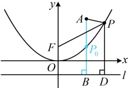
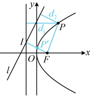

小值为（ ）

A.  $ \sqrt{10} $ B. 4 C. 2 D.  $ 2\sqrt{10} $

解析：如图，直接分析何时  $ |PA| + |PF| $ 最小不易，涉及  $ |PF| $，可尝试用抛物线定义转化为 P 到准线的距离来看，

抛物线的焦点为  $ F(0,1) $，准线为  $ l: y = -1 $，作  $ PD \perp l $ 于点  $ D $，则  $ |PF| = |PD| $，

解析：如图，直接分析何时  $ |PA| + |PF| $ 最小不易，涉及  $ |PF| $，可尝试用抛物线

抛物线的焦点为  $ F(0,1) $，准线为  $ l: y = -1 $，作  $ PD \perp l $ 于点  $ D $，则  $ |PF| = |PD| $，

所以  $ |PA| + |PF| = |PA| + |PD| $，由图可知，当 P 在抛物线上运动时，

 $ |PA| + |PD| \geq |AB| = 3 - (-1) = 4 $，其中  $ AB \perp l $ 于点  $ B $，

当且仅当  $ P $ 为线段  $ AB $ 与抛物线交点  $ P_0 $ 时取等号，

又  $ |PA| + |PF| = |PA| + |PD| $，所以  $ |PA| + |PF| $ 的最小值为 4.

答案：B

【反思】在与抛物线有关的最值问题中，若目标量涉及抛物线上的点P到焦点F的距离，且不易直接看出最值在何时取得，可考虑利用定义，将|PF|转化为P到准线的距离d来分析. 类似的，在有些情况下，也需要将d转化为|PF|来看，比如下面的变式.

【变式】已知点 $P$ 是抛物线 $C: y^2 = 4x$ 上任意一点，若点 $P$ 到抛物线 $C$ 的准线的距离为 $d_1$，到直线 $l: 2x - y + 3 = 0$ 的距离为 $d_2$，则 $d_1 + d_2$ 的最小值是（ ）

A. $1 + \frac{3\sqrt{5}}{5}$      B. $\sqrt{5}$      C. $\frac{3\sqrt{5}}{5}$      D. $\frac{7\sqrt{5}}{5}$

解析：如图，直接分析 $P$ 在何处时，$d_1 + d_2$ 最小不易，涉及抛物线上的点 $P$

距离，可考虑转化为 $P$ 到焦点的距离来看，

由题意，抛物线 $C$ 的焦点为 $F(1,0)$，则由抛物线定义，$d_1 = |PF|$，

所以 $d_1 + d_2 = |PF| + d_2$，如图，作 $FI \perp l$ 于点 $I$，由图可知，$|PF| + d_2 \geq |FI|$，

取等条件是 $P$ 为图中的线段 $FI$ 与抛物线 $C$ 的交点 $P'$，

结合 $d_1 + d_2 = |PF| + d_2$ 可得 $(d_1 + d_2)_{\min} = |FI| = \frac{|2 \times 1 - 0 + 3|}{\sqrt{2^2 + (-1)^2}} = \sqrt{5}$。

答案：B

## 强化训练

## A 组 夯实基础

1\. (2024 · 北京卷)

抛物线  $ y^{2}=16x $ 的焦点坐标为 ___.