# 3.3.2 抛物线的简单几何性质

习题：P1

## 知识梳理

## 知识点 1：抛物线的简单几何性质（表中均有 p > 0）

<table border=1 style='margin: auto; word-wrap: break-word;'><tr><td style='text-align: center; word-wrap: break-word;'>标准方程</td><td style='text-align: center; word-wrap: break-word;'>$ y^{2}=2px $</td><td style='text-align: center; word-wrap: break-word;'>$ y^{2}=-2px $</td><td style='text-align: center; word-wrap: break-word;'>$ x^{2}=2py $</td><td style='text-align: center; word-wrap: break-word;'>$ x^{2}=-2py $</td></tr><tr><td style='text-align: center; word-wrap: break-word;'>图形</td><td style='text-align: center; word-wrap: break-word;'>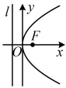</td><td style='text-align: center; word-wrap: break-word;'>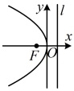</td><td style='text-align: center; word-wrap: break-word;'>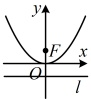</td><td style='text-align: center; word-wrap: break-word;'>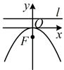</td></tr><tr><td style='text-align: center; word-wrap: break-word;'>范围</td><td style='text-align: center; word-wrap: break-word;'>$ x \ge 0 $\n $ y \in \mathbb{R} $</td><td style='text-align: center; word-wrap: break-word;'>$ x \le 0 $\n $ y \in \mathbb{R} $</td><td style='text-align: center; word-wrap: break-word;'>$ y \ge 0 $\n $ x \in \mathbb{R} $</td><td style='text-align: center; word-wrap: break-word;'>$ y \le 0 $\n $ x \in \mathbb{R} $</td></tr><tr><td style='text-align: center; word-wrap: break-word;'>对称性</td><td colspan="2">关于 x 轴对称</td><td colspan="2">关于 y 轴对称</td></tr><tr><td style='text-align: center; word-wrap: break-word;'>顶点</td><td colspan="4">原点</td></tr><tr><td style='text-align: center; word-wrap: break-word;'>离心率</td><td colspan="4">1</td></tr></table>

知识点2：直线与抛物线的位置关系

以抛物线  $ y^{2}=2px(p>0) $ 为例，直线与抛物线的位置关系的可能情况如下：

<table border=1 style='margin: auto; word-wrap: break-word;'><tr><td style='text-align: center; word-wrap: break-word;'>位置关系</td><td style='text-align: center; word-wrap: break-word;'>相离</td><td style='text-align: center; word-wrap: break-word;'>相切</td><td colspan="2">相交</td></tr><tr><td style='text-align: center; word-wrap: break-word;'>图示</td><td style='text-align: center; word-wrap: break-word;'>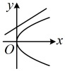</td><td style='text-align: center; word-wrap: break-word;'>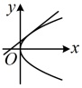</td><td style='text-align: center; word-wrap: break-word;'>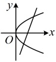</td><td style='text-align: center; word-wrap: break-word;'>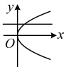</td></tr></table>

在判断直线与抛物线的公共点个数时，常联立直线与抛物线的方程，根据判别式 $ \Delta $的正负情况得到公共点个数，具体情况如下：

① $ \Delta>0\Leftrightarrow $ 直线与抛物线相交，且有两个公共点；

② $ \Delta=0\Leftrightarrow $ 直线与抛物线相切，且有一个公共点；

③ $ \Delta<0\Leftrightarrow $ 直线与抛物线相离，且没有公共点.

注：当直线与抛物线的对称轴平行或重合时，将直线的方程代入抛物线方程，得到的是一元一次方程，该方程有唯一解，所以直线与抛物线有且仅有一个交点。

## 知识点1、2

【例 1】直线 l 过点  $ P(0,1) $，且与抛物线  $ y^{2}=2x $ 有且仅有一个公共点，求 l 的方程.

解：（已有点 $P$，求直线 $l$ 的方程还差斜率，

故考虑设斜率，但需单独考虑斜率不存在的

情况）当直线 $l$ 斜率不存在时，如图 1，直

线 $l$ 即为 $y$ 轴，其方程为 $x=0$，满足直线 $l$

与抛物线只有 1 个交点；

当直线 $l$ 斜率存在时，可设 $l: y = kx + 1$，

联立 $\begin{cases} y = kx + 1 \\ y^2 = 2x \end{cases}$ 消去 $y$ 整理得：

$k^2 x^2 + (2k - 2)x + 1 = 0$，

$(x^2$ 的系数含参，求判别式 $\Delta$ 之前应先讨

论 $x^2$ 的系数为 0 的情况）

当 $k=0$ 时，直线 $l$ 的方程为 $y=1$，

如图 2. 满足直线 $l$ 与抛物线只有 1 个交点。

如图2，满足直线l与抛物线只有1个交点；

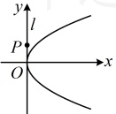

图1

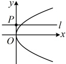

图2

当 $ k\neq0 $时，要使直线l与抛物线只有1个交点，应有 $ \Delta=(2k-2)^{2}-4k^{2}\times1=4-8k=0 $，解得： $ k=\frac{1}{2} $，此时直线l如图3，l与抛物线相切，其方程为 $ y=\frac{1}{2}x+1 $；

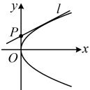

图3

综上所述，直线  $ l $ 的方程为  $ x=0 $， $ y=1 $ 或  $ y=\frac{1}{2}x+1 $。