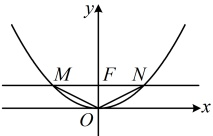
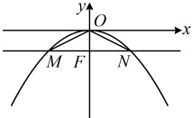

# 本节核心题型

围绕抛物线的简单几何性质，可以衍生出一系列有关的题型。本节我们先通过类型Ⅰ来帮助大家强化对抛物线简单几何性质有关概念的理解；又设计了类型Ⅱ这一组题来研究直线和抛物线的位置关系，包括交点个数的研究和抛物线弦长的计算；最后，当直线和抛物线相交时，若涉及弦中点，则由此产生的这类特殊问题常称为中点弦问题，我们用类型Ⅲ来给大家详细分析如何用点差法解决中点弦问题。

## 类型 I：由抛物线的简单几何性质求其标准方程

【例2】分别根据下列条件求抛物线的标准方程.

（1）抛物线的顶点在原点，关于y轴对称，且经过点 $ M(-2,1) $;

（2）抛物线的顶点在原点，焦点在x轴上，抛物线上的点 $ P(2,m) $到其焦点F的距离为3；

（3）抛物线的顶点在原点，焦点 F 在 y 轴上，过 F 且垂直于 y 轴的直线与抛物线交于 M，N 两点，且  $ \triangle OMN $ 的面积为 8.

解：（1）（求抛物线的标准方程，应先判断开口，以便于设对应的标准方程. 题干给出抛物线的对称轴，则开口只有两种可能，结合经过的点M可进一步确定开口方向）

因为抛物线顶点在原点，关于y轴对称，所以其开口只能向上或向下，

又因为抛物线过点  $ M(-2,1) $，所以抛物线开口只能向上，可设其标准方程为  $ x^{2}=2pv(p>0) $，

将点  $ M(-2,1) $ 代入得  $ (-2)^{2}=2p\cdot1 $，解得：p=2，所以抛物线的方程为  $ x^{2}=4y $。

（2）（求抛物线的标准方程，先判断开口，可结合焦点位置和所过的点来看）

因为抛物线顶点在原点，焦点在x轴上，所以抛物线开口向左或向右，

又因为点  $ P(2,m) $ 在抛物线上，点  $ P $ 在  $ y $ 轴右侧，所以抛物线开口向右，可设其标准方程为  $ y^2 = 2px (p > 0) $，由题意  $ |PF| = 2 + \frac{p}{2} = 3 $，所以  $ p = 2 $，故抛物线的方程为  $ y^2 = 4x $。

（3）（分析发现仅有焦点在y轴上能限制开口，有如图1和图2所示的两种情况，故讨论）

（3）（分析发现仅有焦点在 y 轴上能限制开口，有如图1和图2所示的两种情况，故讨论）

当抛物线开口向上时，可设其标准方程为  $ x^2 = 2py $ ( $ p > 0 $)，则抛物线的焦点为  $ F\left(0, \frac{p}{2}\right) $，

过  $ F $ 且垂直于  $ y $ 轴的直线为  $ y = \frac{p}{2} $，代入  $ x^2 = 2py $ 得  $ x^2 = p^2 $，解得： $ x = \pm p $，所以  $ \left|MN\right| = 2p $

故  $ S_{\triangle OMN} = \frac{1}{2} |MN| \cdot |OF| = \frac{1}{2} \times 2p \times \frac{p}{2} = \frac{p^2}{2} $，由题意， $ S_{\triangle OMN} = 8 $，所以  $ \frac{p^2}{2} = 8 $，

结合  $ n > 0 $ 得  $ n = 4 $。所以抛物线的方程为  $ x^2 = 8v $。

结合 p>0 得 p=4，所以抛物线的方程为  $ x^{2}=8y $；

（对于开口向下的情况，还要再算一遍吗？不用了，由对称性，此时的抛物线与开口向上的抛物线应关于x轴对称，故可直接写出其方程）当抛物线开口向下时，由对称性，抛物线的方程为 $ x^{2}=-8y $；

综上所述，抛物线的方程为 $ x^{2}=8y $或 $ x^{2}=-8y $。

图2

