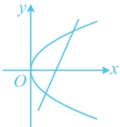
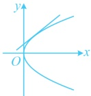
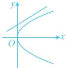
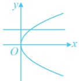
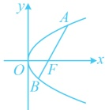

【反思】当题干给出一些抛物线的简单几何性质，让求抛物线的标准方程时，一般需先判断开口方向，以便于设对应的标准方程. 判断开口可以利用的条件常有对称轴、焦点位置或所过的点等.

## 类型Ⅱ：直线与抛物线的位置关系

【例 3】过点  $ P(-1,-1) $ 的直线  $ l $ 与抛物线  $ C: y^2 = 2x $ 相交于不同的两点  $ A $,  $ B $, 则直线  $ l $ 的斜率  $ k $ 的取值范围是___；若  $ k=1 $，则  $ |AB|= $___。

解析：条件给出直线 $l$ 与抛物线 $C$ 有 2 个交点，可联立二者的方程，用判别式 $\Delta > 0$ 建立不等式求 $k$ 的范围，

直线 $l$ 的方程为 $y+1=k(x+1)$，即 $y=kx+k-1$，代入 $y^2=2x$ 整理得：$k^2x^2+[2k(k-1)-2]x+(k-1)^2=0$ ①

要直接算 $\Delta$ 吗？注意到平方项系数含参，故应讨论该系数是否为 0，

当 $k=0$ 时，方程①即为 $-2x+1=0$，解得：$x=\frac{1}{2}$，所以直线 $l$ 与抛物线 $C$ 有且仅有一个交点，不合题意；

当 $k\neq0$ 时，因为直线 $l$ 与抛物线 $C$ 有 2 个交点，所以方程①的判别式 $\Delta=[2k(k-1)-2]^2-4k^2(k-1)^2$

$=4k^2(k-1)^2-8k(k-1)+4-4k^2(k-1)^2=-8k^2+8k+4>0$，解得：$\frac{1-\sqrt{3}}{2}<k<\frac{1+\sqrt{3}}{2}$，

结合 $k\neq0$ 可得 $\frac{1-\sqrt{3}}{2}<k<0$ 或 $0<k<\frac{1+\sqrt{3}}{2}$，综上所述，$k$ 的取值范围是 $\left(\frac{1-\sqrt{3}}{2},0\right)\cup\left(0,\frac{1+\sqrt{3}}{2}\right)$；

再看第二空，$|AB|$ 可由弦长公式 $|AB|=\sqrt{1+k^2}\cdot|x_1-x_2|$ 计算，故先按此计算，再将 $k=1$ 代入，

设 $A(x_1,y_1)$，$B(x_2,y_2)$，由弦长公式，$|AB|=\sqrt{1+k^2}\cdot|x_1-x_2|=\sqrt{1+k^2}\cdot\frac{\sqrt{-8k^2+8k+4}}{|k^2|}$

$=\sqrt{1+k^2}\cdot\frac{\sqrt{-8k^2+8k+4}}{k^2}$，所以当 $k=1$ 时，$|AB|=\sqrt{1+1^2}\cdot\frac{\sqrt{-8\times1^2+8\times1+4}}{1^2}=2\sqrt{2}$。

答案：$\left(\frac{1-\sqrt{3}}{2},0\right)\cup\left(0,\frac{1+\sqrt{3}}{2}\right)$；$2\sqrt{2}$

【反思】①分析直线与抛物线的交点个数，常联立二者的方程，消去y或x，得到关于x或y的方程，此时要先看该方程的平方项系数是否含参。若是，则需讨论。对于平方项系数不为0的情况，交点个数由判别式Δ决定：Δ>0⇔2个交点，如图1；Δ=0⇔1个交点，此时称直线与抛物线相切，如图2；Δ<0⇔没有交点，如图3。对于平方项系数为0的，直线与抛物线只有1个交点，但此时直线与抛物线仍为相交，不是相切，如图4。

图1

图2

图3

图4

图5

②当直线与抛物线相交时，所得弦长仍可由弦长公式  $ L = \sqrt{1 + k^2} \cdot |x_1 - x_2| = \sqrt{1 + m^2} \cdot |y_1 - y_2| $ 计算。若有交点的坐标，则其中的  $ |x_1 - x_2| $ 和  $ |y_1 - y_2| $ 可直接用坐标计算，否则可联立直线和抛物线的方程，用韦达定理推论计算。本题采用的是后者，我们再来举一个直接用坐标算弦长的例子，比如下面的变式1；另外，当弦过抛物线的焦点时，常称之为焦点弦，如图5，可按  $ |AB| = |AF| + |BF| = x_A + \frac{p}{2} + x_B + \frac{p}{2} = x_A + x_B + p $ 计算，比如后面的变式2。

【变式 1】已知点  $ A(2,2) $ 在抛物线  $ C: y^2 = 2px (p > 0) $ 上，过  $ A $ 的直线  $ l $ 与抛物线交于另一点  $ B $，若  $ \triangle AOB $ 的面积为 4，其中  $ O $ 为原点，则直线  $ l $ 的方程为___。