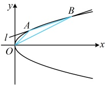

解法1：因为点  $ A(2,2) $ 在抛物线  $ C $ 上，所以  $ 2^2 = 2p \cdot 2 \Rightarrow p = 1 $，故抛物线  $ C $ 的方程为  $ y^2 = 2x $，

如图，条件涉及  $ \triangle AOB $ 的面积，故考虑通过计算该面积来建立方程求直线  $ l $，如何计算  $ S_{\triangle AOB} $？可以  $ AB $ 为底，

点  $ O $ 到直线  $ AB $ 的距离为高来算，其中  $ |AB| $ 可用弦长公式计算，下面先设直线  $ l $ 的方程，由于  $ l $ 肯定不是水平线，

且注意到抛物线方程中  $ x $ 只有一次项，故考虑设横截式方程，这种设法代入抛物线也更好处理，

过点 $A$ 且与 $y$ 轴垂直的直线与抛物线只有 1 个交点，所以 $l$ 不与 $y$ 轴垂直，故可设其方程为 $x = my + t$，将 $A(2,2)$ 代入得 $2 = m \cdot 2 + t$，所以 $t = 2 - 2m$，故直线 $l$ 的方程为 $x = my + 2 - 2m$，即 $x - my + 2m - 2 = 0$ ①，联立 $\begin{cases} x = my + 2 - 2m \\ y^2 = 2x \end{cases}$ 消去 $x$ 整理得：$y^2 - 2my + 4m - 4 = 0$，即 $(y - 2)(y - 2m + 2) = 0$，解得：$y = 2$ 或 $2m - 2$，因为 $y_A = 2$，所以 $y_B = 2m - 2$，已有 $A$，$B$ 的纵坐标，故可直接代入 $|AB| = \sqrt{1 + m^2} \cdot |y_A - y_B|$ 算弦长，

由弦长公式， $ |AB|=\sqrt{1+m^2}\cdot|y_A-y_B|=\sqrt{1+m^2}\cdot|2-(2m-2)|=\sqrt{1+m^2}\cdot|4-2m| $，

又点 $O$ 到直线 $l$ 的距离 $d = \frac{|2m - 2|}{\sqrt{1^2 + (-m)^2}} = \frac{|2m - 2|}{\sqrt{1 + m^2}}$，

所以 $S_{\triangle AOB} = \frac{1}{2} |AB| \cdot d = \frac{1}{2} \times \sqrt{1 + m^2} \cdot |4 - 2m| \cdot \frac{|2m - 2|}{\sqrt{1 + m^2}} = |2m^2 - 6m + 4|$，

由题意，$S_{\triangle AOB} = 4$，所以 $|2m^2 - 6m + 4| = 4 \Rightarrow 2m^2 - 6m + 4 = 4$ 或 $2m^2 - 6m + 4 = -4$，

解得：$m - 0$ 或 $3$。代入①化简得直线 $l$ 的方程为 $x - 2$ 或 $x - 3y + 4 = 0$。

解得：m=0 或 3，代入①化简得直线 l 的方程为 x=2 或  $ x-3y+4=0 $。

 $$ \triangle AOB $$ 

面积，从而建立方程求出点 $B$ 的坐标，再结合点 $A$ 的坐标写出直线 $l$ 的方程，

由题意，$|OA| = \sqrt{2^2 + 2^2} = 2\sqrt{2}$，直线 $OA$ 的斜率 $k_{AO} = \frac{2 - 0}{2 - 0} = 1$，所以 $OA$ 的方程为 $y = x$，即 $x - y = 0$，

点 $B$ 到直线 $OA$ 的距离 $d' = \frac{|x_B - y_B|}{\sqrt{1^2 + (-1)^2}} = \frac{|x_B - y_B|}{\sqrt{2}}$，所以 $S_{\triangle AOB} = \frac{1}{2}|OA| \cdot d'' = \frac{1}{2} \times 2\sqrt{2} \times \frac{|x_B - y_B|}{\sqrt{2}} = |x_B - y_B|$，

又由题意，$S_{\triangle AOB} = 4$，所以 $|x_B - y_B| = 4$，因为点 $B$ 在抛物线 $C$ 上，所以 $y_B^2 = 2x_B$，故 $x_B = \frac{y_B^2}{2}$，

代入 $|x_B - y_B| = 4$ 得 $\left| \frac{y_B^2}{2} - y_B \right| = 4$，所以 $\frac{y_B^2}{2} - y_B = 4$ 或 $\frac{y_B^2}{2} - y_B = -4$，解得：$y_B = -2$ 或 $4$，

当 $y_B = -2$ 时，$x_B = \frac{y_B^2}{2} = 2$，所以 $B(2, -2)$，此时 $l$ 的方程为 $x = 2$；

当 $y_B = 4$ 时，$x_B = \frac{y_B^2}{2} = 8$，所以 $B(8, 4) \Rightarrow k_{AB} = \frac{4 - 2}{8 - 2} = \frac{1}{3}$，故 $l$ 的方程为 $y - 2 = \frac{1}{3}(x - 2)$，即 $x - 3y + 4 = 0$。

答案：x=2 或 x-3y+4=0

【反思】对于开口向右或向左的抛物线  $ y^2 = \pm 2px (p > 0) $，由于其方程中的  $ x $ 只有一次项，所以在联立直线和抛物线方程时，消  $ x $ 更好，故常考虑设直线的横截式方程。但这不绝对，还得看问题的需要，例如在上面的例 3 中，我们就没设横截式方程。类似的，对于开口向上或向下的抛物线，则常设直线的斜截式方程来处理。

【变式 2】已知抛物线  $ y^2 = 2px (p > 0) $ 的焦点为  $ F $，过点  $ F $ 的直线与该抛物线交于  $ A $， $ B $ 两点， $ |AB| = 5\sqrt{2} $， $ AB $ 的中点纵坐标为  $ \sqrt{2} $，则  $ p = $ ___.

解析：条件给出  $ |AB|=5\sqrt{2} $，想到由此建立方程求  $ p $， $ |AB| $ 是焦点弦，可按  $ |AB|=x_1+x_2+p $ 算，

抛物线的焦点为  $ F\left(\frac{p}{2},0\right) $，设  $ A(x_1,y_1) $， $ B(x_2,y_2) $，则  $ |AB|=\left|AF\right|+\left|BF\right|=x_1+\frac{p}{2}+x_2+\frac{p}{2}=x_1+x_2+p $，

又由题意， $ |AB|=5\sqrt{2} $，所以  $ x_1+x_2+p=5\sqrt{2} $ ①，

因为  $ AB $ 中点的纵坐标为  $ \sqrt{2} $，所以  $ \frac{y_1+y_2}{2}=\sqrt{2} $，故  $ y_1+y_2=2\sqrt{2} $ ②，