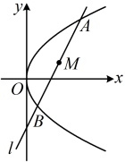

涉及  $ x_{1}+x_{2} $ 和  $ y_{1}+y_{2} $，可考虑设直线 AB 的方程，与抛物线方程联立，结合韦达定理来算它们。直线 AB 过 x 轴上的定点 F，常设横截式方程，但需单独考虑直线垂直于 y 轴的情形，

直线 AB 不可能与 y 轴垂直，否则它与抛物线只有 1 个交点，故可设直线 AB 的方程为  $ x = my + \frac{p}{2} $，代入  $ y^2 = 2px $ 消去 x 整理得： $ y^2 - 2pmy - p^2 = 0 $， $ \Delta = 4p^2m^2 + 4p^2 > 0 $，由韦达定理， $ y_1 + y_2 = 2pm $ ③，所以  $ x_1 + x_2 = my_1 + \frac{p}{2} + my_2 + \frac{p}{2} = m(y_1 + y_2) + p = 2pm^2 + p $ ④，将③和④分别代入②和①可得  $ \begin{cases}2pm = 2\sqrt{2}\\2nm^2 + 2n = 5\sqrt{2}\end{cases} $，解得： $ p = 2\sqrt{2} $ 或  $ \frac{\sqrt{2}}{2} $。

答案： $ 2\sqrt{2} $ 或  $ \frac{\sqrt{2}}{2} $

## 类型III：抛物线中的中点弦问题

【例4】已知动点 P 到定点  $ F(2,0) $ 的距离与它到直线 x=-2 的距离相等，直线 l 与动点 P 的轨迹交于 A, B 两点，且线段 AB 的中点为  $ M(4,2) $，求直线 l 的方程.

解法 1：由题意，点 P 的轨迹是以  $ F(2,0) $ 为焦点，以直线 x=-2 为准线的抛物线，其方程为  $ y^{2}=8x $ ①，

（如图，给出了AB中点M，可设l的横截式方程，与抛物线联立，结合韦达定理计算M的坐标，从而建立方

所设方程中的参数）直线 l 不与 y 轴垂直，否则 l 与抛物线只有 1 个交点，不合题意，

所以可设 $l$ 的方程为 $x = my + t$，将 $M(4,2)$ 代入得 $4 = m \cdot 2 + t$，故 $t = 4 - 2m$，

x=my+4-2m，代入 $ y^{2}=8x $

判别式  $ \Delta = (-8m)^{2} - 4 \times 1 \times (16m - 32) = 64(m^{2} - m + 2) = 64\left[\left(m - \frac{1}{2}\right)^{2} + \frac{7}{4}\right] > 0 $，

设  $ A(x_1, y_1) $， $ B(x_2, y_2) $，由韦达定理， $ y_1 + y_2 = 8m \Rightarrow AB $ 中点的纵坐标  $ y_M = \frac{y_1 + y_2}{2} = 4m $

由题意， $ M $ 的坐标为  $ (4, 2) $，所以  $ 4m = 2 $，从而  $ m = \frac{1}{2} $，故直线  $ l $ 的方程为  $ x = \frac{1}{2}y + 4 - 2 \times \frac{1}{2} $，即  $ 2x - y - 6 = 0 $

解法2：（按解法1得到式①后，题干涉及弦AB的中点M，于是这是中点弦问题，可考虑用点差法处理）

设 $ A(x_{1},y_{1}) $， $ B(x_{2},y_{2}) $，则 $ \begin{cases}y_{1}^{2}=8x_{1}\\y_{2}^{2}=8x_{2}\end{cases} $，两式作差得 $ y_{1}^{2}-y_{2}^{2}=8x_{1}-8x_{2} $，所以 $ (y_{1}+y_{2})(y_{1}-y_{2})=8(x_{1}-x_{2}) $②，

因为 AB 中点为  $ M(4,2) $，所以  $ \frac{y_{1}+y_{2}}{2}=2 $，故  $ y_{1}+y_{2}=4 $，代入②得  $ 4(y_{1}-y_{2})=8(x_{1}-x_{2}) $，

所以 $ \frac{y_{1}-y_{2}}{x_{1}-x_{2}}=2 $，从而直线AB的斜率为2，故直线AB的方程为 $ y-2=2(x-4) $，即2x-y-6=0。

【反思】与椭圆、双曲线中的处理方法一样，在抛物线中，涉及弦和弦中点时，常考虑用点差法处理。点差法建立的方程不仅可以用于求需要的量（如斜率、中点坐标等），还能用来求轨迹方程，我们来看一个变式。

【变式】已知抛物线  $ C: y^{2} = 4x $，过点  $ (4,0) $ 的直线与抛物线交于 A, B 两点，求线段 AB 的中点 M 的轨迹方程.

解法1：（线段AB的中点可通过联立直线AB与抛物线C的方程，结合韦达定理计算，故先设直线AB的方程）

因为直线AB与抛物线交于A，B两点，所以直线AB不与y轴垂直，可设其方程为 $ x=my+4 $，

设  $ A(x_1, y_1) $， $ B(x_2, y_2) $， $ M(x, y) $，联立  $ \begin{cases} x = my + 4 \\ v^2 = 4r \end{cases} $ 消去 x 整理得： $ y^2 - 4my - 16 = 0 $，判别式  $ \Delta = 16m^2 + 64 > 0 $，