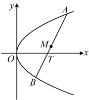

由韦达定理， $ y_{1}+y_{2}=4m $，所以 $ x_{1}+x_{2}=my_{1}+4+my_{2}+4=m(y_{1}+y_{2})+8=4m^{2}+8 $，

因为 M 为 AB 中点，所以  $ \left\{\begin{aligned}x=\frac{x_{1}+x_{2}}{2}\\ y=\frac{y_{1}+y_{2}}{2}\end{aligned}\right. $，故  $ \left\{\begin{aligned}x=2m^{2}+4\textcircled{1}\\ y=2m\textcircled{2}\end{aligned}\right. $，

（所求为 $M$ 的轨迹方程，故应消去 $m$，建立 $x$ 和 $y$ 的方程，怎么消？观察发现由②可解出 $m$，代入①即可）

由②得 $m = \frac{y}{2}$，代入①得 $x = 2\left(\frac{y}{2}\right)^2 + 4$，整理得：$y^2 = 2(x - 4)$，所以点 $M$ 的轨迹方程为 $y^2 = 2(x - 4)$。

解法2：（AB是抛物线的弦，M是弦中点，涉及中点弦问题，也可考虑用点差法处理）

设 $ A(x_{1},y_{1}) $， $ B(x_{2},y_{2}) $， $ M(x,y) $，则 $ y_{1}^{2}=4x_{1} $， $ y_{2}^{2}=4x_{2} $，

两式作差得  $ y_{1}^{2}-y_{2}^{2}=4(x_{1}-x_{2}) $，所以  $ \frac{y_{1}-y_{2}}{x_{1}-x_{2}}\cdot(y_{1}+y_{2})=4(x_{1}\neq x_{2}) $ ③，

因为 M 是 AB 的中点，所以  $ \frac{y_{1}+y_{2}}{2}=y $，故  $ y_{1}+y_{2}=2y $，代入③化简得： $ \frac{y_{1}-y_{2}}{x_{1}-x_{2}}\cdot y=2 $ ④，

（还需消去 $ \frac{y_1-y_2}{x_1-x_2} $这部分，才能得到M的轨迹方程，怎么消？显然这部分表示直线AB的斜率，观察图形可发现，直线AB的斜率就是直线MT的斜率，于是由此可将 $ \frac{y_1-y_2}{x_1-x_2} $转化为用x，y表示的形式）

如图，记 $ T(4,0) $，则直线AB过M和T，所以 $ k_{AB}=k_{MT} $，故 $ \frac{y_1-y_2}{x_1-x_2}=\frac{y}{x-4} $

代入④得 $ \frac{y}{x-4}\cdot y=2 $，化简得： $ y^{2}=2(x-4) $⑤，

（上面的结果是在  $ x_1 \neq x_2 $ 的情况下得出的，那  $ x_1 = x_2 $ 的时候呢？我们单独来看看）当  $ x_1 = x_2 $ 时， $ AB \perp x $ 轴，由对称性可知  $ M $ 与  $ T $ 重合，经检验，此时  $ M $ 的坐标  $ (4,0) $ 也满足方程⑤，所以点  $ M $ 的轨迹方程为  $ y^2 = 2(x - 4) $。

## 补充、拓展

抛物线与椭圆、双曲线不同，它的方程中的x，y有一个只含一次项，这就决定了抛物线上的动点可以方便地设为单变量形式，这种设法在很多情况下处理问题比较方便，我们通过后面的类型IV来给大家详细介绍。另外，抛物线在各类考试中比较容易出综合性的题目，我们在类型V中会给大家举一些具体的例子。

类型IV：抛物线上动点的设法

【例5】已知点P在抛物线 $ x^{2}=-5y $上，若 $ A(0,-3) $，则 $ \left|PA\right| $的最小值为（）

A.  $ \frac{1}{4} $ B.  $ \frac{1}{2} $ C.  $ \frac{35}{4} $ D.  $ \frac{\sqrt{35}}{2} $

解法 1：已知  $ A $ 的坐标，可考虑设  $ P $ 的坐标，表示  $ |PA| $，再分析最小值，

设  $ P(x,y) $，则  $ |PA| = \sqrt{x^2 + (y+3)^2} $ ①，有  $ x $， $ y $ 两个变量，不易直接分析最值，考虑消元，可利用抛物线的方程来消元，消  $ x $ 还是消  $ y $？观察发现直接把  $ x^2 $ 换成  $ -5y $，消去  $ x $，形式更简洁，

因为点  $ P $ 在抛物线上，所以  $ x^2 = -5y $，代入①得  $ |PA| = \sqrt{-5y + (y+3)^2} = \sqrt{y^2 + y + 9} = \sqrt{\left(y + \frac{1}{2}\right)^2 + \frac{35}{4}} $，