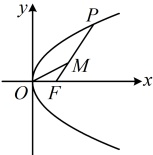
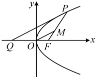
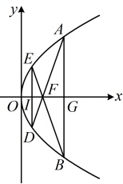

故只需求  $ k_{PQ} $ 的最大值，Q 是定点，如图2，当直线 PQ 与抛物线相切时， $ k_{PQ} $ 最大，设图2中的切线 PQ 的方程为  $ x = my - p (m > 0) $，

代入  $ y^{2}=2px $ 整理得： $ y^{2}-2pmy+2p^{2}=0 $

判别式  $ \Delta = 4p^{2}m^{2} - 8p^{2} = 0 $，结合 m > 0 解得：  $ m = \sqrt{2} $，

所以  $ k_{PQ} = \frac{1}{m} = \frac{\sqrt{2}}{2} $，故  $ (k_{OM})_{\max} = \frac{\sqrt{2}}{2} $.

答案：C

图1

图2

类型V：抛物线综合题

【例6】已知 $F$ 为抛物线 $C: y^2 = 4x$ 的焦点，直线 $x = t$ 与 $C$ 交于 $A$，$B$ 两点，$AF$ 与 $C$ 的另一个交点为 $D$，$BF$ 与 $C$ 的另一个交点为 $E$，若 $\triangle ABF$ 与 $\triangle DEF$ 的面积之比为 4，则 $t = $___.

解法 1：既然给出了$\triangle ABF$与$\triangle DEF$的面积之比，于是可考虑求出这两个三角形的面积，从而建立方程解 $t$，由题设条件可知$S_{\triangle ABF} > S_{\triangle DEF}$，所以如图，应有直线$AB$在焦点$F(1,0)$的右侧，故$t>1$，将$x=t$代入$y^2=4x$可得$y^2=4t$，解得：$y=\pm2\sqrt{t}$，所以$|AB|=4\sqrt{t}$，又$|FG|=t-1$，所以$S_{\triangle ABF}=\frac{1}{2}|AB|\cdot|FG|=2\sqrt{t}(t-1)$，再求$S_{\triangle DEF}$，需要$D$，$E$的坐标，由于直线$AD$过点$F$，所以$A$、$D$的坐标有关系，可设直线$AD$的方程来寻找这一关系。

因为 $ F(1,0) $，由图可知直线AD不与y轴垂直，所以可设AD的方程为 $ x=my+1 $

代入  $ y^{2}=4x $ 消去 x 整理得：  $ y^{2}-4my-4=0 $

不妨设  $ A $ 在  $ x $ 轴上方，则  $ y_A = 2\sqrt{t} $，所以  $ y_D = \frac{-4}{y_A} = -\frac{2}{\sqrt{t}} $， $ x_D = \frac{y_D^2}{4} = \frac{1}{t} $，

由图形的对称性可知 $D$，$E$ 关于 $x$ 轴对称，所以 $|DE| = \frac{4}{\sqrt{t}}$，$|IF| = 1 - \frac{1}{t}$，

故  $ S_{\triangle DEF} = \frac{1}{2} |DE| \cdot |IF| = \frac{1}{2} \times \frac{4}{\sqrt{t}} \left(1 - \frac{1}{t}\right) = \frac{2}{\sqrt{t}} \left(1 - \frac{1}{t}\right) $,

由题意， $ \frac{S_{\triangle ABF}}{S_{\triangle DEF}}=4 $，所以 $ \frac{2\sqrt{t}(t-1)}{\frac{2}{\sqrt{t}}\left(1-\frac{1}{t}\right)}=4 $，解得： $ t=2 $。

解法2：如图，观察发现图形有丰富的对称性，故也可考虑通过分析几何关系来建立关于 $ t $的方程，

由对称性， $ DE\parallel AB $，所以 $ \triangle DEF\sim\triangle ABF $，由 $ \frac{S_{\triangle ABF}}{S_{\triangle DEF}}=4 $结合图形可知直线 $ AB $在 $ F $的右侧，所以 $ t>1 $，

相似三角形的面积比等于对应边长之比的平方，所以 $ \frac{|AB|}{|DE|}=2 $，从而 $ |DE|=\frac{1}{2}|AB| $，故 $ |ID|=\frac{1}{2}|AG| $①，

由图可知， $ \triangle IDF\sim\triangle GAF $，结合①可得 $ |IF|=\frac{1}{2}|FG| $②，

有了①②，就能用 $A$ 的坐标求 $D$ 的坐标，代入抛物线即可建立关于 $t$ 的方程，下面先求 $A$ 的坐标，

将 $x=t$ 代入 $y^2=4x$ 可得 $y^2=4t$，解得：$y=\pm2\sqrt{t}$，所以 $|AG|=2\sqrt{t}$，$|ID|=\frac{1}{2}|AG|=\sqrt{t}$，

又由题意，$F(1,0)$，$G(t,0)$，所以 $|FG|=t-1$，从而 $|IF|=\frac{1}{2}|FG|=\frac{t-1}{2}$，故 $|OI|=|OF|-|IF|=1-\frac{t-1}{2}=\frac{3-t}{2}$，

所以 $D\left(\frac{3-t}{2},-\sqrt{t}\right)$，代入 $y^2=4x$ 得 $t=4\times\frac{3-t}{2}$，解得：$t=2$。

答案：2

【反思】抛物线综合题考法多种多样，涉及的知识面、方法面较广，解决这类问题，除了掌握好常见问题的通