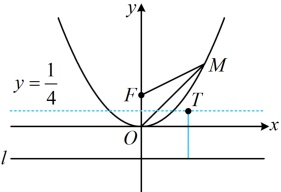
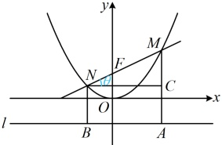

图1

图2

D 项，不妨先看直线 MN 倾斜角为锐角的情形， $ \overrightarrow{MF} = 2\overrightarrow{FN} $ 可翻译为  $ |MF| = 2|FN| $，涉及焦半径  $ |MF| $ 和  $ |FN| $，考虑过 M, N 向准线作垂线，联系抛物线定义处理，

如图2，过点M，N分别作 $ MA\perp l $于点A， $ NB\perp l $于点B，作 $ NC\perp MA $于点C，

因为  $ \overrightarrow{MF} = 2\overrightarrow{FN} $，所以可设  $ |NF| = |NB| = a $， $ |MF| = |MA| = 2a $，

则 $ \left|MN\right|=\left|MF\right|+\left|NF\right|=3a $， $ \left|MC\right|=\left|MA\right|-\left|CA\right|=\left|MA\right|-\left|NB\right|=2a-a=a $，

设直线 MN 的倾斜角为  $ \theta\left(0 < \theta < \frac{\pi}{2}\right) $，则  $ \angle MNC = \theta $，在  $ \triangle MNC $ 中， $ \left|NC\right| = \sqrt{\left|MN\right|^2 - \left|MC\right|^2} = \sqrt{9a^2 - a^2} = 2\sqrt{2}a $。所以  $ \tan \angle MNC = \frac{|MC|}{|NC|} = \frac{a}{2\sqrt{2}a} = \frac{\sqrt{2}}{4} $，又  $ \angle MNC = \theta $，所以  $ \tan \theta = \frac{\sqrt{2}}{4} $，故直线 MN 的斜率为  $ \frac{\sqrt{2}}{4} $，由图形的对称性，当直线 MN 倾斜角为钝角时，其斜率为  $ -\frac{\sqrt{2}}{4} $，所以直线 MN 的斜率为  $ \pm\frac{\sqrt{2}}{4} $，故 D 项正确。

答案：AD

【反思】由本题的 B 项可以推广出一个常见的结论，对于抛物线  $ x^2 = 2py (p > 0) $，若  $ M $， $ N $ 两点在抛物线上，且  $ OM \perp ON $，则直线  $ MN $ 过定点  $ (0, 2p) $。

## 强化训练

## A 组 夯实基础

1. (2025·北京卷)

抛物线  $ y^2 = 2px $ ( $ p > 0 $) 的顶点到焦点的距离为 3，则  $ p = $ ___.

2.（2025·四川成都模拟）

若抛物线的顶点在原点，关于 x 轴对称，且经过点  $ A(-1,2) $，则抛物线的标准方程为（）

A.  $ y^{2}=-4x $ B.  $ y^{2}=4x $

C.  $ x^{2}=4y $ D.  $ x^{2}=-4y $

3.（2025·河北模拟）

抛物线的顶点在原点，焦点在 y 轴上，抛物线上的点  $ P(m,1) $ 到其焦点 F 的距离为 3，则抛物线的标准方程为 ___.