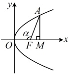
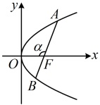
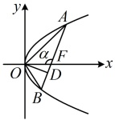

# 微专题5：抛物线常用二级结论

习题：P1

## 内容提要

抛物线有很多的二级结论，但其中很大一部分的应用频率较低，用得少，就难以记住，这部分结论本节不会涉及，我们只筛选出了一些在高考中比较常用的抛物线二级结论供大家学习，记住这些结论可适当缩短解题时间.

1. 角版焦半径、焦点弦、焦原三角形面积公式：设抛物线  $ y^{2}=2px(p>0) $ 的焦点为 F，O 为原点.

①焦半径公式：设 $ A $为抛物线上任意一点，记 $ \angle AFO = \alpha $，则焦半径 $ \left|AF\right| = \frac{p}{1 + \cos \alpha} $。

证明：作  $ AM \perp x $ 轴于 M，先考虑 M 在 F 右侧的情形，如图 1，

设  $ A(x_0, y_0) $，则  $ |FM| = x_0 - \frac{p}{2} $，又  $ |FM| = |AF| \cos \angle AFM = |AF| \cos(\pi - \alpha) = -|AF| \cos \alpha $，与上式比较可得  $ -|AF| \cos \alpha = x_0 - \frac{p}{2} $，另一方面，由坐标版焦半径公式知  $ |AF| = x_0 + \frac{p}{2} $，与上式作差消去  $ x_0 $ 整理得： $ |AF| = \frac{p}{1 + \cos \alpha} $；同理可证当  $ M $ 在  $ F $ 左侧或恰好与  $ F $ 重合时，都有  $ |AF| = \frac{p}{1 + \cos \alpha} $。

图1

图2

图3

②焦点弦公式：$AB$ 是抛物线的焦点弦，记 $\angle AFO = \alpha$，则 $|AB| = \frac{2p}{\sin^2 \alpha}$。

证明：如上图2，$\angle BFO = \pi - \alpha$，由①中的焦半径公式可得

 $$ \left|AF\right|=\frac{p}{1+\cos\alpha},\quad\left|BF\right|=\frac{p}{1+\cos(\pi-\alpha)}=\frac{p}{1-\cos\alpha}, $$ 

 $$  以 \left|AB\right|=\left|AF\right|+\left|BF\right|=\frac{p}{1+\cos\alpha}+\frac{p}{1-\cos\alpha}=\frac{p(1-\cos\alpha)+p(1+\cos\alpha)}{(1+\cos\alpha)(1-\cos\alpha)}=\frac{2p}{1-\cos^{2}\alpha}=\frac{2p}{\sin^{2}\alpha} $$ 

③焦原三角形（以焦点弦端点和原点为三个顶点的三角形）面积公式：设AB是抛物线的任意一条焦点弦，记 $ \angle AFO = \alpha $，则 $ S_{\triangle AOB} = \frac{p^2}{2\sin\alpha} $。

证明：如上图3，作 $ OD \perp AB $于 $ D $，则 $ |OD|=|OF|\cdot\sin\angle OFD=|OF|\cdot\sin(\pi-\alpha) $