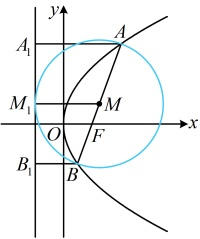
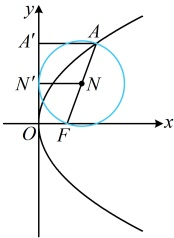

$$=|OF|\cdot\sin\alpha=\frac{p}{2}\cdot\sin\alpha\text{，}\text{由②中的焦点弦公式可得}\left|AB\right|=\frac{2p}{\sin^{2}\alpha}$$，所以$$S_{\triangle AOB}=\frac{1}{2}\left|AB\right|\cdot\left|OD\right|=\frac{1}{2}\cdot\frac{2p}{\sin^{2}\alpha}\cdot\frac{p}{2}\cdot\sin\alpha=\frac{p^{2}}{2\sin\alpha}$$。

注：②和③中的 $ \alpha $可由 $ \angle AFO $换成 $ \angle BFO $或AB的倾斜角，结果不变；但若 $ \alpha $统一取 $ \angle AFO $，则①②③中的结论对各种开口的抛物线都成立，这也是我们要把 $ \angle AFO $设为 $ \alpha $的原因。

2. 焦半径倒数和定值结论：设抛物线的焦点为 F，AB 是抛物线的一条焦点弦，则  $ \frac{1}{|AF|}+\frac{1}{|BF|}=\frac{2}{p} $.

证明：如上图2，由①中的焦半径公式， $ |AF|=\frac{p}{1+\cos\alpha} $， $ |BF|=\frac{p}{1+\cos(\pi-\alpha)}=\frac{p}{1-\cos\alpha} $，所以 $ \frac{1}{|AF|}+\frac{1}{|BF|}=\frac{1+\cos\alpha}{p}+\frac{1-\cos\alpha}{p}=\frac{2}{p} $。

3. 两个“神奇小圆”：以开口向右的抛物线  $ y^2 = 2px (p > 0) $ 为例，以焦点弦为直径的圆与准线相切，以焦半径为直径的圆与 y 轴相切。

证明：如图4，设AB为抛物线的一条焦点弦，M为AB的中点，作 $ AA_{1}\perp $准线于点 $ A_{1} $， $ MM_{1}\perp $准线于点 $ M_{1} $， $ BB_{1}\perp $准线于点 $ B_{1} $，则 $ \left|MM_{1}\right|=\frac{1}{2}(\left|AA_{1}\right|+\left|BB_{1}\right|)=\frac{1}{2}(\left|AF\right|+\left|BF\right|)=\frac{1}{2}|AB| $，所以圆心M到准线的距离等于圆的半径，故以抛物线的焦点弦为直径的圆与抛物线的准线相切；

如图5，设$A$为抛物线上一点，$N$为$AF$的中点，作$AA' \perp y$轴于点$A'$，$NN' \perp y$轴于点$N'$，则$|NN'| = \frac{1}{2}(|OF| + |AA'|) = \frac{1}{2}\left(\frac{p}{2} + |AF| - \frac{p}{2}\right) = \frac{1}{2}|AF|$，所以圆心$N$到$y$轴的距离等于圆的半径，故以抛物线的焦半径为直径的圆与$y$轴相切。

图4

图5

