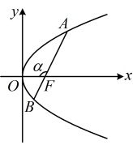

4. 抛物线的平均性质：设过  $ M(a,0) $ 的直线与抛物线  $ y^{2}=2px(p>0) $ 交于  $ A(x_{1},y_{1}) $， $ B(x_{2},y_{2}) $ 两点，则  $ x_{1}x_{2}=a^{2} $， $ y_{1}y_{2}=-2pa $ 。该性质的用法比较简单，下面不单独设计类型来举例，直接融入到各个类型中给出其使用方法的例子。

证明：因为 $A$，$B$ 都在抛物线 $y^2 = 2px$ 上，所以 $AB$ 不与 $y$ 轴垂直，可设其方程为 $x = my + a$，联立 $\begin{cases} x = my + a \\ y^2 = 2px \end{cases}$ 消去 $x$ 整理得：$y^2 - 2pmy - 2pa = 0$，由韦达定理，$y_1 y_2 = -2pa$，

所以 $ x_{1}x_{2}=\frac{y_{1}^{2}}{2p}\cdot\frac{y_{2}^{2}}{2p}=\left(\frac{y_{1}y_{2}}{2p}\right)^{2}=\left(\frac{-2pa}{2p}\right)^{2}=a^{2} $.

## 典型例题

## 类型Ⅰ：角版焦半径、焦点弦、焦原三角形面积公式、焦半径倒数和定值结论的应用

【例 1】过抛物线  $ C: y^2 = 2x $ 的焦点  $ F $ 的直线  $ l $ 与  $ C $ 交于  $ A, B $ 两点，若  $ |AF| = \frac{3}{2} $，则  $ |BF| = $ ___。

解法 1：已知  $ |AF| $，可由坐标聚焦半径公式求得点  $ A $ 的横坐标，结合抛物线的平均性质又能求得点  $ B $ 的横坐标， $ |BF| $ 也就有了，由题意，抛物线  $ C $ 的焦点为  $ F\left(\frac{1}{2}, 0\right) $， $ |AF| = x_A + \frac{1}{2} = \frac{3}{2} \Rightarrow x_A = 1 $，

由抛物线的平均性质， $ x_A x_B = \left(\frac{1}{2}\right)^2 = \frac{1}{4} $，所以  $ x_B = \frac{1}{4x_A} = \frac{1}{4} $，故  $ |BF| = x_B + \frac{1}{2} = \frac{3}{4} $。

解法 2：如图，已知  $ |AF| $，可由角聚焦半径公式求得  $ \cos\alpha $，并用于求  $ |BF| $，

在抛物线  $ C $ 中， $ p = 1 $，设  $ \angle AFO = \alpha $，则  $ |AF| = \frac{p}{1 + \cos\alpha} = \frac{1}{1 + \cos\alpha} = \frac{3}{2} $，所以  $ \cos\alpha = -\frac{1}{3} $，

故  $ |BF| = \frac{p}{1 + \cos(\pi - \alpha)} = \frac{1}{1 - \cos\alpha} = \frac{1}{1 - \left(-\frac{1}{2}\right)} = \frac{3}{4} $。

解法 3：已知  $ |AF| $ 求  $ |BF| $，也可用结论  $ \frac{1}{|AF|} + \frac{1}{|BF|} = \frac{2}{p} $，

由题意， $ p = 1 $，所以  $ \frac{1}{|AF|} + \frac{1}{|BF|} = \frac{2}{p} = 2 $，将  $ |AF| = \frac{3}{2} $ 代入可求得  $ |BF| = \frac{3}{4} $。

答案： $ \frac{3}{4} $

【反思】涉及抛物线的焦半径、焦点弦，常有以下几种考虑方向：①用坐标版焦半径公式处理，若知道焦点弦的一个端点坐标，则可结合抛物线的平均性质求另一端点的坐标；②用角版焦半径公式处理，此法不需要联立直线和抛物线的方程，比较方便；③用 $ \frac{1}{|AF|}+\frac{1}{|BF|}=\frac{2}{p} $建立方程，求解需要的量。下面我们来看几个变式。

【变式 1】过抛物线  $ C: y^2 = 4x $ 的焦点  $ F $ 的直线  $ l $ 与抛物线  $ C $ 交于  $ A $,  $ B $ 两点，若  $ |AF| = 4|BF| $，则  $ |AB| = $ ___.

解法1：由 $ |AF|=4|BF| $可用角版焦半径公式建立方程求得 $ \cos\alpha $，那么 $ |AB| $也就有了，抛物线C中，p=2，如图，设 $ \angle AFO=\alpha $，则由角版焦半径公式，