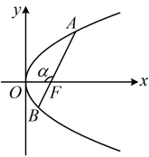
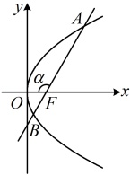

 $ |AF|=\frac{p}{1+\cos\alpha}=\frac{2}{1+\cos\alpha} $， $ |BF|=\frac{p}{1+\cos(\pi-\alpha)}=\frac{2}{1-\cos\alpha} $，

因为 $ |AF|=4|BF| $，所以 $ \frac{2}{1+\cos\alpha}=4\times\frac{2}{1-\cos\alpha} $，从而 $ \cos\alpha=-\frac{3}{5} $；

故由角版焦点弦公式， $ |AB|=\frac{2p}{\sin^2\alpha}=\frac{2p}{1-\cos^2\alpha}=\frac{2\times2}{1-\left(-\frac{3}{5}\right)^2}=\frac{25}{4} $。

解法2：已知 $ |AF|=4|BF| $，想到结合 $ \frac{1}{|AF|}+\frac{1}{|BF|}=\frac{2}{p} $也可求出 $ |AF| $和 $ |BF| $，从而求得 $ |AB| $，

由题意， $ \frac{1}{|AF|}+\frac{1}{|BF|}=\frac{2}{p}=1 $，结合 $ |AF|=4|BF| $可得 $ |AF|=5 $， $ |BF|=\frac{5}{4} $，所以 $ |AB|=|AF|+|BF|=5+\frac{5}{4}=\frac{25}{4} $。

答案： $ \frac{25}{4} $

【变式 2】过抛物线  $ C: y^2 = 2px (p > 0) $ 的焦点  $ F $ 的直线交抛物线  $ C $ 于  $ A $， $ B $ 两点，其中  $ A $ 在第一象限，若  $ |AF| = 3|BF| = 3 $，则直线  $ AB $ 的方程为（ ）

A.  $ y = \sqrt{2}x - 3 $ \quad B.  $ y = x - 1 $ \quad C.  $ y = \sqrt{3}x - \frac{3\sqrt{3}}{4} $ \quad D.  $ y = 2x - 3 $

解法1：所求为直线AB的方程，我们先把它设出来，直线AB过x轴上的点F，可考虑设横截式方程，

由题意， $ F\left(\frac{p}{2},0\right) $，因为直线AB过点F，且与抛物线C有2个交点，所以AB不与y轴垂直，

故可设直线AB的方程为 $ x=my+\frac{p}{2} $，求直线AB的方程就是求m和p，我们来翻译已知条件，建立方程。条件

涉及 $ |AF| $和 $ |BF| $，它们可用坐标版焦半径公式计算，故先设A，B的坐标，

设 $ A(x_1,y_1) $， $ B(x_2,y_2) $，则 $ |AF|=x_1+\frac{p}{2} $， $ |BF|=x_2+\frac{p}{2} $，由题意， $ |AF|=3|BF|=3 $，所以 $ \begin{cases}x_1+\frac{p}{2}=3\textcircled{1} \\ x_2+\frac{p}{2}=1\textcircled{2}\end{cases} $，

仅由①②无法求出需要的m和p，还需找其它方程，怎么找？可联立直线和抛物线的方程，写出韦达定理，

将 $ x=my+\frac{p}{2} $代入 $ y^2=2px $消去x整理得： $ y^2-2pmy-p^2=0 $， $ \Delta=(-2pm)^2-4\times1\times(-p^2)=4p^2(m^2+1)>0 $，

由韦达定理， $ \begin{cases}y_1+y_2=2pm\textcircled{3}\\y_1,y_2=-p^2\textcircled{4}\end{cases} $，涉及的变量较多，考虑消元，可先利用直线的方程消去①②中的 $ x_1 $， $ x_2 $，

将 $ x_1=my_1+\frac{p}{2} $和 $ x_2=my_2+\frac{p}{2} $分别代入①②得 $ \begin{cases}my_1+p=3\textcircled{5}\\my_2+p=1\textcircled{6}\end{cases} $，

所求为m和p，故考虑消去 $ y_1 $， $ y_2 $，观察发现由⑤⑥反解出 $ y_1 $， $ y_2 $，代入③④即可得到只含m，p的方程组，

因为 $ |AF|>|BF| $，且A在第一象限，所以如图，直线AB的斜率为正数，故 $ m>0 $，

由⑤⑥得 $ y_1=\frac{3-p}{m} $， $ y_2=\frac{1-p}{m} $，所以 $ y_1+y_2=\frac{4-2p}{m} $， $ y_1,y_2=\frac{p^2-4p+3}{m^2} $，

代入③④得 $ \left\{\begin{aligned}\frac{4-2p}{m}&=2pm\textcircled{7}\\ \frac{p^{2}-4p+3}{m^{2}}&=-p^{2}\textcircled{8}\end{aligned}\right. $，由⑦得 $ m^{2}=\frac{2-p}{p} $，

