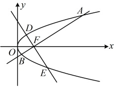

代入⑧得 $ \frac{p^2-4p+3}{\frac{2-p}{p}}=-p^2 $，解得： $ p=\frac{3}{2} $，所以 $ m^2=\frac{2-p}{p}=\frac{2-\frac{7}{2}}{\frac{3}{2}}=\frac{1}{3} $，

结合 $ m>0 $可得 $ m=\frac{\sqrt{3}}{3} $，故直线AB的方程为 $ x=\frac{\sqrt{3}}{3}y+\frac{3}{4} $，即 $ y=\sqrt{3}x-\frac{3\sqrt{3}}{4} $。

解法2：涉及 $ |AF| $和 $ |BF| $，也可考虑用角版焦半径公式计算它们，如图，设 $ \angle AFO=\alpha $，则 $ \angle BFO=\pi-\alpha $，

由角版焦半径公式， $ |AF|=\frac{p}{1+\cos\alpha} $， $ |BF|=\frac{p}{1+\cos(\pi-\alpha)}=\frac{p}{1-\cos\alpha} $，

由题意， $ |AF|=3|BF|=3 $，所以 $ \begin{cases}\frac{p}{1+\cos\alpha}=3\\\frac{p}{1-\cos\alpha}=1\end{cases} $，解得： $ \cos\alpha=-\frac{1}{2} $， $ p=\frac{3}{2} $，所以 $ \alpha=\frac{2\pi}{3} $， $ F\left(\frac{3}{4},0\right) $，

从而直线AB的倾斜角为 $ \pi-\alpha=\frac{\pi}{3} $，故其斜率 $ k=\tan\frac{\pi}{3}=\sqrt{3} $，

所以直线AB的方程为 $ y=\sqrt{3}\left(x-\frac{3}{4}\right) $，即 $ y=\sqrt{3}x-\frac{3\sqrt{3}}{4} $。

答案：C

【反思】涉及焦半径时，除了可用坐标版公式计算外，很多时候用角版的焦半径公式来计算更方便

【变式3】（2017·新课标Ⅰ卷）已知F为抛物线 $ C:y^{2}=4x $的焦点，过F作两条互相垂直的直线 $ l_{1} $， $ l_{2} $，直线 $ l_{1} $与C交于A，B两点，直线 $ l_{2} $与C交于D，E两点，则 $ |AB|+|DE| $的最小值为（ ）

A. 16

B. 14

C. 12

D. 10

解法1： $ |AB| $和 $ |DE| $都是焦点弦，故可联立直线和抛物线的方程，用坐标版的焦点弦公式计算它们，

由题意， $ F(1,0) $，两直线的斜率都存在且不为0，不妨设 $ l_1 $的方程为 $ y=k(x-1)(k\neq0) $，设 $ A(x_1,y_1) $， $ B(x_2,y_2) $，

联立 $ \begin{cases}y=k(x-1)\\y^2=4x\end{cases} $消去 $ y $整理得： $ k^2x^2-(2k^2+4)x+k^2=0 $，由韦达定理， $ x_1+x_2=\frac{2k^2+4}{k^2}=2+\frac{4}{k^2} $，

所以 $ |AB|=x_1+x_2+2=4+\frac{4}{k^2} $ ①，求 $ |DE| $要重复上述过程吗？其实不用，注意到直线 $ DE $与 $ AB $相比，仅斜率

变成了 $ -\frac{1}{k} $，其它都一样，故在求得的 $ |AB| $中将 $ k $换成 $ -\frac{1}{k} $，即得 $ |DE| $，

用 $ -\frac{1}{k} $代换①中的 $ k $得 $ |DE|=4+4k^2 $，所以 $ |AB|+|DE|=8+\frac{4}{k^2}+4k^2\geq8+2\sqrt{\frac{4}{k^2}\cdot4k^2}=16 $，

当且仅当 $ \frac{4}{k^2}=4k^2 $，即 $ k=\pm1 $时等号成立，故 $ |AB|+|DE| $的最小值为16.

解法2：两直线垂直，它们的倾斜角相差$90^\circ$，故也可引入角度为变量，用角版焦点弦公式算$|AB|$和$|DE|$，不妨设直线$l_1$的倾斜角为$\alpha$（$0 < \alpha < \frac{\pi}{2}$），则$l_2$的倾斜角为$\frac{\pi}{2} + \alpha$

所以 $ |AB|+|DE|=\frac{4}{\sin^{2}\alpha}+\frac{4}{\sin^{2}\left(\frac{\pi}{2}+\alpha\right)}=\frac{16}{\sin^{2}2\alpha}\geq16 $，

取等条件是  $ \alpha = \frac{\pi}{4} $，故  $ |AB| + |DE| $ 的最小值为 16.

答案：A