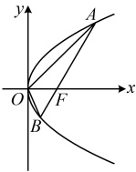

【变式 4】过抛物线  $ y^2 = 4x $ 的焦点  $ F $ 的直线交抛物线于  $ A $， $ B $ 两点，点  $ O $ 是原点，若  $ |AF| = 3 $，则  $ \triangle AOB $ 的面积为（ ）

A.  $ \frac{\sqrt{2}}{2} $  

B.  $ \sqrt{2} $  

C.  $ \frac{3\sqrt{2}}{2} $  

D.  $ 2\sqrt{2} $

解法 1：由  $ |AF| = 3 $ 可求得  $ A $ 的坐标，结合抛物线的平均性质又能得到  $ B $ 的坐标，

由题意， $ F(1,0) $， $ |AF| = x_A + 1 = 3 $，所以  $ x_A = 2 $，不妨设  $ A $ 在  $ x $ 轴上方，则  $ y_A = 2\sqrt{x_A} = 2\sqrt{2} $。

在抛物线中， $ p = 2 $，由抛物线的平均性质， $ y_A y_B = -2p \times 1 = -4 $，所以  $ y_B = -\frac{4}{y_A} = -\sqrt{2} $，

有了  $ A $， $ B $ 的纵坐标，如图，可将  $ \triangle AOB $ 拆分成上、下两个小三角形分别算面积，

由图可知， $ S_{\triangle AOB} = S_{\triangle AOF} + S_{\triangle BOF} = \frac{1}{2}|OF| \cdot |y_A| + \frac{1}{2}|OF| \cdot |y_B| = \frac{1}{2} \times 1 \times \left|2\sqrt{2}\right| + \frac{1}{2} \times 1 \times \left|-\sqrt{2}\right| = \frac{3\sqrt{2}}{2} $。

解法 2：由  $ |AF| = 3 $ 结合角版焦半径公式可求得  $ \angle AFO $，进而可按  $ S = \frac{p^2}{2\sin\alpha} $ 算面积，

如图，在抛物线中， $ p = 2 $，设  $ \angle AFO = \alpha $，则  $ |AF| = \frac{2}{1 + \cos\alpha} = 3 \Rightarrow \cos\alpha = -\frac{1}{3} $，

所以  $ \sin\alpha = \sqrt{1 - \cos^2\alpha} = \frac{2\sqrt{2}}{3} $，故  $ S_{\triangle AOB} = \frac{p^2}{2\sin\alpha} = \frac{4}{2 \times \frac{2\sqrt{2}}{3}} = \frac{3\sqrt{2}}{2} $。

答案：C

## 类型Ⅱ：两个“神奇小圆”的应用

【例2】已知抛物线  $ C: y^2 = 2px (p > 0) $ 的焦点为  $ F $，过  $ F $ 的直线  $ l $ 与  $ C $ 交于  $ A $， $ B $ 两点，若以  $ AB $ 为直径的圆与直线  $ x = -1 $ 相切，则  $ p = $ ___.

解法1：条件给出直线x=-1与以AB为直径的圆相切，可翻译为圆心到直线的距离等于半径，故先找圆心和半径，怎么找？圆心为AB中点，半径 $ r=\frac{1}{2}|AB| $，它们都可通过联立直线AB和抛物线，结合韦达定理计算，由题意， $ F\left(\frac{p}{2},0\right) $，直线l过点F，且与抛物线C交于A，B两点，所以l不与y轴垂直，

可设其方程为  $ x = my + \frac{p}{2} $，代入  $ y^2 = 2px $ 整理得： $ y^2 - 2pmy - p^2 = 0 $，判别式  $ \Delta = (-2pm)^2 - 4 \times 1 \times (-p^2) = 4p^2(m^2 + 1) > 0 $，设  $ A(x_1, y_1) $， $ B(x_2, y_2) $，则由韦达定理， $ y_1 + y_2 = 2pm $，

所以  $ x_1 + x_2 = my_1 + \frac{p}{2} + my_2 + \frac{p}{2} = m(y_1 + y_2) + p = 2pm^2 + p $，故  $ AB $ 中点为  $ M\left(\frac{2pm^2 + p}{2}, pm\right) $，

 $ |AB| = |AF| + |BF| = x_1 + \frac{p}{2} + x_2 + \frac{p}{2} = x_1 + x_2 + p = 2pm^2 + 2p $，所以圆  $ M $ 的半径  $ r = \frac{1}{2}|AB| = pm^2 + p $，

由题意，圆  $ M $ 与直线  $ x = -1 $ 相切，所以圆心到该直线的距离  $ d = r $，即  $ \frac{2pm^2 + p}{2} - (-1) = pm^2 + p \Rightarrow p = 2 $。

解法2：分析出按$d=r$来建立方程求$p$的过程同解法1，但我们不急于联立直线$l$和抛物线的方程，直接用$A$的坐标把$d=r$翻译出来，看能得到什么，需要联立直线和抛物线方程时，再联立，

设$A(x_1,y_1)$，$B(x_2,y_2)$，则$AB$中点为$M\left(\frac{x_1+x_2}{2},\frac{y_1+y_2}{2}\right)$，所以圆心$M$到直线$x=-1$的距离$d=\frac{x_1+x_2}{2}+1$，

以$AB$为直径的圆的半径$r=\frac{1}{2}|AB|=\frac{1}{2}(x_1+x_2+p)$，因为直线$x=-1$与该圆相切，所以$d=r$，