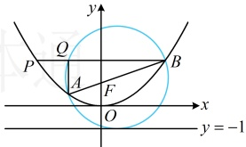

即 $ \frac{x_{1}+x_{2}}{2}+1=\frac{1}{2}(x_{1}+x_{2}+p) $，解得：p=2。

解法3：条件涉及以焦点弦AB为直径的圆，想到该圆与抛物线的准线相切的结论。

以抛物线C的焦点弦AB为直径的圆与准线 $ x=-\frac{p}{2} $相切，

又因为该圆与直线x=-1相切，所以x=-1即为准线，故 $ -\frac{p}{2}=-1 $，解得：p=2。

答案：2

【反思】遇到以抛物线的焦点弦为直径的圆时，要想到该圆与准线相切。有时题干不会明说该圆是以焦点弦为直径的圆，需要先进行分析才能发现，我们来看一个变式。

【变式】已知直线 $ l:y=-1 $，抛物线 $ C:x^2=4y $的焦点为 $ F $，过点 $ F $的直线交抛物线 $ C $于 $ A $， $ B $两点，点 $ B $关于 $ y $轴对称的点为 $ P $。若过点 $ A $， $ B $的圆与直线 $ l $相切，且与直线 $ PB $交于点 $ Q $，则当 $ \overrightarrow{QB}=3\overrightarrow{PQ} $时，直线 $ AB $的斜率为___。

解析：以抛物线焦点弦为直径的圆与准线相切，问题中 $l$ 是准线，$AB$ 是焦点弦，所以过 $A$，$B$ 且与 $l$ 相切的圆就是以 $AB$ 为直径的圆，故 $AQ \perp QB$，怎样处理 $\overrightarrow{QB} = 3\overrightarrow{PQ}$？可用它找 $Q$，$B$ 的坐标关系，由于 $AQ \perp QB$，所以 $Q$，$A$ 横坐标相等，故可得到 $A$，$B$ 的横坐标关系，

设 $A(x_1, y_1)$，$B(x_2, y_2)$，则 $P(-x_2, y_2)$，$Q(x_1, y_2)$，所以 $\overrightarrow{QB} = (x_2 - x_1, 0)$，$\overrightarrow{PQ} = (x_1 + x_2, 0)$，

设  $ A(x_1, y_1) $， $ B(x_2, y_2) $，则  $ P(-x_2, y_2) $， $ Q(x_1, y_2) $，所以  $ \overrightarrow{QB} = (x_2 - x_1, 0) $， $ \overrightarrow{PQ} = (x_1 + x_2, 0) $ 因为  $ \overrightarrow{QB} = 3\overrightarrow{PQ} $，所以  $ x_2 - x_1 = 3(x_1 + x_2) $，故  $ x_2 = -2x_1 $ ①，要求的是直线  $ AB $ 的斜率，故可考虑设该斜率，写出  $ AB $ 的方程，与抛物线联立，结合韦达定理建立关于  $ x_1 $， $ x_2 $ 和斜率的方程，由题意， $ F(0,1) $，由图可知直线  $ AB $ 斜率存在，可设其方程为  $ y = kx + 1 $，代入  $ x^2 = 4y $ 可得  $ x^2 - 4kx - 4 = 0 $，由韦达定理， $ x_1 + x_2 = 4k $， $ x_1x_2 = -4 $，将①代入上述两式化简得： $ x_1 = -4k $， $ x_1^2 = 2 $，所以  $ (-4k)^2 = 2 \Rightarrow k = \pm \frac{\sqrt{2}}{4} $。

答案： $ \pm\frac{\sqrt{2}}{4} $

【例 3】（2013·新课标Ⅱ卷）设抛物线  $ C: y^2 = 2px (p > 0) $ 的焦点为  $ F $，点  $ M $ 在  $ C $ 上， $ |MF| = 5 $，若以  $ MF $ 为直径的圆过点  $ (0,2) $，则  $ C $ 的方程为（ ）

A.  $ y^2 = 4x $ 或  $ y^2 = 8x $              B.  $ y^2 = 2x $ 或  $ y^2 = 8x $

C.  $ y^2 = 4x $ 或  $ y^2 = 16x $              D.  $ y^2 = 2x $ 或  $ y^2 = 16x $

解法1：题干所给的两个条件都容易用M的坐标来翻译，故考虑设M的坐标，建立方程组求p.方便起见，我们利用抛物线的方程把M的坐标设为单变量形式，

由题意， $ F\left(\frac{p}{2},0\right) $，记 $ T(0,2) $，设 $ M\left(\frac{y_0^2}{2p},y_0\right) $，则 $ \left|MF\right|=\frac{y_0^2}{2p}+\frac{p}{2}=5 $ ①，

如图，因为以 MF 为直径的圆过点  $ T(0,2) $，所以  $ TF \perp TM $，故  $ k_{TF} \cdot k_{TM} = \frac{0 - 2}{2} \cdot \frac{y_0 - 2}{2p} = -\frac{8(y_0 - 2)}{y_0^2} = -1 $ ②，

由②解得： $ y_{0}=4 $，代入①解得：p=2 或 8，所以抛物线 C 的方程为  $ y^{2}=4x $ 或  $ y^{2}=16x $