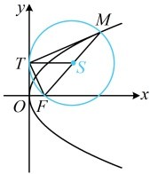

解法2：条件涉及以焦半径 $MF$ 为直径的圆，想到该圆与 $y$ 轴相切，故可由此出发分析，如图，以抛物线 $y^2 = 2px$ ($p > 0$) 的焦半径 $MF$ 为直径的圆与 $y$ 轴相切，$T(0,2)$ 为切点，设圆心为 $S$，则 $ST \perp y$ 轴，所以圆心 $S$ 的纵坐标为 2，

结合 $S$ 为 $FM$ 中点得 $y_M = 2y_T = 4$，所以 $x_M = \frac{y_M^2}{2p} = \frac{8}{p}$，故 $|MF| = \frac{8}{p} + \frac{p}{2}$，

又由题意，$|MF| = 5$，所以 $\frac{8}{p} + \frac{p}{2} = 5$，解得：$p = 2$ 或 8，

故抛物线 $C$ 的方程为 $y^2 = 4x$ 或 $y^2 = 16x$。

答案：C

【反思】遇到以抛物线  $ y^{2}=2px(p>0) $ 的焦半径为直径的圆时，要想到该圆与 y 轴相切.

## 强化训练

考虑到本节涉及的题型都有一定的综合性和难度，故不设 A 组题，只设计了 B 组和 C 组题.

B 组 强化能力

1.（2025·陕西模拟）

设抛物线  $ C: y = 4x^2 $ 的焦点为  $ F $，过焦点  $ F $ 的直线与抛物线  $ C $ 相交于  $ A $， $ B $ 两点，则  $ |AB| $ 的最小值为（ ）

A. 1 \quad B.  $ \frac{1}{2} $ \quad C.  $ \frac{1}{4} $ \quad D.  $ \frac{1}{8} $

## 一 数·高中数学一本通

2.（2025·四川南充模拟）

设 O 为原点，F 为抛物线 C:  $ y^{2}=4\sqrt{2}x $ 的焦点，P 为 C 上一点，若  $ \left|PF\right|=4\sqrt{2} $，则  $ \triangle POF $ 的面积为（）

A. 2 B.  $ 2\sqrt{2} $ C.  $ 2\sqrt{3} $ D. 4

设抛物线  $ C: y^{2}=4x $ 的焦点为 F，直线 l 过点 F 且与 C 交于 A，B 两点，若  $ \left|AF\right|=3\left|BF\right| $，则 l 的方程为（）

A. y = x - 1 或 y = -x + 1

B.  $ y = \frac{\sqrt{3}}{3}(x - 1) $ 或  $ y = -\frac{\sqrt{3}}{3}(x - 1) $

C.  $ y=\sqrt{3}(x-1) $ 或  $ y=-\sqrt{3}(x-1) $

D.  $ y=\frac{\sqrt{2}}{2}(x-1) $ 或  $ y=-\frac{\sqrt{2}}{2}(x-1) $