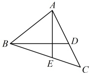
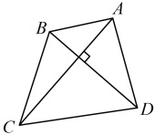

# 微专题6：解析几何大题——长度与面积

习题：P1

## 内容提要

解析几何大题虽然以计算为主，但我们要学会合理地翻译各种题设条件，才能让计算变得更加有效、高效。我们将通过4节来学习各种常见条件的翻译方法，本节主要介绍长度、面积这两类条件的翻译。

### 1. 弦长的计算方法

在前面 3.1.2 那节，我们已经给大家归纳过弦长公式，该公式由平面上两点间的距离公式推导而来，具有普适性，对椭圆、双曲线、抛物线等曲线都是适用的，具体计算时，有两种情况：

①当弦所在直线的方程以  $ y = kx + t $ 的形式设出时，可按  $ |AB| = \sqrt{1 + k^2} \cdot |x_1 - x_2| = \sqrt{1 + k^2} \cdot \frac{\sqrt{\Delta}}{|a|} $ 计算弦长  $ |AB| $，且若  $ A, B $ 的坐标容易获得，我们就选择  $ |AB| = \sqrt{1 + k^2} \cdot |x_1 - x_2| $ 算  $ |AB| $；若  $ A, B $ 的坐标不易获得，还可通过联立直线  $ AB $ 和椭圆（或双曲线、抛物线）的方程，消去  $ y $ 得到关于  $ x $ 的一元二次方程  $ ax^2 + bx + c = 0 (a \neq 0) $，此时由韦达定理推论， $ |x_1 - x_2| = \frac{\sqrt{\Delta}}{|a|} $，代入上述弦长公式  $ |AB| = \sqrt{1 + k^2} \cdot |x_1 - x_2| $ 可得  $ |AB| = \sqrt{1 + k^2} \cdot \frac{\sqrt{\Delta}}{|a|} $，于是可按此计算弦长，无需计算  $ A, B $ 的坐标。

②当弦所在直线的方程以  $ x = my + n $ 的形式设出时，与上面类似，可按  $ |AB| = \sqrt{1 + m^2} \cdot |y_1 - y_2| = \sqrt{1 + m^2} \cdot \frac{\sqrt{\Delta}}{|a|} $ 来计算弦长。

总之，在计算弦长之前，应先选择合适的设直线的方法，一般情况下，当直线过 y 轴上定点时，常设斜截式方程  $ y = kx + t $，当直线过 x 轴上定点时，常设横截式方程  $ x = my + n $，但请注意，这不是绝对，也有例外。设好直线后，再看是通过求  $ A $， $ B $ 的坐标来算弦长，还是不求坐标，结合韦达定理推论来求弦长。

2．面积的计算：算面积常伴随着算弦长，我们分三角形和四边形来归纳面积的计算方法.

①对于三角形面积的计算，最常见的方法有两种：

(i)  $ S = \frac{1}{2} \times $ 底  $ \times $ 高，在题干没有特殊条件的情况下，

常用此法算三角形的面积.

(ii)用“水平宽”或“铅垂高”算面积：如图1，

图1

 $$ S_{\triangle ABC}=\frac{1}{2}\left|AE\right|\cdot\left|x_{B}-x_{C}\right|=\frac{1}{2}\left|BD\right|\cdot\left|y_{A}-y_{C}\right|. $$ 

图2

