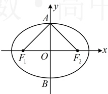
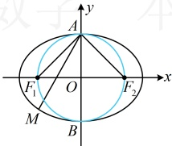

所以 $ \frac{1}{3}<m^2<3 $，且 $ \frac{1}{|AC|}+\frac{1}{|BD|}=\frac{3-m^2}{2\sqrt{3}(m^2+1)}+\frac{3m^2-1}{2\sqrt{3}(1+m^2)}=\frac{2(1+m^2)}{2\sqrt{3}(m^2+1)}=\frac{\sqrt{3}}{3} $，故 $ \frac{1}{|AC|}+\frac{1}{|BD|} $为定值 $ \frac{\sqrt{3}}{3} $。

【反思】①遇到同类对象（例如本题的 $ |AC| $和 $ |BD| $）时，严格计算其中一个，剩下的直接通过代换得到，这是解析几何中常用的降低计算量的方法；②当不方便求点的坐标时，常联立直线和曲线的方程，结合韦达定理推论来计算弦长公式中的 $ \left|x_1-x_2\right| $或 $ \left|y_1-y_2\right| $，如果点的坐标好算，那就直接用坐标算它们，比如下面的变式。

【变式】已知椭圆  $ C: \frac{x^{2}}{a^{2}} + \frac{y^{2}}{b^{2}} = 1 (a > b > 0) $ 的上、下顶点分别为  $ A, B $，左、右焦点分别为  $ F_{1}, F_{2} $，若  $ C $ 的离心率为  $ \frac{\sqrt{2}}{2} $， $ \triangle AF_{1}F_{2} $ 的面积为 2.

（1）求椭圆 C 的方程；

（2）设以  $ F_1F_2 $ 为直径的圆为圆  $ O $，过点  $ A $ 的直线  $ l $ 交椭圆  $ C $ 于另一点  $ M $，记  $ l $ 被圆  $ O $ 截得的弦长为  $ L $，求  $ \frac{L}{|AM|} $ 的取值范围。

解：（1）设椭圆的半焦距为  $ c $，由题意， $ A(0,b) $， $ B(0,-b) $，椭圆的离心率  $ e = \frac{c}{a} = \frac{\sqrt{2}}{2} $，所以  $ a = \sqrt{2}c $ ①，

如图1， $ S_{\triangle AF_1F_2} = \frac{1}{2}|F_1F_2| \cdot |AO| = \frac{1}{2} \times 2c \times b = bc $，又由题意， $ S_{\triangle AF_1F_2} = 2 $，所以  $ bc = 2 $ ②，

由①②结合  $ c^2 = a^2 - b^2 $ 可解得： $ a = 2 $， $ b = c = \sqrt{2} $，所以椭圆  $ C $ 的方程为  $ \frac{x^2}{4} + \frac{y^2}{2} = 1 $。

图1

图2

（2）（如图2，$L$ 是直线被圆截得的弦长，可按$L=2\sqrt{r^2-d^2}$ 计算，求其中的$d$ 需要直线$l$ 的方程，故先设该方程，直线$l$ 过$y$ 轴上的定点$A$，可设斜截式，下面先考虑斜率不存在的情况）

当直线$l$ 斜率不存在时，$l$ 与$y$ 轴重合，此时$L=\left|AM\right|=2b=2\sqrt{2}$，所以$\frac{L}{\left|AM\right|}=1$；

当直线$l$ 斜率存在时，由（1）得$A(0,\sqrt{2})$，所以可设$l:y=kx+\sqrt{2}$，即$kx-y+\sqrt{2}=0$，圆$O$ 的半径$r=\sqrt{2}$，原点$O$ 到$l$ 的距离$d=\frac{\left|\sqrt{2}\right|}{\sqrt{k^2+(-1)^2}}=\frac{\sqrt{2}}{\sqrt{k^2+1}}$，所以$L=2\sqrt{r^2-d^2}=2\sqrt{2-\frac{2}{k^2+1}}=2\sqrt{\frac{2k^2}{k^2+1}}=\frac{2\sqrt{2}\left|k\right|}{\sqrt{k^2+1}}$，

（再求$\left|AM\right|$，可用弦长公式$|AM|=\sqrt{1+k^2}\cdot\left|x_A-x_M\right|$ 来求，$x_A$ 是已知的，只差$x_M$。注意到直线$l$ 与椭圆的一个交点$A$ 已知，所以可通过联立直线$l$ 和椭圆的方程来求另一交点$M$ 的坐标）

联立$\begin{cases}y=kx+\sqrt{2}\\ \frac{x^2}{4}+\frac{y^2}{2}=1\end{cases}$ 消去$y$ 整理得：$(1+2k^2)x^2+4\sqrt{2}kx=0$，解得：$x=0$ 或 $-\frac{4\sqrt{2}k}{1+2k^2}$，

因为$x_A=0$，所以$x_M=-\frac{4\sqrt{2}k}{1+2k^2}$，故由弦长公式，$|AM|=\sqrt{1+k^2}\cdot\left|x_A-x_M\right|=\frac{4\sqrt{2}\left|k\right|\sqrt{1+k^2}}{1+2k^2}$，