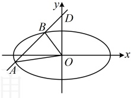

所以 $ \frac{L}{\left|AM\right|}=\frac{\frac{2\sqrt{2\left|k\right|}}{\sqrt{k^2+1}}}{\frac{4\sqrt{2\left|k\right|}\sqrt{1+k^2}}{1+2k^2}}=\frac{1+2k^2}{2(1+k^2)}=\frac{2(1+k^2)-1}{2(1+k^2)}=1-\frac{1}{2(1+k^2)} $ ③，

因为直线  $ l $ 与椭圆交于除  $ A $ 外的另一点  $ M $，所以  $ k\neq0 $，从而  $ 2(1+k^2)>2 $，故  $ 0<\frac{1}{2(1+k^2)}<\frac{1}{2} $，

所以  $ \frac{1}{2}<1-\frac{1}{2(1+k^2)}<1 $，结合③可得  $ \frac{1}{2}<\frac{L}{\left|AM\right|}<1 $；综上所述， $ \frac{L}{\left|AM\right|} $ 的取值范围是  $ \left(\frac{1}{2},1\right] $。

## 类型Ⅱ：面积的计算

【例 2】已知椭圆  $ C: \frac{x^{2}}{4} + y^{2} = 1 $，若直线  $ m: y = kx + n (k > 0, n > 0) $ 与椭圆 C 交于 A，B 两点，O 为坐标原点，且直线 OA，OB，AB 的斜率之和为 0，求  $ \triangle OAB $ 面积的最大值.

解法1：（条件给出 OA，OB，AB 的斜率之和为 0，计算 OA，OB 的斜率需要 A，B 的坐标，故先设坐标）

设  $ A(x_1,y_1) $， $ B(x_2,y_2) $，由题意， $ k_{OA} + k_{OB} + k_{AB} = \frac{y_1}{x_1} + \frac{y_2}{x_2} + k = \frac{x_1y_2 + x_2y_1}{x_1x_2} + k = 0 $ ①，

（涉及  $ x_1, x_2 $ 和  $ x_1, y_2 + x_2, y_1 $，想到联立直线  $ m $ 和椭圆的方程，结合韦达定理算它们）

联立  $ \begin{cases} y = kx + n \\ \frac{x^2}{4} + y^2 = 1 \end{cases} $ 消去  $ y $ 整理得： $ (1 + 4k^2)x^2 + 8knx + 4n^2 - 4 = 0 $，

判别式  $ \Delta = (8kn)^2 - 4(1 + 4k^2)(4n^2 - 4) = 16(4k^2 + 1 - n^2) > 0 $ ②，

由韦达定理， $ x_1 + x_2 = -\frac{8kn}{1 + 4k^2} $， $ x_1x_2 = \frac{4n^2 - 4}{1 + 4k^2} $ ③，

（忘种计异  $ x_1, y_2 + x_2, y_1 $ 可用且线的方程将  $ y_1 $， $ y_2 $ 换掉，转化为关于  $ x_1 $， $ x_2 $ 的式子，结合韦达定理计算

所以  $ x_1, y_2 + x_2, y_1 = x_1(kx_2 + n) + x_2(kx_1 + n) = 2kx_1x_2 + n(x_1 + x_2) = 2k \cdot \frac{4n^2 - 4}{1 + 4k^2} + n \cdot \left(-\frac{8kn}{1 + 4k^2}\right) = -\frac{8k}{1 + 4k^2} $ ④，

将③④代入①得  $ \frac{-\frac{8k}{1 + 4k^2}}{4n^2 - 4} + k = 0 $，化简得： $ n^2 = 3 $，结合  $ n > 0 $ 得  $ n = \sqrt{3} $，代入②可得  $ 4k^2 - 2 > 0 $，

（已知条件翻译完了，再来算  $ S_{\triangle OAB} $，可以 AB 为底，点 O 到直线 m 的距离为高，其中 |AB| 可由弦长公式计算）

由弦长公式， $ |AB| = \sqrt{1 + k^2} \cdot |x_1 - x_2| = \sqrt{1 + k^2} \cdot \frac{\sqrt{16(4k^2 + 1 - n^2)}}{|1 + 4k^2|} = \sqrt{1 + k^2} \cdot \frac{4\sqrt{4k^2 - 2}}{1 + 4k^2} $，

直线 m 的方程可化为  $ kx - y + n = 0 $，所以点 O 到直线 m 的距离  $ d = \frac{|n|}{\sqrt{k^2 + (-1)^2}} = \frac{\sqrt{3}}{\sqrt{k^2 + 1}} $，

故  $ S_{\triangle OAB} = \frac{1}{2}|AB| \cdot d = \frac{1}{2} \times \sqrt{1 + k^2} \cdot \frac{4\sqrt{4k^2 - 2}}{1 + 4k^2} \times \frac{\sqrt{3}}{\sqrt{k^2 + 1}} = \frac{2\sqrt{3} \cdot \sqrt{4k^2 - 2}}{1 + 4k^2} $，

（怎样求上式的最大值？分子的 $ \sqrt{4k^2-2} $可看成关于 $ k $的一次函数，分母为二次函数，涉及“ $ \frac{一次函数}{二次函数} $”，可考虑将“一次函数”换元成 $ t $，再上下同除以 $ t $处理）

令 $ t=\sqrt{4k^2-2} $，则 $ t>0 $，且 $ 4k^2=t^2+2 $，所以 $ S_{\triangle OAB}=\frac{2\sqrt{3}\cdot\sqrt{4k^2-2}}{1+4k^2}=\frac{2\sqrt{3}t}{1+t^2+2}=\frac{2\sqrt{3}t}{t^2+3}=\frac{2\sqrt{3}}{t+\frac{3}{t}}\leq\frac{2\sqrt{3}}{2\sqrt{t\cdot\frac{3}{t}}}=1 $，