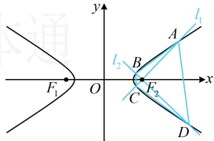

取等条件是 $ t=\frac{3}{t} $，即 $ t=\sqrt{3} $，所以 $ \triangle OAB $的面积的最大值为1.

解法2：（翻译 $ k_{OA}+k_{OB}+k_{AB}=0 $，得到 $ n=\sqrt{3} $的过程同解法1，对于 $ \triangle OAB $的面积，注意到直线 $ m $与 $ y $轴交于定点 $ D(0,\sqrt{3}) $，故也可用“水平宽”来计算）

记 $ D(0,\sqrt{3}) $，则 $ S_{\triangle OAB}=\left|S_{\triangle OAD}-S_{\triangle OBD}\right|=\left|\frac{1}{2}\left|OD\right|\cdot\left|x_{1}\right|-\frac{1}{2}\left|OD\right|\cdot\left|x_{2}\right|\right|=\frac{1}{2}\left|OD\right|\cdot\left\|x_{1}\right|-\left|x_{2}\right|=\frac{\sqrt{3}}{2}\left\|x_{1}\right|-\left|x_{2}\right| $ ⑤，

因为 $ x_{1}x_{2}=\frac{4n^{2}-4}{1+4k^{2}}=\frac{8}{1+4k^{2}}>0 $，所以 $ x_{1} $， $ x_{2} $同号，故 $ \left\|x_{1}\right\|-\left|x_{2}\right|=\left|x_{1}-x_{2}\right|=\frac{\sqrt{16(4k^{2}+1-n^{2})}}{\left|1+4k^{2}\right|}=\frac{4\sqrt{4k^{2}-2}}{1+4k^{2}} $，

代入⑤得 $ S_{\triangle OAB}=\frac{\sqrt{3}}{2}\times\frac{4\sqrt{4k^{2}-2}}{1+4k^{2}}=\frac{2\sqrt{3}\cdot\sqrt{4k^{2}-2}}{1+4k^{2}} $，接下来同解法1.

【反思】按“ $ S=\frac{1}{2}\times底\times高 $”算面积，以及利用“水平宽”或“铅垂高”算面积，是两种最常用的计算三角形面积的方法，其中的“底”常用弦长公式计算。若是四边形的面积，又怎么算呢？我们来看下面的两道题。

【例3】设双曲线  $ E:\frac{x^{2}}{3}-y^{2}=1 $ 的左、右焦点分别为  $ F_{1} $， $ F_{2} $，过  $ F_{2} $ 作两条互相垂直的直线  $ l_{1} $ 和  $ l_{2} $，与 E 的右支分别交于 A，C 两点和 B，D 两点，求四边形 ABCD 面积的最小值.

解：（如图，四边形  $ ABCD $ 的对角线  $ AC $ 与  $ BD $ 互相垂直，可按  $ S = \frac{1}{2}|AC| \cdot |BD| $ 算面积，下面我们给出这一算式的详细推导过程）由题意， $ AC \perp BD $，所以四边形  $ ABCD $ 的面积  $ S = S_{\triangle ABC} + S_{\triangle ADC} $

 $$ \begin{aligned}=\frac{1}{2}\big|AC\big|\cdot\big|BF_{2}\big|+\frac{1}{2}\big|AC\big|\cdot\big|DF_{2}\big|=\frac{1}{2}\big|AC\big|\cdot\big(\big|BF_{2}\big|+\big|DF_{2}\big|\big)=\frac{1}{2}\big|AC\big|\cdot\big|BD\big|\end{aligned} $$ 

（故核心是计算$|AC|$和$|BD|$，这在本节例1已经算过，此处不再赘述）

由本节例1可知，$|AC|=\frac{2\sqrt{3}(m^2+1)}{3-m^2}$，$|BD|=\frac{2\sqrt{3}(1+m^2)}{3m^2-1}$，且$\frac{1}{3}<m^2<3$，

所以$S=\frac{1}{2}\cdot\frac{2\sqrt{3}(m^2+1)}{3-m^2}\cdot\frac{2\sqrt{3}(1+m^2)}{3m^2-1}=\frac{6(m^2+1)^2}{(3-m^2)(3m^2-1)}=\frac{6(m^2+1)^2}{10m^2-3-3m^4}$，

（怎样求上式的最小值？观察发现分子为平方式，若将$m^2+1$换元成$t$，则分子可以进一步简化，故按此处理）

令$t=m^2+1$，则$\frac{4}{3}<t<4$，且$m^2=t-1$，所以$S=\frac{6t^2}{10(t-1)-3-3(t-1)^2}=\frac{6t^2}{16t-16-3t^2}=\frac{6}{\frac{16}{t}-\frac{16}{t^2}-3}$

$=\frac{6}{-16\left(\frac{1}{t}-\frac{1}{2}\right)^2+1}$，故当$t=2$时，$S$取得最小值$6$。

【反思】当四边形 $ABCD$ 的对角线互相垂直时，其面积可按 $S = \frac{1}{2}|AC| \cdot |BD|$ 来算。若对角线不垂直，又如何求四边形的面积呢？我们来看下面的变式。

【变式】已知椭圆  $ C:\frac{x^{2}}{a^{2}}+\frac{y^{2}}{b^{2}}=1(a>b>0) $ 的离心率为  $ \frac{\sqrt{3}}{2} $，且过点  $ \left(1,\frac{\sqrt{3}}{2}\right) $.

（1）求椭圆 C 的方程；

（2）若斜率为 $ \frac{1}{2} $的直线l与椭圆C交于M，N两点，且M在第一象限，点A，B分别为椭圆C的右顶点和上顶点，求四边形AMBN的面积S的最大值.