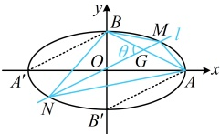

解：（1）由题意，椭圆  $ C $ 的离心率  $ e = \frac{\sqrt{a^2 - b^2}}{a} = \frac{\sqrt{3}}{2} $，化简得： $ a = 2b $，所以椭圆的方程可化为  $ \frac{x^2}{4b^2} + \frac{y^2}{b^2} = 1 $，又因为椭圆  $ C $ 过点  $ \left(1, \frac{\sqrt{3}}{2}\right) $，所以  $ \frac{1}{4b^2} + \frac{3}{4b^2} = 1 $，从而  $ b = 1 $， $ a = 2b = 2 $，故椭圆  $ C $ 的方程为  $ \frac{x^2}{4} + y^2 = 1 $。

（2）解法1：（显然四边形$AMBN$的对角线不垂直，如何算其面积？可考虑以对角线$MN$为分割线，将四边形$AMBN$分割成$\triangle AMN$和$\triangle BMN$分别算面积，下面先用弦长公式算两个三角形的公共底边长$|MN|$）

因为直线$l$的斜率为$\frac{1}{2}$，所以可设$l: y=\frac{1}{2}x+m$，即$x-2y+2m=0$，设$M(x_1, y_1)$，$N(x_2, y_2)$，

将$y=\frac{1}{2}x+m$代入$\frac{x^2}{4}+y^2=1$整理得：$x^2+2mx+2m^2-2=0$，

判别式  $ \Delta = (2m)^2 - 4 \times 1 \times (2m^2 - 2) = 8 - 4m^2 > 0 $， $ -\sqrt{2} < m < \sqrt{2} $，（这是  $ m $ 的准确范围）

范围吗？题干规定了  $ M $ 在第一象限，这对  $ m $ 是有限制的，所以还需翻译它）

由（1）得  $ B(0,1) $， $ A(2,0) $，设椭圆  $ C $ 的左顶点为  $ A'(-2,0) $，

下顶点为  $ B'(0,-1) $，则  $ k_{AB'} = \frac{1-0}{0-(2)} = \frac{1}{2} $， $ k_{AB'} = \frac{-1-0}{0-2} = \frac{1}{2} $，

所以要使  $ l $ 与椭圆  $ C $ 的交点  $ M $ 在第一象限，直线  $ l $ 应介于  $ AB' $ 和  $ A'B $ 之间，故  $ l $ 在  $ y $ 轴上的截距  $ m \in (-1,1) $，

由弦长公式， $ \left|MN\right| = \sqrt{1 + \left(\frac{1}{2}\right)^2} \cdot \left|x_1 - x_2\right| = \frac{\sqrt{5}}{2} \cdot \frac{\sqrt{8 - 4m^2}}{|1|} = \sqrt{5(2 - m^2)} $，

点  $ A $， $ B $ 到直线  $ l $ 的距离分别为  $ d_1 = \frac{\left|2 - 2 \times 0 + 2m\right|}{\sqrt{1^2 + (-2)^2}} = \frac{\left|2 + 2m\right|}{\sqrt{5}} $， $ d_2 = \frac{\left|0 - 2 \times 1 + 2m\right|}{\sqrt{1^2 + (-2)^2}} = \frac{|2m - 2|}{\sqrt{5}} $，

结合  $ m \in (-1,1) $ 可得  $ d_1 = \frac{2 + 2m}{\sqrt{5}} $， $ d_2 = \frac{2 - 2m}{\sqrt{5}} $，所以四边形  $ AMBN $ 的面积  $ S = S_{\triangle AMN} + S_{\triangle BMN} $

 $ = \frac{1}{2} \left|MN\right| \cdot d_1 + \frac{1}{2} \left|MN\right| \cdot d_2 = \frac{1}{2} \left|MN\right| \cdot \left(d_1 + d_2\right) = \frac{1}{2} \sqrt{5(2 - m^2)} \cdot \left(\frac{2 + 2m}{\sqrt{5}} + \frac{2 - 2m}{\sqrt{5}}\right) = 2\sqrt{2 - m^2} \leq 2\sqrt{2} $，

取等条件是 m=0，所以四边形 AMBN 的面积 S 的最大值为  $ 2\sqrt{2} $.

解法2：（能否像上面例3那样利用对角线MN和AB来求四边形AMBN的面积S？也可以，观察图形可发现对角线AB与MN所形成的4个角相等或互补，它们的正弦值都相等，且在本题的条件下，该正弦值可求，故可尝试将四边形AMBN按对角线分割成4个小三角形，并利用对角线形成的角来算面积）

如图，设 MN 与 AB 交于点 G，设  $ \angle BGN = \theta $，则  $ \angle AGM = \theta $， $ \angle BGM = \angle AGN = \pi - \theta $，

所以  $ \sin \angle BGM = \sin \angle AGN = \sin (\pi - \theta) = \sin \theta $，故四边形 AMBN 的面积  $ S = S_{\triangle AGM} + S_{\triangle AGN} + S_{\triangle BGM} + S_{\triangle BGN} = \frac{1}{2} |AG| \cdot |GM| \cdot \sin \angle AGM + \frac{1}{2} |AG| \cdot |GN| \cdot \sin \angle AGN + \frac{1}{2} |BG| \cdot |GM| \cdot \sin \angle BGM + \frac{1}{2} |BG| \cdot |GN| \cdot \sin \angle BGN $

 $ = \frac{1}{2} |AG| \cdot |GM| \cdot \sin \theta + \frac{1}{2} |AG| \cdot |GN| \cdot \sin \theta + \frac{1}{2} |BG| \cdot |GM| \cdot \sin \theta + \frac{1}{2} |BG| \cdot |GN| \cdot \sin \theta $

 $ = \frac{1}{2} |AG| \cdot |GM| \cdot \sin \theta + \frac{1}{2} |AG| \cdot |GN| \cdot \sin \theta + \frac{1}{2} |BG| \cdot |GM| \cdot \sin \theta + \frac{1}{2} |BG| \cdot |GN| \cdot \sin \theta $

 $ = \frac{1}{2} |AG| \cdot (|GM| + |GN|) \cdot \sin \theta + \frac{1}{2} |BG| \cdot (|GM| + |GN|) \cdot \sin \theta = \frac{1}{2} |AG| \cdot |MN| \cdot \sin \theta + \frac{1}{2} |BG| \cdot |MN| \cdot \sin \theta $

 $ = \frac{1}{2} (|AG| + |BG|) \cdot |MN| \cdot \sin \theta = \frac{1}{2} |AB| \cdot |MN| \cdot \sin \theta = \frac{\sqrt{5}}{2} |MN| \cdot \sin \theta $ ①，

（求得  $ |MN| = \sqrt{5(2 - m^2)} $ 的过程同解法 1，此处不再赘述，怎样求  $ \sin \theta $？观察图形可发现，容易获得  $ BA $ 和直线  $ l $ 的方向向量的坐标，故可先由这两个向量用夹角余弦公式算  $ \cos \theta $，再求  $ \sin \theta $）

因为直线  $ l $ 的斜率为  $ \frac{1}{2} $，所以  $ l $ 的一个方向向量为  $ \boldsymbol{u} = (2,1) $，

又  $ \overrightarrow{BA} = (2,-1) $，所以  $ \cos \theta = |\cos \langle \boldsymbol{u}, \overrightarrow{BA} \rangle| = \frac{|\boldsymbol{u} \cdot \overrightarrow{BA}|}{|\boldsymbol{u}| \cdot |\overrightarrow{BA}|} = \frac{|2 \times 2 + 1 \times (-1)|}{\sqrt{2^2 + 1^2} \times \sqrt{2^2 + (-1)^2}} = \frac{3}{5} $，故  $ \sin \theta = \sqrt{1 - \cos^2 \theta} = \frac{4}{5} $，