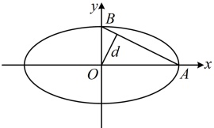
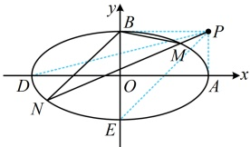

（2）过点  $ P(2,1) $ 的直线 l 与椭圆 C 交于 M, N 两点，其中点 M 在第一象限，点 N 在 x 轴下方且不在 y 轴上，设直线 BM，BN 的斜率分别为  $ k_1 $， $ k_2 $，求证： $ \frac{1}{k_1} + \frac{1}{k_2} $ 为定值，并求出该定值.

解：（1）由题意，椭圆 C 的离心率  $ e = \frac{c}{a} = \frac{\sqrt{a^{2} - b^{2}}}{a} = \frac{\sqrt{3}}{2} $，化简得：a = 2b ①，

（求 $a$，$b$ 还差 1 个方程，题干还给出了 $O$ 到直线 $AB$ 的距离，如图 1，该距离即为 $\text{Rt}\triangle AOB$ 斜边上的高，可由“等面积法”计算，结果用 $a$，$b$ 表示，故由此能建立第二个方程）

由题意，$O$ 到直线 $AB$ 的距离 $d = \frac{2\sqrt{5}}{5}$，因为 $S_{\triangle AOB} = \frac{1}{2}|OA| \cdot |OB| = \frac{1}{2}|AB| \cdot d$，故 $|OA| \cdot |OB| = |AB| \cdot d$，

又 $|OA| = a$，$|OB| = b$，$|AB| = \sqrt{a^2 + b^2}$，所以 $ab = \sqrt{a^2 + b^2} \cdot \frac{2\sqrt{5}}{5}$，结合式①解得：$b=1$，$a=2$，

所以椭圆 $C$ 的标准方程为 $\frac{x^2}{4} + y^2 = 1$。

（2）（表示 $ k_{1} $， $ k_{2} $需要M，N的坐标，故先设坐标）设 $ M(x_{1},y_{1}) $， $ N(x_{2},y_{2}) $，由（1）可得 $ B(0,1) $，所以 $ k_{1}=\frac{y_{1}-1}{x_{1}} $， $ k_{2}=\frac{y_{2}-1}{x_{2}} $，故 $ \frac{1}{k_{1}}+\frac{1}{k_{2}}=\frac{x_{1}}{y_{1}-1}+\frac{x_{2}}{y_{2}-1} $②，

（上式关于  $ x_{1} $ 和  $ x_{2} $， $ y_{1} $ 和  $ y_{2} $ 的结构是对称的，可以想象，若将其通分，应该可以化出包含  $ x_{1}+x_{2} $， $ x_{1}x_{2} $ 等系数对称的可用韦达定理计算的结构，故考虑设直线 l 的方程，并与椭圆联立）

如图2，直线$l$过点$P(2,1)$与椭圆$C$交于$M,N$两点，则直线$l$的斜率存在，可设其方程为$y-1=k(x-2)$，即$y=kx+1-2k$，记椭圆的左顶点为$D(-2,0)$，下顶点为$E(0,-1)$，

因为$M$在第一象限，$N$在$x$轴下方且不在$y$轴上，所以$k>k_{PD}=\frac{1-0}{2-(-2)}=\frac{1}{4}$，且$k\neq k_{PE}=\frac{1-(-1)}{2-0}=1$，

联立$\begin{cases}y=kx+1-2k\\\dfrac{x^2}{4}+y^2=1\end{cases}$消去$y$整理得：$(4k^2+1)x^2-(16k^2-8k)x+16k^2-16k=0$，

由韦达定理， $ x_{1}+x_{2}=\frac{16k^{2}-8k}{4k^{2}+1} $， $ x_{1}x_{2}=\frac{16k^{2}-16k}{4k^{2}+1} $，

由②可知 $ \frac{1}{k_1}+\frac{1}{k_2}=\frac{x_1}{y_1-1}+\frac{x_2}{y_2-1}=\frac{x_1}{k(x_1-2)}+\frac{x_2}{k(x_2-2)}=\frac{1}{k}\left(\frac{x_1-2+2}{x_1-2}+\frac{x_2-2+2}{x_2-2}\right)=\frac{1}{k}\left(1+\frac{2}{x_1-2}+1+\frac{2}{x_2-2}\right) $

 $ =\frac{1}{k}\left[2+\frac{2(x_2-2)+2(x_1-2)}{(x_1-2)(x_2-2)}\right]=\frac{1}{k}\left[2+\frac{2(x_1+x_2)-8}{x_1x_2-2(x_1+x_2)+4}\right]=\frac{1}{k}\left(2+\frac{2\cdot\frac{16k^2-8k}{4k^2+1}-8}{\frac{16k^2-16k}{4k^2+1}-2\cdot\frac{16k^2-8k}{4k^2+1}+4}\right) $

 $ =\frac{1}{k}\left[2+\frac{32k^2-16k-8(4k^2+1)}{16k^2-16k-2(16k^2-8k)+4(4k^2+1)}\right]=\frac{1}{k}\left(2+\frac{-16k-8}{4}\right)=\frac{1}{k}\cdot(-4k)=-4 $，所以 $ \frac{1}{k_1}+\frac{1}{k_2} $为定值 $ -4 $。

图1

图2

【反思】解决证明类定值问题，核心是选择合适的设法（设点或设线）来计算目标量。本题只需设斜率 k 这一个变量，就能证明目标量为定值，有时可能需要设两个变量，此时就得利用已知条件建立变量间的关系，并用该关系化简目标量，才能证明目标量为定值，我们来看一个变式。