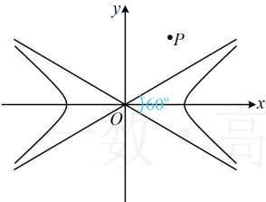
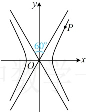
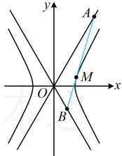

【变式】已知双曲线  $ E:\frac{x^{2}}{a^{2}}-\frac{y^{2}}{b^{2}}=1(a>0,b>0) $ 的两条渐近线所成的锐角为  $ 60^{\circ} $，且点  $ P(2,3) $ 为 E 上一点.

（1）求双曲线E的方程；

（2）设 M 为 E 在第一象限的动点，过 M 的直线与 E 恰有一个公共点，且分别与 E 的两条渐近线交于点 A 和 B，设 O 为原点，证明： $ \triangle AOB $ 的面积为定值，并求此定值.

解：（1）（条件给出双曲线的两条渐近线所成的角，有如图1和图2所示的两种情况，故讨论）

双曲线  $ E $ 的两条渐近线所成的锐角为  $ 60^\circ $，渐近线只能为  $ y = \pm \frac{\sqrt{3}}{3}x $ 或  $ y = \pm \sqrt{3}x $，

若双曲线  $ E $ 的渐近线为  $ y = \pm \frac{\sqrt{3}}{3}x $，注意到点  $ P(2,3) $ 在  $ y = \frac{\sqrt{3}}{3}x $ 的上方，

而双曲线 $E$ 的焦点在 $x$ 轴上，所以双曲线 $E$ 不可能过点 $P$，故双曲线 $E$ 的渐近线为 $y = \pm \sqrt{3}x$，故 $\frac{b}{a} = \sqrt{3}$ ①，

又双曲线 $E$ 过点 $P(2,3)$，所以 $\frac{4}{a^2} - \frac{9}{b^2} = 1$，结合①解得：$a = 1$，$b = \sqrt{3}$，故双曲线 $E$ 的方程为 $x^2 - \frac{y^2}{3} = 1$。

图1

图2

图3

（2）（如图3，已有$\angle AOB$，只需求出$|OA|$和$|OB|$，就能计算$S_{\triangle AOB}$，而求$|OA|$和$|OB|$需要$A$，$B$的坐标，故考虑设出双曲线的切线方程，与两条渐近线联立求$A$，$B$的坐标）

因为点 $M$ 在第一象限，双曲线 $E$ 在点 $M$ 处的切线斜率存在，所以可设直线 $AB$ 的方程为 $y = kx + m (k > \sqrt{3})$，联立 $\begin{cases} y = kx + m \\ y = \sqrt{3}x \end{cases}$ 解得：$x = \frac{m}{\sqrt{3} - k}$，所以 $x_A = \frac{m}{\sqrt{3} - k}$，故由弦长公式，$|OA| = \sqrt{1 + (\sqrt{3})^2} \cdot \left| \frac{m}{\sqrt{3} - k} - 0 \right| = 2 \left| \frac{m}{\sqrt{3} - k} \right|$，联立 $\begin{cases} y = kx + m \\ y = -\sqrt{3}x \end{cases}$ 解得：$x = -\frac{m}{\sqrt{3} + k}$，所以 $x_B = -\frac{m}{\sqrt{3} + k}$，故 $|OB| = \sqrt{1 + (-\sqrt{3})^2} \cdot \left| -\frac{m}{\sqrt{3} + k} - 0 \right| = 2 \left| \frac{m}{\sqrt{3} + k} \right|$，所以 $S_{\triangle AOB} = \frac{1}{2} |OA| \cdot |OB| \cdot \sin \angle AOB = \frac{1}{2} \times 2 \left| \frac{m}{\sqrt{3} - k} \right| \cdot 2 \left| \frac{m}{\sqrt{3} + k} \right| \times \sin 120^\circ = \sqrt{3} \cdot \left| \frac{m^2}{3 - k^2} \right|$ ②，

（表面上看式②不是定值，但别忘了，直线 AB 与双曲线 E 相切，翻译此条件可建立 k 与 m 的关系，将该关系代入式②消元，也许就能得到式②为定值了）

联立 $ \begin{cases} y = kx + m \\ 3x^2 - y^2 = 3 \end{cases} $消去 y 整理得： $ (3 - k^2)x^2 - 2kmx - m^2 - 3 = 0 $，

因为直线  $ AB $ 与双曲线  $ E $ 相切，所以判别式  $ \Delta = 4k^2m^2 - 4(3 - k^2)(-m^2 - 3) = 0 $，整理得： $ m^2 = k^2 - 3 $ ③，将式③代入式②可得  $ S_{\triangle AOB} = \sqrt{3} \cdot \left| \frac{k^2 - 3}{3 - k^2} \right| = \sqrt{3} $，所以  $ \triangle AOB $ 的面积为定值  $ \sqrt{3} $。

类型Ⅱ：探究类定值问题