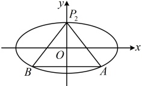
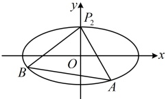

代入②得  $ k_{P_{2}A} + k_{P_{2}B} = \frac{2m \cdot \frac{t^{2} - 4}{m^{2} + 4} + (t - m) \left( -\frac{2mt}{m^{2} + 4} \right) - 2t}{\frac{4t^{2} - 4m^{2}}{m^{2} + 4}} = \frac{2mt^{2} - 8m - 2mt^{2} + 2m^{2}t - 2m^{2}t - 8t}{4t^{2} - 4m^{2}}} $

 $ = -\frac{2(m + t)}{t^{2} - m^{2}} = -\frac{2(m + t)}{(t - m)(t + m)} = \frac{2}{m - t} $，由题意， $ k_{P_{2}A} + k_{P_{2}B} = -1 $，所以  $ \frac{2}{m - t} = -1 $，故  $ t = m + 2 $，

代入③得  $ m < 0 $，又  $ t \neq -m $，所以  $ m \neq -1 $，故  $ m \in (-\infty, -1) \cup (-1, 0) $，

所以直线  $ l $ 的方程为  $ x = my + m + 2 $，即  $ x = m(y + 1) + 2 $，故直线  $ l $ 过定点  $ (2, -1) $。

图1

图2

解法2：（解法1中计算 $ k_{P_{2}A}+k_{P_{2}B} $比较麻烦，能否简化？我们知道，若能在联立直线l和椭圆C的方程时，将其化为 $ p\left(\frac{y-1}{x}\right)^{2}+q\frac{y-1}{x}+r=0 $这种关于 $ \frac{y-1}{x} $的一元二次方程，就能直接用韦达定理计算 $ \frac{y_{1}-1}{x_{1}}+\frac{y_{2}-1}{x_{2}} $，故按此尝试.既然我们需要的是 $ \frac{y-1}{x} $这一结构，那在椭圆和直线l的方程中，都把y凑成y-1）

设出 $A$，$B$ 的坐标、直线 $l$ 的方程为 $x = my + t$ 和得到 $k_{P_2A} + k_{P_2B} = \frac{y_1 - 1}{x_1} + \frac{y_2 - 1}{x_2}$ 的过程同解法 $1$，此处不再赘述，直线 $l$ 的方程可化为 $x = m(y - 1) + t + m$，即 $x - m(y - 1) = t + m$ ④，

椭圆 $C$ 的方程可化为 $\frac{x^2}{4} + [(y - 1) + 1]^2 = 1$，将平方展开整理得：$4(y - 1)^2 + 8(y - 1) + x^2 = 0$ ⑤，

（可以想象，若能将式⑤化为形如  $ p(y-1)^2 + qx(y-1) + rx^2 = 0 $ 的关于 x 和 y-1 的二次齐次式，就能通过同除以  $ x^2 $ 得到关于  $ \frac{y-1}{x} $ 的一元二次方程  $ p\left(\frac{y-1}{x}\right)^2 + q \cdot \frac{y-1}{x} + r = 0 $，怎么化？观察发现式⑤只有中间的  $ 8(y-1) $ 这一项不是二次的，故考虑将它化为二次的，可利用直线的方程来实现）

在⑤两端乘以  $ t+m $ 得  $ 4(t+m)(y-1)^{2}+8(t+m)(y-1)+(t+m)x^{2}=0 $ ⑥，

由④得  $ t + m = x - m(y - 1) $，用它替换式⑥里  $ 8(t + m)(y - 1) $ 这一项中的  $ t + m $ 得

 $ 4(t+m)(y-1)^{2}+8[x-m(y-1)](y-1)+(t+m)x^{2}=0 $，化简得： $ 4(t-m)(y-1)^{2}+8x(y-1)+(t+m)x^{2}=0 $，

两端同除以  $ x^{2} $ 得  $ 4(t-m)\left(\frac{y-1}{x}\right)^{2}+8\cdot\frac{y-1}{x}+t+m=0 $ ⑦，

因为 A，B 是直线 l 与椭圆 C 的两个交点，所以 A，B 的坐标满足方程⑦，即  $ 4(t-m)\left(\frac{y_{1}-1}{x_{1}}\right)^{2}+8\cdot\frac{y_{1}-1}{x_{1}}+t+m=0 $ 且  $ 4(t-m)\left(\frac{y_{2}-1}{x_{2}}\right)^{2}+8\cdot\frac{y_{2}-1}{x_{2}}+t+m=0 $。所以  $ \frac{y_{1}-1}{x_{1}} $ 和  $ \frac{y_{2}-1}{x_{2}} $ 是上述关于  $ \frac{y-1}{x} $ 的一元二次方程⑦的两个不相等的实根，故由韦达定理， $ \frac{y_{1}-1}{x_{1}}+\frac{y_{2}-1}{x_{2}}=-\frac{8}{4(t-m)}=\frac{2}{m-t} $，接下来同解法 1.

【反思】①对于直线过定点问题，当容易设直线方程处理时，可考虑设直线的方程，翻译已知条件，寻找所设方程中参数的关系，从而找到直线所过的定点。有时也会遇到不方便设直线方程的情况，比如下面的变式；②定点问题与定值问题有着天然的联系。例如本题若将条件和结论互换，变成已知过点 $ (2,-1) $的直线与椭圆交于A，B两点，让证明 $ P_{2}A $与 $ P_{2}B $的斜率之和为定值，它就变成了一道典型的定值问题；

③当斜率之和、斜率之积为定值时，直线常过定点，这是典型的定点模型，后面还会遇到：