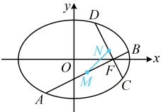
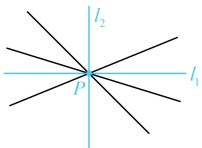
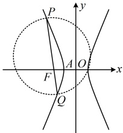

因为 x 轴也过点 P，所以直线 MN 总是经过定点  $ P\left(\frac{2}{3},0\right) $.

图1

图2

【反思】像本题这样不方便设直线  $ MN $ 的方程处理时，可考虑先求出  $ M $,  $ N $ 两点的坐标，用特值探路找到直线  $ MN $ 过的定点  $ P $，再用向量法证明  $ M $,  $ N $,  $ P $ 三点共线，就能得到直线  $ MN $ 过定点  $ P $。

【例 4】已知双曲线  $ C: \frac{x^2}{a^2} - \frac{y^2}{b^2} = 1 (a > 0, b > 0) $ 的左顶点为  $ A $，过其左焦点  $ F $ 的直线与双曲线  $ C $ 交于  $ P $， $ Q $ 两点。当  $ PQ \perp x $ 轴时， $ |PA| = \sqrt{10} $， $ \triangle PAQ $ 的面积为 3。

（1）求双曲线 C 的方程；

（2）证明：以 PQ 为直径的圆经过定点.

解：（1）设  $ F(-c,0) $，当  $ PQ \perp x $ 轴时，如图1，直线  $ PQ $ 的方程为  $ x = -c $，代入  $ \frac{x^2}{a^2} - \frac{y^2}{b^2} = 1 $ 可得  $ \frac{c^2}{a^2} - \frac{y^2}{b^2} = 1 $，所以  $ y^2 = \left(\frac{c^2}{a^2} - 1\right)b^2 = \frac{c^2 - a^2}{a^2} \cdot b^2 = \frac{b^2}{a^2} \cdot b^2 = \frac{b^4}{a^2} $，解得： $ y = \pm \frac{b^2}{a} $，故  $ |PF| = \frac{b^2}{a} $，又  $ |AF| = c - a $，所以  $ |PA| = \sqrt{|PF|^2 + |AF|^2} = \sqrt{\frac{b^4}{a^2} + (c - a)^2} $，由题意， $ |PA| = \sqrt{10} $，所以  $ \sqrt{\frac{b^4}{a^2} + (c - a)^2} = \sqrt{10} $ ①由题意， $ S_{\triangle PAQ} = \frac{1}{2}|PQ| \cdot |AF| = \frac{1}{2} \times \frac{2b^2}{a} \times (c - a) = \frac{b^2(c - a)}{a} = 3 $ ②，

（方程①②都较复杂，怎么解呢？观察发现字母以 $ \frac{b^2}{a} $和 $ c-a $整体出现，可将它们换元，化简两个方程）设 $ u=\frac{b^2}{a} $， $ v=c-a $，则由①②可得 $ \begin{cases}\sqrt{u^2+v^2}=\sqrt{10}\textcircled{3}\\uv=3\textcircled{4}\end{cases} $，由④得 $ v=\frac{3}{u} $，

代入③得  $ \sqrt{u^{2}+\frac{9}{u^{2}}}=\sqrt{10} $，解得：u=1或3，

若u=1，则 $ v=\frac{3}{u}=3 $，此时 $ \left\{\begin{aligned}&\frac{b^{2}}{a}=1\textcircled{5}\\&c-a=3\textcircled{6}\end{aligned}\right. $，由⑤可得 $ a=b^{2}=c^{2}-a^{2}=(c+a)(c-a) $，

结合⑥得  $ a=3(c+a) $，所以  $ 2a+3c=0 $，因为 a>0，c>0，所以此方程无解；

若  $ u=3 $，则  $ v=\frac{3}{u}=1 $，此时  $ \left\{\begin{aligned}&\frac{b^{2}}{a}=3\textcircled{7}\\&c-a=1\textcircled{8}\end{aligned}\right. $，由⑦可得  $ 3a=b^{2}=c^{2}-a^{2}=(c+a)(c-a) $

结合⑧得  $ 3a = c + a $，所以  $ c = 2a $，代入⑧解得： $ a = 1 $，所以  $ c = 2a = 2 $， $ b = \sqrt{c^2 - a^2} = \sqrt{3} $，故双曲线 C 的方程为  $ x^2 - \frac{y^2}{3} = 1 $。

(2) (怎样翻译以  $ P\ov)Q $ 为直径的圆过定点？不妨设定点为 T，则可翻译为  $ \overrightarrow{TP}\cdot\overrightarrow{TQ}=0 $ 。求数量积需要坐标，若直