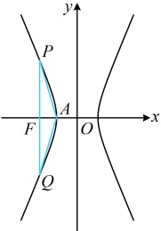
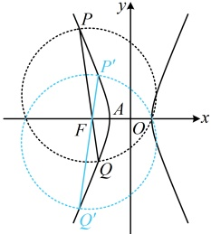

得到了两个圆，直径分别为  $ PQ $ 和  $ P'Q' $，这两个圆也关于  $ x $ 轴对称，故它们的交点在  $ x $ 轴上，所以若题设的圆过定点，定点只能在  $ x $ 轴上）

由对称性，以  $ PQ $ 为直径的圆所过的定点只可能在  $ x $ 轴上，设  $ T(t,0) $， $ P(x_1,y_1) $， $ Q(x_2,y_2) $，

则  $ \overrightarrow{TP} = (x_1 - t, y_1) $， $ \overrightarrow{TQ} = (x_2 - t, y_2) $，所以  $ \overrightarrow{TP} \cdot \overrightarrow{TQ} = (x_1 - t)(x_2 - t) + y_1y_2 = x_1x_2 - t(x_1 + x_2) + t^2 + y_1y_2 $ ⑨，

（观察发现有  $ x_1x_2 $， $ x_1 + x_2 $， $ y_1y_2 $ 这些结构，故又设直线  $ PQ $ 的方程，并代入双曲线，结合韦达定理计算它们）

由（1）知  $ F(-2,0) $，当  $ PQ $ 不与  $ y $ 轴垂直时，可设其方程为  $ x = my - 2 $，

代入  $ x^2 - \frac{y^2}{3} = 1 $ 整理得： $ (3m^2 - 1)y^2 - 12my + 9 = 0 $，

因为直线  $ PQ $ 与双曲线  $ C $ 有两个交点，所以  $ \begin{cases} 3m^2 - 1 \neq 0 \\ \Delta = 144m^2 - 4(3m^2 - 1) \times 9 > 0 \end{cases} $，故  $ m \neq \pm \frac{\sqrt{3}}{3} $，

由韦达定理， $ y_1 + y_2 = \frac{12m}{3m^2 - 1} $， $ y_1y_2 = \frac{9}{3m^2 - 1} $，所以  $ x_1 + x_2 = my_1 - 2 + my_2 - 2 = m(y_1 + y_2) - 4 = \frac{4}{3m^2 - 1} $，

 $ x_1x_2 = (my_1 - 2)(my_2 - 2) = m^2y_1y_2 - 2m(y_1 + y_2) + 4 = -\frac{3m^2 + 4}{3m^2 - 1} $，

代入⑨得  $ \overrightarrow{TP} \cdot \overrightarrow{TQ} = -\frac{3m^2 + 4}{3m^2 - 1} - \frac{4t}{3m^2 - 1} + t^2 + \frac{9}{3m^2 - 1} = \frac{(3t^2 - 3)m^2 - t^2 - 4t + 5}{3m^2 - 1} $，（注意上式的变量是  $ m $，而  $ t $ 是我们要求的常数，所以要使上式恒为 0，不随  $ m $ 的改变而变化，只能分子的两个系数同时为 0）

令  $ \begin{cases} 3t^2 - 3 = 0 \\ -t^2 - 4t + 5 = 0 \end{cases} $ 可得  $ t = 1 $，所以当且仅当  $ t = 1 $ 时，总有  $ \overrightarrow{TP} \cdot \overrightarrow{TQ} = 0 $，故以  $ PQ $ 为直径的圆始终过点  $ T(1,0) $；

（前面设了  $ PQ $ 的横截式方程，它不能表示垂直于  $ y $ 轴的情形，所以还需单独验证这种情况得到的圆是否也过上述定点  $ T $）

当  $ PQ \perp y $ 轴时， $ P $， $ Q $ 分别为双曲线的两个顶点，故以  $ PQ $ 为直径的圆为  $ x^2 + y^2 = 1 $，该圆也过点  $ T(1,0) $；

综上所述，以  $ PQ $ 为直径的圆过定点  $ T(1,0) $。

图1

图2

【反思】①利用图形的对称性来缩窄搜索的范围，这是解析几何大题中常用的高阶思维方法。例如本题我们利用图形的对称性，把点T的搜索范围从整个平面内缩窄到了x轴上，从而使问题明朗化；

②对于圆过定点问题，不一定要先求出圆的方程，再找定点。例如本题的以  $ PQ $ 为直径的圆过定点  $ T $，可以直接按  $ \overrightarrow{TP} \cdot \overrightarrow{TQ} = 0 $ 来翻译，从而建立方程求解定点  $ T $ 的坐标，无需求出该圆的方程。当然，如果圆的方程本身并不难求，结果也不复杂，那么也可以考虑先求圆的方程，再找定点，在练习题中我们会举相关的例子。