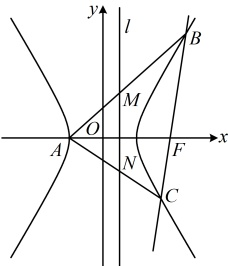

直线 BC 过点  $ F(2,0) $，且与 E 交于 B，C 两点，所以 BC 不与 y 轴垂直，故可设其方程为  $ x = my + 2 $，代入  $ x^2 - \frac{y^2}{3} = 1 $ 消去 x 整理得： $ (3m^2 - 1)y^2 + 12my + 9 = 0 $，

因为直线 BC 与双曲线有 2 个交点，所以  $ \begin{cases} 3m^2 - 1 \ne 0 \\ \Delta = 144m^2 - 36(3m^2 - 1) = 36(m^2 + 1) > 0 \end{cases} $，故  $ m^2 \ne \frac{1}{3} $，由韦达定理， $ y_1 + y_2 = -\frac{12m}{3m^2 - 1} $， $ y_1 y_2 = \frac{9}{3m^2 - 1} $，

所以  $ x_1 + x_2 = m(y_1 + y_2) + 4 = -\frac{4}{3m^2 - 1} $， $ x_1x_2 = m^2y_1y_2 + 2m(y_1 + y_2) + 4 $

 $ = -\frac{3m^2 + 4}{3m^2 - 1} $，代入①得  $ \overrightarrow{FM} \cdot \overrightarrow{FN} = \frac{9}{4}\left(1 + \frac{\frac{9}{3m^2 - 1}}{-\frac{3m^2 + 4}{3m^2 - 1} - \frac{4}{3m^2 - 1} + 1}\right) $

 $ = \frac{9}{4}\left(1 + \frac{9}{-3m^2 - 4 - 4 + 3m^2 - 1}\right) = 0 $，所以  $ FM \perp FN $，

故以线段  $ MN $ 为直径的圆讨占  $ F $

【反思】直角、锐角、钝角这类条件可能会以点在圆上、点在圆外、点在圆内这样的形式隐含地给出，一般而言，可总结如下. 设  $ M $， $ N $ 是不重合的两点，则：

①  $ \overrightarrow{FM} \cdot \overrightarrow{FN} = 0 \Leftrightarrow \angle MFN = 90^\circ $ 或  $ F $ 与  $ M $， $ N $ 中的一个重合  $ \Leftrightarrow $ 点  $ F $ 在以  $ MN $ 为直径的圆上；

②  $ \overrightarrow{FM} \cdot \overrightarrow{FN} > 0 \Leftrightarrow \angle MFN $ 为锐角或  $ 0^\circ \Leftrightarrow $ 点  $ F $ 在以  $ MN $ 为直径的圆外；

③  $ \overrightarrow{FM} \cdot \overrightarrow{FN} < 0 \Leftrightarrow \angle MFN $ 为钝角或平角  $ \Leftrightarrow $ 点  $ F $ 在以  $ MN $ 为直径的圆内.

【变式】已知抛物线 C 的顶点在原点，焦点在直线  $ l: x - 2y - 2 = 0 $ 上.

（1）求抛物线 C 的标准方程；

（2）过点  $ M(a,0) $ 的直线  $ l' $ 与焦点在 x 轴上的抛物线 C 交于 A, B 两点，若  $ \angle AOB $ 为锐角，求实数 a 的取值范围.

解：（1）（直线 $l$ 与坐标轴有 2 个交点，它们都可能是抛物线的焦点，故讨论，下面先求 $l$ 与坐标轴的交点）

在 $x-2y-2=0$ 中分别令 $y=0$，$x=0$ 得 $x=2$，$y=-1$，所以直线 $l$ 与 $x$ 轴、$y$ 轴的交点分别为 $(2,0)$，$(0,-1)$，

若抛物线 $C$ 的焦点是 $(2,0)$，则抛物线的方程是 $y^2=8x$；

若抛物线 $C$ 的焦点是 $(0,-1)$，则抛物线的方程是 $x^2=-4y$；

综上所述，抛物线 C 的方程是  $ y^{2}=8x $ 或  $ x^{2}=-4y $

（2）因为抛物线 C 的焦点在 x 轴上，所以其方程为  $ y^{2}=8x $，

（怎样翻译 $\angle AOB$ 为锐角？ $\angle AOB$ 为锐角意味着 $\overrightarrow{OA}$ 与 $\overrightarrow{OB}$ 的夹角为锐角，又点 $O$ 不在直线 $AB$ 上，所以该条件等价于 $\overrightarrow{OA} \cdot \overrightarrow{OB} > 0$，故可按此翻译。计算 $\overrightarrow{OA} \cdot \overrightarrow{OB}$ 需要 $A$，$B$ 的坐标，故先设坐标）

设 $A\left(\frac{y_1}{8}, y_1\right)$，$B\left(\frac{y_2^2}{8}, y_2\right)$，则 $\overrightarrow{OA} = \left(\frac{y_1^2}{8}, y_1\right)$，$\overrightarrow{OB} = \left(\frac{y_2^2}{8}, y_2\right)$，所以 $\overrightarrow{OA} \cdot \overrightarrow{OB} = \frac{y_1^2}{8} \cdot \frac{y_2^2}{8} + y_1 y_2 = \left(\frac{y_1 y_2}{8}\right)^2 + y_1 y_2$ ①，

（核心是算 $y_1 y_2$，于是想到设直线 $l'$ 的方程，与抛物线联立，结合韦达定理计算它）

因为直线 $l'$ 过点 $M(a,0)$，且与抛物线 $C$ 有 2 个交点，所以 $l'$ 不与 $y$ 轴垂直，故可设其方程为 $x = my + a$，代入 $y^2 = 8x$ 消去 $x$ 整理得：$y^2 - 8my - 8a = 0$，由韦达定理，$y_1 y_2 = -8a$，

代入①得 $\overrightarrow{OA} \cdot \overrightarrow{OB} = \left(\frac{-8a}{8}\right)^2 - 8a = a^2 - 8a$，因为 $\angle AOB$ 为锐角，且点 $O$ 不在直线 $AB$ 上，所以 $\overrightarrow{OA} \cdot \overrightarrow{OB} > 0$，

故 $a^2 - 8a > 0$，解得：$a < 0$ 或 $a > 8$，故实数 $a$ 的取值范围是 $(-\infty, 0) \cup (8, +\infty)$。