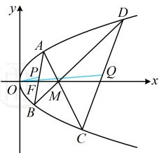

记 $ a=\left(1,\frac{2m}{2m^2+1}\right) $， $ b=\left(16,\frac{8m}{2m^2+1}\right) $，则 $ a $， $ b $分别与 $ \overrightarrow{OP} $， $ \overrightarrow{OQ} $同向，

令 $ t=\frac{2m}{2m^2+1} $，则 $ t=f(m) $，由（1）可得 $ -\frac{\sqrt{2}}{2}\leq t\leq\frac{\sqrt{2}}{2} $，且 $ a=(1,t) $， $ b=(16,4t) $，

所以 $ \cos\angle POQ=\cos\langle a,b\rangle=\frac{a\cdot b}{|a|\cdot|b|}=\frac{16+4t^2}{\sqrt{1+t^2}\cdot\sqrt{256+16t^2}}=\frac{4+t^2}{\sqrt{1+t^2}\cdot\sqrt{16+t^2}} $，

（怎样求此式的最小值？不妨全拿进根号再看）

故  $ \cos\angle POQ=\sqrt{\frac{(4+t^{2})^{2}}{(1+t^{2})(16+t^{2})}}=\sqrt{\frac{t^{4}+8t^{2}+16}{16+17t^{2}+t^{4}}}=\sqrt{\frac{t^{4}+17t^{2}+16-9t^{2}}{t^{4}+17t^{2}+16}}=\sqrt{1-\frac{9t^{2}}{t^{4}+17t^{2}+16}} $ ②，

（要使  $ \cos \angle POQ $ 最小，只需  $ \frac{9t^2}{t^4 + 17t^2 + 16} $ 最大，可上下同除以  $ t^2 $，将分子化为常数再看，但需先考虑  $ t^2 = 0 $ 的情形）由  $ -\frac{\sqrt{2}}{2} \leq t \leq \frac{\sqrt{2}}{2} $ 可得  $ 0 \leq t^2 \leq \frac{1}{2} $，当  $ t^2 = 0 $ 时， $ \cos \angle POQ = 1 $；

当  $ 0 < t^2 \leq \frac{1}{2} $ 时， $ \frac{9t^2}{t^4 + 17t^2 + 16} = \frac{9}{t^2 + \frac{16}{t^2} + 17} $ ③，（能用均值不等式吗？经尝试，等号取不到，所以不能，故直

接分析单调性，显然将 $ t^{2} $换元更容易看出单调性，故先换元）

设  $ u = t^2 $，则  $ 0 < u \leq \frac{1}{2} $，且  $ t^2 + \frac{16}{t^2} = u + \frac{16}{u} $，由双勾函数的性质可知函数  $ y = u + \frac{16}{u} $ 在  $ \left(0, \frac{1}{2}\right] $ 上单调递减，所以当  $ u = \frac{1}{2} $ 时， $ y = u + \frac{16}{u} $ 取得最小值  $ \frac{65}{2} $，故  $ \left(t^2 + \frac{16}{t^2}\right)_{\min} = \frac{65}{2} $，

结合③可得 $ \frac{9t^{2}}{t^{4}+17t^{2}+16} $的最大值为 $ \frac{9}{\frac{65}{2}+17}=\frac{2}{11} $

由②知当 $ \frac{9t^2}{t^4 + 17t^2 + 16} $最大时， $ \cos \angle POQ $最小，所以 $ (\cos \angle POQ)_{\min} = \sqrt{1 - \frac{2}{11}} = \frac{3\sqrt{11}}{11} $；综上所述， $ \cos \angle POQ $的最小值为 $ \frac{3\sqrt{11}}{11} $。

【反思】若要具体计算某角的大小或其三角函数值，则可考虑将该角看成某两个向量的夹角，用夹角余弦公式处理.

类型Ⅱ：倾斜角互补

【例 3】椭圆  $ C: \frac{x^2}{a^2} + \frac{y^2}{b^2} = 1 (a > b > 0) $ 的右焦点为  $ F(c, 0) $，短轴长为 2，且  $ C $ 截直线  $ x = c $ 所得弦  $ MN $ 的长为  $ \sqrt{2} $。

（1）求椭圆 C 的方程；

（2）若 A，B 是椭圆 C 上的两个动点，且  $ \angle AFM = \angle BFM $，证明：直线 AB 过定点.

解：（1）由题意，椭圆 C 的短轴长 2b=2，所以 b=1

将 $x=c$ 代入 $\frac{x^2}{a^2}+\frac{y^2}{b^2}=1$ 解得： $y=\pm\frac{b\sqrt{a^2-c^2}}{a}$，结合 $a^2-c^2=b^2$ 可得 $y=\pm\frac{b^2}{a}$，所以 $|MN|=\frac{2b^2}{a}$。

又 $|MN|=\sqrt{2}$，所以 $\frac{2b^2}{a}=\sqrt{2}$，结合 $b=1$ 可得 $a=\sqrt{2}$，故椭圆 $C$ 的方程为 $\frac{x^2}{2}+y^2=1$。

（2）（怎样翻译  $ \angle AFM = \angle BFM $ ？如图，显然这两个角不好求， $ \angle AFM = \angle BFM $ 意味着直线 AF 和 BF 关于竖直线 MN 对称，于是它们的斜率互为相反数，即斜率之和为 0，故可按此翻译，下面先设点，表示斜率之和）