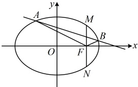

由（1）得  $ F(1,0) $，设  $ A(x_1,y_1) $， $ B(x_2,y_2) $，因为  $ \angle AFM = \angle BFM $ 且  $ FM \perp x $ 轴，所以  $ k_{FA} + k_{FB} = \frac{y_1}{x_1 - 1} + \frac{y_2}{x_2 - 1} = 0 $ 从而  $ \frac{y_1(x_2 - 1) + y_2(x_1 - 1)}{(x_1 - 1)(x_2 - 1)} = \frac{x_1y_2 + x_2y_1 - (y_1 + y_2)}{(x_1 - 1)(x_2 - 1)} = 0 $，故  $ x_1y_2 + x_2y_1 - (y_1 + y_2) = 0 $ ①，

（涉及  $ x_1, y_2 + x_2, y_1 $， $ y_1 + y_2 $，想到设直线  $ AB $ 的方程，与椭圆联立，结合韦达定理计算它们）

直线  $ AB $ 的斜率存在，否则  $ \angle AFM $ 和  $ \angle BFM $ 一个为锐角，一个为钝角，它们不可能相等，

所以可设直线  $ AB $ 的方程为  $ y = kx + m $，代入  $ \frac{x^2}{2} + y^2 = 1 $ 消去  $ y $ 整理得： $ (1 + 2k^2)x^2 + 4kmx + 2m^2 - 2 = 0 $，

判别式  $ \Delta = 8(2k^2 - m^2 + 1) > 0 $，由韦达定理， $ x_1 + x_2 = -\frac{4km}{1 + 2k^2} $， $ x_1x_2 = \frac{2m^2 - 2}{1 + 2k^2} $，

所以  $ x_1y_2 + x_2y_1 = x_1(kx_2 + m) + x_2(kx_1 + m) = 2kx_1x_2 + m(x_1 + x_2) $

 $ = 2k \cdot \left( \frac{2m^2 - 2}{1 + 2k^2} \right) + m \cdot \left( -\frac{4km}{1 + 2k^2} \right) = -\frac{4k}{1 + 2k^2} $，

 $ y_1 + y_2 = kx_1 + m + kx_2 + m = k(x_1 + x_2) + 2m = k \cdot \left( -\frac{4km}{1 + 2k^2} \right) + 2m = \frac{2m}{1 + 2k^2} $，

代入①得  $ -\frac{4k}{1 + 2k^2} - \frac{2m}{1 + 2k^2} = 0 $，化简得： $ m = -2k $，

所以直线  $ AB $ 的方程为  $ y = kx - 2k $，即  $ y = k(x - 2) $，故直线  $ AB $ 过定点  $ (2,0) $。

【反思】当我们通过分析图形的几何特征发现两条直线的倾斜角互补时，常按它们的斜率之和为 0 来翻译。有时倾斜角互补不会直白地给出，需要将已知条件进行分析整合才能发现，我们来看一个变式。

【变式】已知椭圆  $ C: \frac{x^{2}}{a^{2}} + \frac{y^{2}}{b^{2}} = 1 (a > b > 0) $ 的左、右焦点分别为  $ F_{1} $， $ F_{2} $，点  $ P\left(1, \frac{\sqrt{3}}{2}\right) $ 在椭圆  $ C $ 上，且  $ \triangle PF_{1}F_{2} $ 的面积为  $ \frac{3}{2} $。

（1）求椭圆 C 的方程；

（2）过点  $ M(4,0) $ 的直线 l 与椭圆 C 交于  $ A(x_1,y_1) $， $ B(x_2,y_2) $ 两点，且  $ y_1y_2 \neq 0 $，在 x 轴上是否存在定点 N，使得直线 NA，NB 与 y 轴围成的三角形始终为底边在 y 轴上的等腰三角形？若存在，求出点 N 的坐标；若不存在，说明理由.

解：（1）设椭圆 $C$ 的半焦距为 $c$，则 $a^2 - b^2 = c^2$，因为点 $P\left(1, \frac{\sqrt{3}}{2}\right)$ 在椭圆 $C$ 上，所以 $\frac{1}{a^2} + \frac{3}{4b^2} = 1$ ①，

由题意，$\triangle PF_1F_2$ 的面积为 $\frac{3}{2}$，又 $S_{\triangle PF_1F_2} = \frac{1}{2} \cdot 2c \cdot \frac{\sqrt{3}}{2} = \frac{\sqrt{3}}{2}c$，$\frac{\sqrt{3}}{2}c = \frac{3}{2}$，所以 $c = \sqrt{3}$，故 $a^2 - b^2 = c^2 = 3$，

结合①解得：$a = 2$，$b = 1$，所以椭圆 $C$ 的方程为 $\frac{x^2}{4} + y^2 = 1$。

（2）（怎样翻译 NA，NB 与 y 轴围成等腰三角形？如图，该等腰三角形即  $ \triangle NGH $，本身就有  $ NO \perp GH $，若再加上  $ |NG| = |NH| $，则由三线合一，x 轴是  $ \angle GNH $ 的角平分线，从而又得到了 NG 和 NH 关于水平线对称，也即直线 NA，NB 关于水平线对称，于是它们的倾斜角互补，可按斜率之和为 0 来翻译）

设直线 NA，NB 分别与 y 轴交于点 G，H，则题设条件等价于  $ \triangle NGH $ 是以 GH 为底边的等腰三角形，又  $ NO \perp GH $，所以 NO 为  $ \angle GNH $ 的平分线，从而  $ \angle GNO = \angle HNO $，故直线 GN 与直线 HN 的倾斜角互补，所以直线 NA 和 NB 的倾斜角互补，设  $ N(t,0) $，则 NA 与 NB 的斜率之和  $ k_{NA} + k_{NB} = \frac{y_1}{x_1 - t} + \frac{y_2}{x_2 - t} $