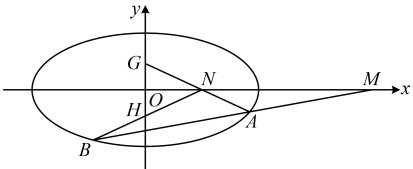

$$= \frac { y _ { 1 } ( x _ { 2 } - t ) + y _ { 2 } ( x _ { 1 } - t ) } { ( x _ { 1 } - t ) ( x _ { 2 } - t ) } = \frac { x _ { 1 } y _ { 2 } + x _ { 2 } y _ { 1 } - t ( y _ { 1 } + y _ { 2 } ) } { ( x _ { 1 } - t ) ( x _ { 2 } - t ) } = 0 , \text { 所以 } x _ { 1 } y _ { 2 } + x _ { 2 } y _ { 1 } - t ( y _ { 1 } + y _ { 2 } ) = 0 \text { ②，}$$

（涉及  $ x_1y_2 + x_2y_1 $ 和  $ y_1 + y_2 $，可通过设直线  $ l $ 的方程，与椭圆联立，结合韦达定理计算它们。直线  $ l $ 过  $ x $ 轴上的定点，考虑设横截式方程）由  $ y_1y_2 \ne 0 $ 可知直线  $ l $ 不与  $ y $ 轴垂直，所以可设其方程为  $ x = my + 4 $，

代入 $ \frac{x^{2}}{4}+y^{2}=1 $消去x整理得： $ (m^{2}+4)y^{2}+8my+12=0 $

判别式 $ \Delta=64m^{2}-4(m^{2}+4)\times12=16(m^{2}-12)>0 $

解得： $ m < -2\sqrt{3} $ 或  $ m > 2\sqrt{3} $

由韦达定理， $ y_{1}+y_{2}=-\frac{8m}{m^{2}+4} $， $ y_{1}y_{2}=\frac{12}{m^{2}+4} $，

所以  $ x_{1}y_{2}+x_{2}y_{1}=(my_{1}+4)y_{2}+(my_{2}+4)y_{1}=2my_{1}y_{2}+4(y_{1}+y_{2}) $

 $$ =2m\cdot\frac{12}{m^{2}+4}+4\left(-\frac{8m}{m^{2}+4}\right)=-\frac{8m}{m^{2}+4} $$ 

将以上各式代入②得 $ -\frac{8m}{m^2+4}-t\left(-\frac{8m}{m^2+4}\right)=0 $，化简得： $ m(t-1)=0 $ ③，

要使式③对任意的  $ m < -2\sqrt{3} $ 或  $ m > 2\sqrt{3} $ 都成立，只需 t = 1，所以存在点  $ N(1,0) $ 满足题意.

## 强化训练

考虑到本节涉及的题型都有一定的综合性和难度，故不设 A 组题，只设计了 B 组和 C 组题.

## B组 强化能力

1.（2017·新课标Ⅱ卷）

设 O 为坐标原点，动点 M 在椭圆  $ C: \frac{x^{2}}{2} + y^{2} = 1 $ 上，过 M 作 x 轴的垂线，垂足为 N，点 P 满足  $ \overrightarrow{NP} = \sqrt{2}\overrightarrow{NM} $.

（1）求点P的轨迹方程；

（2）设点  $ Q $ 在直线  $ x = -3 $ 上，且  $ \overrightarrow{OP} \cdot \overrightarrow{PQ} = 1 $，证明：过点  $ P $ 且垂直于  $ OQ $ 的直线  $ l $ 过  $ C $ 的左焦点  $ F $。