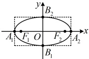
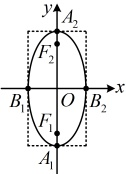

# 3.1.2 椭圆的简单几何性质

习题：P1

## 知识梳理

## 知识点 1：椭圆的简单几何性质

<table border=1 style='margin: auto; word-wrap: break-word;'><tr><td style='text-align: center; word-wrap: break-word;'>标准方程</td><td style='text-align: center; word-wrap: break-word;'>$ \frac{x^{2}}{a^{2}}+\frac{y^{2}}{b^{2}}=1(a&gt;b&gt;0) $</td><td style='text-align: center; word-wrap: break-word;'>$ \frac{y^{2}}{a^{2}}+\frac{x^{2}}{b^{2}}=1(a&gt;b&gt;0) $</td></tr><tr><td style='text-align: center; word-wrap: break-word;'>焦点位置</td><td style='text-align: center; word-wrap: break-word;'>焦点在x轴上</td><td style='text-align: center; word-wrap: break-word;'>焦点在y轴上</td></tr><tr><td style='text-align: center; word-wrap: break-word;'>图形</td><td style='text-align: center; word-wrap: break-word;'></td><td style='text-align: center; word-wrap: break-word;'></td></tr><tr><td style='text-align: center; word-wrap: break-word;'>范围</td><td style='text-align: center; word-wrap: break-word;'>$ x\in[-a,a] $,  $ y\in[-b,b] $</td><td style='text-align: center; word-wrap: break-word;'>$ x\in[-b,b] $,  $ y\in[-a,a] $</td></tr><tr><td style='text-align: center; word-wrap: break-word;'>对称性</td><td colspan="2">关于x轴,y轴对称,关于原点中心对称</td></tr><tr><td style='text-align: center; word-wrap: break-word;'>顶点</td><td style='text-align: center; word-wrap: break-word;'>左、右顶点: $ A_{1}(-a,0) $,  $ A_{2}(a,0) $\n上、下顶点: $ B_{2}(0,b) $,  $ B_{1}(0,-b) $</td><td style='text-align: center; word-wrap: break-word;'>左、右顶点: $ B_{1}(-b,0) $,  $ B_{2}(b,0) $\n上、下顶点: $ A_{2}(0,a) $,  $ A_{1}(0,-a) $</td></tr><tr><td style='text-align: center; word-wrap: break-word;'>轴长</td><td colspan="2">长轴长 $ \vert A_{1}A_{2}\vert=2a $, 长半轴长 $ \vert OA_{1}\vert=\vert OA_{2}\vert=a $\n短轴长 $ \vert B_{1}B_{2}\vert=2b $, 短半轴长 $ \vert OB_{1}\vert=\vert OB_{2}\vert=b $</td></tr><tr><td style='text-align: center; word-wrap: break-word;'>焦距</td><td colspan="2">$ \vert F_{1}F_{2}\vert=2c $</td></tr><tr><td style='text-align: center; word-wrap: break-word;'>离心率</td><td colspan="2">$ e=\frac{c}{a}(0&lt;e&lt;1) $</td></tr></table>

注：离心率  $ e=\frac{c}{a}=\sqrt{\frac{c^{2}}{a^{2}}}=\sqrt{\frac{a^{2}-b^{2}}{a^{2}}}=\sqrt{1-\frac{b^{2}}{a^{2}}} $，故有  $ \frac{b^{2}}{a^{2}}=1-e^{2} $，由这一关系式可知，当 e 趋近于 1 时， $ \frac{b^{2}}{a^{2}} $ 趋近于 0，所以  $ \frac{b}{a} $ 趋近于 0，可以理解为椭圆的短半轴长远小于长半轴长，此时椭圆越扁平；同理，当 e 趋近于 0 时， $ \frac{b}{a} $ 趋近于 1，可以理解为椭圆的短半轴长趋近于长半轴长，此时椭圆越接近圆。由此可知，离心率刻画的是椭圆的“扁平程度”。

## 知识点 2：直线与椭圆的位置关系

1. 直线与椭圆的三种位置关系

## 知识点1

【例1】（多选）已知椭圆 $ M:\frac{x^{2}}{4}+\frac{y^{2}}{13}=1 $， $ N:\frac{x^{2}}{10}+y^{2}=1 $，则（ ）

A. M与N的离心率相等

B. M与N的焦距相等

C. M与N的长轴长相等

D. M的短轴长是N的短轴长两倍

解析：对于椭圆 $M$, $a_1^2=13$, $b_1^2=4$,

所以 $a_1=\sqrt{13}$, $b_1=2$, $c_1=\sqrt{a_1^2-b_1^2}=3$,

对于椭圆 $N$, $a_2^2=10$, $b_2^2=1$,

所以 $a_2=\sqrt{10}$, $b_2=1$, $c_2=\sqrt{a_2^2-b_2^2}=3$,

A 项, $M$ 的离心率 $e_1=\frac{c_1}{a_1}=\frac{3}{\sqrt{13}}=\frac{3\sqrt{13}}{13}$,

$N$ 的离心率 $e_2=\frac{c_2}{a_2}=\frac{3}{\sqrt{10}}=\frac{3\sqrt{10}}{10}$,

所以 $e_1\ne e_2$, 故 A 项错误;

B 项, 因为 $c_1=c_2$, 所以 $2c_1=2c_2$,

从而 $M$ 与 $N$ 焦距相等, 故 B 项正确;

C 项, $2a_1=2\sqrt{13}\ne2a_2=2\sqrt{10}$, 所以 $M$ 与

$N$ 的长轴长不相等, 故 C 项错误;

D 项, $M$ 的短轴长 $2b_1=4$, $N$ 的短轴长 $2b_2=2$,

所以 $M$ 的短轴长是 $N$ 的短轴长的 2倍, 故 D 项正确.

答案：BD

【例 2】若椭圆  $ C:\frac{x^{2}}{a^{2}}+\frac{y^{2}}{6}=1 $ 的右焦点为  $ F(2,0) $，则 C 的长轴长为 ___.

解析：由题意，C的焦点在x轴上且c=2， $ b^{2}=6 $，所以 $ a^{2}=b^{2}+c^{2}=6+2^{2}=10 $，从而 $ a=\sqrt{10} $，故C的长轴长为 $ 2a=2\sqrt{10} $。答案： $ 2\sqrt{10} $