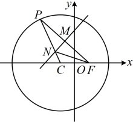
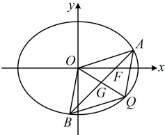

由图可知 l 不与 y 轴垂直，所以可设直线 l 的方程为 x = my + 1，设  $ A(x_{1}, y_{1}) $， $ B(x_{2}, y_{2}) $，

联立 $ \left\{\begin{aligned}x=my+1\\ \frac{x^{2}}{3}+\frac{y^{2}}{2}=1\end{aligned}\right. $消去x整理得： $ (2m^{2}+3)y^{2}+4my-4=0 $， $ \Delta=(4m)^{2}-4(2m^{2}+3)\cdot(-4)=48(m^{2}+1)>0 $，

由韦达定理， $ y_{1}+y_{2}=-\frac{4m}{2m^{2}+3} $， $ x_{1}+x_{2}=m(y_{1}+y_{2})+2=\frac{6}{2m^{2}+3} $，所以AB中点为 $ G\left(\frac{3}{2m^{2}+3},-\frac{2m}{2m^{2}+3}\right) $，若四边形OAQB是平行四边形，则G也是OQ的中点，所以点Q的坐标为 $ \left(\frac{6}{2m^{2}+3},-\frac{4m}{2m^{2}+3}\right) $，

（有了点 Q 的坐标，题干还要求点 Q 在椭圆上，所以将该坐标代入椭圆的方程，即可求出 m）

代入椭圆方程得 $ \frac{12}{(2m^{2}+3)^{2}}+\frac{8m^{2}}{(2m^{2}+3)^{2}}=1 $，解得： $ m=\pm\frac{\sqrt{2}}{2} $，

此时直线 l 的方程为  $ x = \pm \frac{\sqrt{2}}{2}y + 1 $，即  $ \sqrt{2}x \pm y - \sqrt{2} = 0 $，

所以存在直线 $l$ 使得四边形 $OAQB$ 为平行四边形，其方程为 $\sqrt{2}x + y - \sqrt{2} = 0$ 或 $\sqrt{2}x - y - \sqrt{2} = 0$

图1

图2

解法2：（按解法1求出 $ x_1+x_2 $和 $ y_1+y_2 $后，注意到 $ OAQB $为平行四边形等价于 $ \overrightarrow{OQ}=\overrightarrow{OA}+\overrightarrow{OB} $，故也可由此直接求点 $ Q $的坐标，无需先求 $ AB $中点 $ G $的坐标）

若四边形 $ OAQB $是平行四边形，则 $ \overrightarrow{OQ}=\overrightarrow{OA}+\overrightarrow{OB}=(x_1+x_2,y_1+y_2)=\left(\frac{6}{2m^2+3},-\frac{4m}{2m^2+3}\right) $，

所以点 $ Q $的坐标为 $ \left(\frac{6}{2m^2+3},-\frac{4m}{2m^2+3}\right) $，接下来同解法1.

【反思】解析几何大题中，遇到平行四边形，常抓住对角线互相平分这一特征来求顶点的坐标，再用该坐标建立方程，求解需要的量.

## 类型Ⅱ：菱形的翻译方法

【例2】已知椭圆 C 的右焦点为  $ F(1,0) $，且经过点  $ A\left(-1,\frac{3}{2}\right) $.

（1）求椭圆 C 的方程；

（2）过右焦点 F 作不与坐标轴垂直的直线 l 与椭圆 C 交于 M, N 两点，O 为坐标原点，是否存在椭圆 C 上的一点 Q 以及 x 轴上的一点  $ P(x_{0}, 0) $，使四边形 PMQN 为菱形？若存在，求  $ x_{0} $；若不存在，请说明理由.

解：（1）设椭圆  $ C:\frac{x^{2}}{a^{2}}+\frac{y^{2}}{b^{2}}=1(a>b>0) $，由椭圆 C 的右焦点为  $ F(1,0) $ 可得半焦距 c=1，所以  $ a^{2}-b^{2}=1 $ ①，又椭圆经过点  $ A\left(-1,\frac{3}{2}\right) $，所以  $ \frac{1}{a^{2}}+\frac{9}{4b^{2}}=1 $，结合①解得： $ a=2 $， $ b=\sqrt{3} $，故椭圆 C 的方程为  $ \frac{x^{2}}{4}+\frac{y^{2}}{3}=1 $。

（2）（怎样翻译四边形  $ PMQN $ 为菱形？可翻译为  $ PQ $ 与  $ MN $ 互相垂直平分，其中  $ MN $ 的中点  $ l $ 可通过联立直线