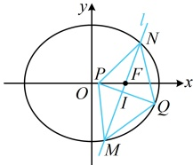

/与椭圆的方程，结合韦达定理求得，下面先求1的坐标）

因为 $l$ 过点 $F$，且不与坐标轴垂直，所以可设 $l$ 的方程为 $x = my + 1 (m \neq 0)$，设 $M(x_1, y_1)$，$N(x_2, y_2)$，

联立 $\begin{cases} x = my + 1 \\ \dfrac{x^2}{4} + \dfrac{y^2}{3} = 1 \end{cases}$ 消去 $x$ 整理得：$(3m^2 + 4)y^2 + 6my - 9 = 0$，判别式 $\Delta = (6m)^2 - 4(3m^2 + 4) \cdot (-9) = 144(m^2 + 1) > 0$，

由韦达定理，$y_1 + y_2 = -\dfrac{6m}{3m^2 + 4}$，所以 $x_1 + x_2 = my_1 + 1 + my_2 + 1 = m(y_1 + y_2) + 2$

$= m \cdot \left( -\dfrac{6m}{3m^2 + 4} \right) + 2 = \dfrac{8}{3m^2 + 4}$，故 $MN$ 的中点为 $I\left( \dfrac{4}{3m^2 + 4}, -\dfrac{3m}{3m^2 + 4} \right)$，

（有 $m$ 和 $x_0$ 两个未知数，需要建立两个方程，如何建立？由 $P$，$I$ 的坐标可求 $Q$ 的坐标，代入椭圆可得到一个方程；另一个呢？翻译 $PI \perp l$，又能得到一个方程）

若四边形 $PMON$ 为菱形，则 $I$ 为 $PO$ 的中点。日 $PI \perp l$。

由 $I$ 为 $PQ$ 的中点可得点 $Q$ 的坐标为 $x_Q = \dfrac{8}{3m^2 + 4} - x_0$，$y_Q = -\dfrac{6m}{3m^2 + 4}$，所以 $Q\left( \dfrac{8}{3m^2 + 4} - x_0, -\dfrac{6m}{3m^2 + 4} \right)$，

代入椭圆 $C$ 的方程得 $\dfrac{\left( \dfrac{8}{3m^2 + 4} - x_0 \right)^2}{4} + \dfrac{\left( -\dfrac{6m}{3m^2 + 4} \right)^2}{3} = 1$ ②，

由 $PI \perp l$ 可得 $k_{PI} \cdot k_l = \dfrac{-\dfrac{3m}{3m^2 + 4} - 0}{\dfrac{4}{3m^2 + 4} - x_0} \cdot \dfrac{1}{m} = -1$，所以 $x_0 = \dfrac{1}{3m^2 + 4}$，代入②得 $\dfrac{\left( \dfrac{7}{3m^2 + 4} \right)^2}{4} + \dfrac{\left( -\dfrac{6m}{3m^2 + 4} \right)^2}{3} = 1$，

化简得：$12m^4 + 16m^2 + 5 = 0$，此方程无解，所以不存在满足题设条件的点 $Q$ 和点 $P$。

化简得： $ 12m^{4}+16m^{2}+5=0 $，此方程无解，所以不存在满足题设条件的点Q和点P.

【反思】解析几何大题中，常抓住菱形对角线互相垂直平分这一特征来建立方程，求解需要的量.

【变式】已知圆 P 过点  $ Q(0,2) $，且在 x 轴上截得的弦长为 4，记圆心 P 的轨迹为曲线 C.

（1）求曲线 C 的方程：

（2）以  $ M(0,a)(a>0) $ 为顶点恰好能作三个菱形 MANB，使 A，B，N 均在曲线 C 上，求 a 的取值范围.

解：（1）（条件涉及圆的弦长，考虑按  $ L=2\sqrt{r^2-d^2} $ 计算，结合题意可知点  $ P $ 到  $ x $ 轴的距离  $ d $ 和  $ r $（即  $ |PQ| $）都容易用点  $ P $ 的坐标表示，故直接设  $ P $ 的坐标，翻译所给的弦长，建立关于所设坐标的方程）

如图1，设  $ P(x,y) $，则圆心  $ P $ 到  $ x $ 轴的距离  $ d=\left|y\right| $，

又因为圆  $ P $ 过点  $ Q(0,2) $，所以圆  $ P $ 的半径  $ r=\left|QP\right|=\sqrt{x^2+(y-2)^2} $，

由题意，圆  $ P $ 在  $ x $ 轴上截得的弦长为 4，所以  $ 4=2\sqrt{r^2-d^2} $，从而  $ r^2-d^2=4 $，故  $ x^2+(y-2)^2-\left|y\right|^2=4 $，

化简得曲线  $ C $ 的轨迹方程为  $ x^2=4y $。

（2）（如图2，条件涉及MANB是菱形，可按对角线互相垂直平分来翻译，由于M要看成定点，所以我们设直线AB的方程，与抛物线联立，结合韦达定理求AB中点G的坐标）

因为 $A$，$B$ 两点都在抛物线 $C$ 上，所以直线 $AB$ 的斜率存在，设其方程为 $y = kx + t$，设 $A(x_1, y_1)$，$B(x_2, y_2)$ 当 $k = 0$ 时，对任意的 $M(0, a)(a > 0)$，取 $t = \frac{a}{2}$，$N$ 与 $O$ 重合，都能使四边形 $MANB$ 为菱形，如图 3，

所以当  $ k \neq 0 $ 时，应该还能作出 2 个菱形 MANB，联立  $ \left\{\begin{aligned}y &= kx + t\\x^2 &= 4v\end{aligned}\right. $ 消去 y 整理得：  $ x^2 - 4kx - 4t = 0 $，

判别式 $ \Delta=(-4k)^{2}-4\times1\times(-4t)=16(k^{2}+t)>0 $，由韦达定理， $ x_{1}+x_{2}=4k $，

所以  $ y_{1}+y_{2}=k(x_{1}+x_{2})+2t=k\cdot4k+2t=4k^{2}+2t $，故 AB 的中点为  $ G(2k,2k^{2}+t) $。