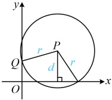
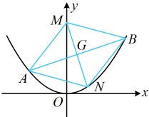
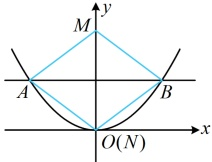

（有了 $G$ 的坐标，可以利用它也是 $MN$ 的中点，求得 $N$ 的坐标，代入抛物线建立方程）

因为四边形 $MANB$ 为菱形，所以 $G$ 为 $MN$ 的中点，从而 $x_N = 2x_G - x_M = 4k$，$y_N = 2y_G - y_M = 4k^2 + 2t - a$，故 $N(4k, 4k^2 + 2t - a)$，代入 $x^2 = 4y$ 得 $16k^2 = 4(4k^2 + 2t - a)$，化简得：$a = 2t$ ①，

（由此不易看出 $a$ 的范围，怎么办呢？由 $MANB$ 是菱形还可得到 $MG \perp AB$，于是又来翻译它，再作观察）

由四边形 $MANB$ 为菱形可得 $MG \perp AB$，所以 $k_{MG} \cdot k_{AB} = \frac{2k^2 + t - a}{2k} \cdot k = -1$，化简得：$t = a - 2 - 2k^2$，

代入①得 $a = 2(a - 2 - 2k^2)$，化简得：$a = 4k^2 + 4$，因为 $k \ne 0$，所以 $a = 4k^2 + 4 > 4$ ②，

此时结合①可得 $t = \frac{a}{2} > 2$，经检验，满足 $\Delta = 16(k^2 + t) > 0$，由②可得 $k = \pm \frac{\sqrt{a - 4}}{2}$，

所以满足以 $M(0, a)$ 为顶点恰能作出两个（不含 $k = 0$ 时的那一个）菱形 $MANB$，故 $a$ 的取值范围为 $(4, +\infty)$。

图1

图2

图3

【反思】可以看到尽管本题的问法与例2不同，但翻译菱形的方法一致，都是按对角线互相垂直平分来翻译的。

## 类型Ⅲ：非对称韦达定理问题

【例 3】（2024·全国甲卷）设椭圆  $ C: \frac{x^{2}}{a^{2}} + \frac{y^{2}}{b^{2}} = 1 (a > b > 0) $ 的右焦点为  $ F $，点  $ M\left(1, \frac{3}{2}\right) $ 在  $ C $ 上，且  $ MF \perp x $ 轴。

（1）求 C 的方程：

（2）过点  $ P(4,0) $ 的直线交 C 于 A, B 两点，N 为线段 FP 的中点，直线 NB 交直线 MF 于点 Q。证明： $ AQ \perp y $ 轴。

解：（1）如图1，因为 $ M\left(1,\frac{3}{2}\right) $， $ MF\perp x $轴，所以 $ F(1,0) $，故 $ a^{2}-b^{2}=1 $①，

又因为M在椭圆C上，所以 $ \frac{1}{a^{2}}+\frac{9}{4b^{2}}=1 $，结合①解得： $ a=2 $， $ b=\sqrt{3} $，所以C的方程为 $ \frac{x^{2}}{4}+\frac{y^{2}}{3}=1 $

（2）（要证  $ A O \perp $ y 轴，只需证 A，O 纵坐标相等，可考虑设 A，R 的坐标，用于求 O 的坐标）

(2)（要证  $ AQ \perp y $ 轴，只需证  $ A, Q $ 纵坐标相等，可考虑设  $ A, B $ 的坐标，用于求  $ Q $ 的坐标）

设  $ A(x_1, y_1) $， $ B(x_2, y_2) $，由题意， $ P(4,0) $， $ F(1,0) $，所以 FP 中点为  $ N\left(\frac{5}{2}, 0\right) $，从而  $ k_{NB} = \frac{y_2}{x_2 - \frac{5}{2}} = \frac{2y_2}{2x_2 - 5} $，

故直线 NB 的方程为  $ y = \frac{2y_2}{2x_2 - 5}\left(x - \frac{5}{2}\right) $，令  $ x = 1 $ 得  $ y = -\frac{3y_2}{2x_2 - 5} $，所以  $ y_Q = -\frac{3y_2}{2x_2 - 5} $，

要证  $ AQ \perp y $ 轴，只需证  $ -\frac{3y_2}{2x_2 - 5} = y_1 $，即证  $ -3y_2 = 2x_2y_1 - 5y_1 $ ②，

（式②中  $ x_1 $ 和  $ x_2 $， $ y_1 $ 和  $ y_2 $ 系数不对称，不方便直接由韦达定理计算，怎么办呢？既有 x 又有 y，可考虑设直线 AB 的方程，并利用该方程将式②消元，再观察怎样计算。直线 AB 过 x 轴上的定点，考虑设横截式方程）

当  $ AB \perp y $ 轴时，如图 3，A，Q 都在 x 轴上，满足  $ AQ \perp y $ 轴；

当 AB 不与 y 轴垂直时，可设其方程为  $ x = my + 4 $，则  $ x_2 = my_2 + 4 $，

代入②得  $ -3y_2 = 2(my_1 + 4)y_1 - 5y_1 $，整理得： $ 2my_1y_2 + 3(y_1 + y_2) = 0 $ ③，