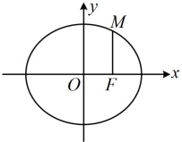
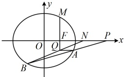
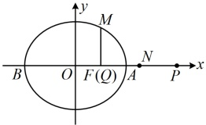

（此时发现有  $ y_1 + y_2 $ 和  $ y_1 y_2 $，故联立直线 AB 和椭圆 C 的方程，用韦达定理计算它们）

联立  $ \begin{cases} x = my + 4 \\ \frac{x^2}{4} + \frac{y^2}{3} = 1 \end{cases} $ 消去 x 整理得： $ (3m^2 + 4)y^2 + 24my + 36 = 0 $，判别式  $ \Delta = (24m)^2 - 4(3m^2 + 4) \cdot 36 = 144(m^2 - 4) > 0 $，解得： $ m < -2 $ 或  $ m > 2 $，由韦达定理， $ y_1 + y_2 = -\frac{24m}{3m^2 + 4} $， $ y_1 y_2 = \frac{36}{3m^2 + 4} $，所以  $ 2m \cdot \frac{36}{3m^2 + 4} + 3\left(-\frac{24m}{3m^2 + 4}\right) = 0 $，从而式③成立，故  $ AQ \perp y $ 轴；综上所述， $ AQ \perp y $ 轴。

图1

图2

图3

【反思】当式子中既有 x，又有 y 时，若遇到系数不对称的情况，可考虑利用直线的方程消元，将变量统一成 x 或 y，也许系数就对称了，此时可再结合韦达定理计算.

【变式】已知椭圆  $ C: \frac{x^{2}}{a^{2}} + \frac{y^{2}}{b^{2}} = 1 (a > b > 0) $ 经过点  $ (0,1) $ 和  $ \left(1, \frac{\sqrt{2}}{2}\right) $，M，N 分别为 C 的左、右顶点，过椭圆 C 右焦点 F 的直线 l 与椭圆 C 交于不与 M, N 重合的 A, B 两点.

（1）求椭圆 C 的方程：

（2）设直线 $ AM,\ BN $交于点T，求证：点T的横坐标 $ x_{T} $为定值.

解：（1）由题意， $ b=1 $， $ \frac{1}{a^{2}}+\frac{1}{2b^{2}}=1 $，所以 $ a=\sqrt{2} $，故椭圆C的方程为 $ \frac{x^{2}}{2}+y^{2}=1 $。

 $$ x_{7} $$ 

 $$ x_{T}) $$ 

由（1）可得  $ M(-\sqrt{2},0) $， $ N(\sqrt{2},0) $，设  $ A(x_1,y_1) $， $ B(x_2,y_2) $，则  $ k_{AM} = \frac{y_1}{x_1 + \sqrt{2}} $， $ k_{BN} = \frac{y_2}{x_2 - \sqrt{2}} $，所以直线 AM，BN 的方程分别为  $ y = \frac{y_1}{x_1 + \sqrt{2}}(x + \sqrt{2}) $， $ y = \frac{y_2}{x_2 - \sqrt{2}}(x - \sqrt{2}) $，

联立 $ \left\{\begin{aligned}&y=\frac{y_{1}}{x_{1}+\sqrt{2}}(x+\sqrt{2})\\ &y=\frac{y_{2}}{x_{2}-\sqrt{2}}(x-\sqrt{2})\end{aligned}\right. $消去y可得 $ \frac{y_{1}}{x_{1}+\sqrt{2}}(x+\sqrt{2})=\frac{y_{2}}{x_{2}-\sqrt{2}}(x-\sqrt{2}) $，

所以 $ \frac{y_{1}}{x_{1}+\sqrt{2}}(x_{T}+\sqrt{2})=\frac{y_{2}}{x_{2}-\sqrt{2}}(x_{T}-\sqrt{2}) $ ①，（可以想象，若由此式直接反解出 $ x_{T} $，则所得结果较为麻烦，怎么办呢？可以考虑将含 $ x_{T} $的部分拿到一起，先把这部分整体求出来，再由此求 $ x_{T} $）

由①可得 $ \frac{x_{T}+\sqrt{2}}{x_{T}-\sqrt{2}}=\frac{y_{2}(x_{1}+\sqrt{2})}{y_{1}(x_{2}-\sqrt{2})} $ ②，（怎样算右边？涉及的变量较多，可考虑设 l 的方程，并用它消去两个变量）

因为 A，B 不与 M，N 重合，所以直线 l 不与 y 轴垂直，故可设其方程为 x = my + 1

则  $ x_{1}=my_{1}+1 $， $ x_{2}=my_{2}+1 $，代入②得  $ \frac{x_{T}+\sqrt{2}}{x_{T}-\sqrt{2}}=\frac{y_{2}(x_{1}+\sqrt{2})}{y_{1}(x_{2}-\sqrt{2})}=\frac{y_{2}(my_{1}+1+\sqrt{2})}{y_{1}(my_{2}+1-\sqrt{2})}=\frac{my_{1}y_{2}+(1+\sqrt{2})y_{2}}{my_{1}y_{2}+(1-\sqrt{2})y_{1}} $ ③，

（涉及 $ y_{1}y_{2} $，想到联立直线/和椭圆的方程，结合韦达定理计算它）