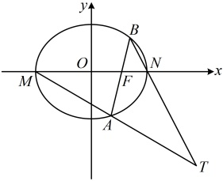

联立 $ \left\{\begin{aligned}x=my+1\\ \frac{x^{2}}{2}+y^{2}=1\end{aligned}\right. $消去x得： $ (m^{2}+2)y^{2}+2my-1=0 $，由韦达定理 $ \left\{\begin{aligned}y_{1}+y_{2}=-\frac{2m}{m^{2}+2}\textcircled{4}\\ y_{1}y_{2}=-\frac{1}{m^{2}+2}\textcircled{5}\end{aligned}\right. $，

（可以想象，式③中有 $ (1+\sqrt{2})y_{2} $和 $ (1-\sqrt{2})y_{1} $，这两部分由于无法凑成系数对称的结构，故不能用韦达定理计算，而若将 $ y_{1}y_{2}=-\frac{1}{m^{2}+2} $代入式③，则仍有 $ y_{1} $， $ y_{2} $，m三个变量，怎么办呢？消元的方向肯定没错，既然无法用韦达定理消 $ y_{1} $， $ y_{2} $，那我们转换思路，改为消m试试）

由④⑤可知  $ my_{1}y_{2}=-\frac{m}{m^{2}+2}=\frac{y_{1}+y_{2}}{2} $，代入③得  $ \frac{x_{T}+\sqrt{2}}{x_{T}-\sqrt{2}}=\frac{my_{1}y_{2}+(1+\sqrt{2})y_{2}}{my_{1}y_{2}+(1-\sqrt{2})y_{1}} $

 $ \frac{\frac{y_{1}+y_{2}}{2}+(1+\sqrt{2})y_{2}}{\frac{y_{1}+y_{2}}{2}+(1-\sqrt{2})y_{1}}=\frac{y_{1}+(3+2\sqrt{2})y_{2}}{(3-2\sqrt{2})y_{1}+y_{2}}=\frac{(3+2\sqrt{2})\left(\frac{1}{3+2\sqrt{2}}y_{1}+y_{2}\right)}{(3-2\sqrt{2})y_{1}+y_{2}} $

 $ (3-2\sqrt{2})y_{1}+y_{2}=3+2\sqrt{2} $，解得： $ x_{T}=2 $

所以点T的横坐标 $ x_{T} $为定值2.

【反思】遇到像 $ \frac{my_1y_2+(1+\sqrt{2})y_2}{my_1y_2+(1-\sqrt{2})y_1} $这种含有 $ (1+\sqrt{2})y_2 $和 $ (1-\sqrt{2})y_1 $的系数不对称的结构，用韦达定理消 $ y_1 $， $ y_2 $往往行不通，此时可转为消 $ m $，具体操作方法是找到 $ my_1y_2 $与 $ y_1+y_2 $的关系，再替换掉式中的 $ my_1y_2 $，从而消去变量 $ m $，说不定就能约分，求得结果.

## 强化训练

## 一 数·高中数学一本通

考虑到本节涉及的题型都有一定的综合性和难度，故不设 A 组题，只设计了 B 组和 C 组题。

## B组 强化能力

### 1. （2025·陕西西安模拟）

设抛物线  $ C: y^{2} = 2px (p > 0) $，直线  $ l $ 过抛物线  $ C $ 的焦点  $ F $ 且与  $ C $ 交于  $ A $， $ B $ 两点， $ \frac{1}{|AF|} + \frac{1}{|BF|} = 2 $

（1）求抛物线 C 的方程：

（2）设点 $ P(1,0) $，点Q在抛物线C上，且四边形PAQB为菱形，求直线l的方程.